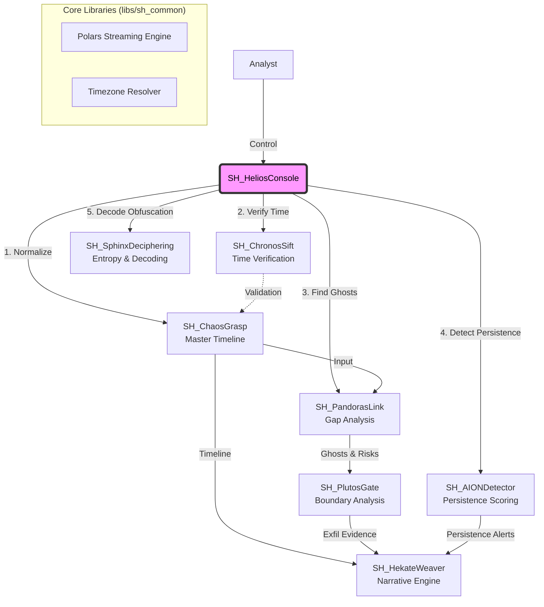

# SkiaHelios (SH Tools)
> **"Ex Umbra in Solem"** (From the Shadows into the Sun)

[](https://opensource.org/licenses/MIT)
[](https://www.python.org/)
[](https://www.pola.rs/)

## 👁️ Philosophy & Mission
**"Extracting the sun of binary-level truth (Helios) from the shadows of chaotic evidence (Skia)."**

**SkiaHelios** is a definitive digital forensics suite designed for high-resolution analysis. It allows analysts to establish **"Absolute Coordinates"** in time and space, dominating the entire workflow from initial triage to final testimony.

Unlike traditional tools that rely strictly on OS APIs, SkiaHelios parses raw binary structures to reveal what is hidden, ensuring **"Order out of Chaos."**

## 🏗️ Architecture: The "SH" Ecosystem

SkiaHelios operates as a unified monorepo, orchestrating specialized modules through a centralized command console. It leverages **Polars LazyFrame** and **Streaming API** to process gigabytes of MFT/USN data with minimal memory footprint.



## 📂 Directory Structure

```text
SkiaHelios/
├── README.md               ... Documentation
├── requirements.txt        ... Python Dependencies (Polars, etc.)
├── SH_HeliosConsole/       ... Interactive Commander (Entry Point)
├── SH_ChaosGrasp/          ... Master Timeline Generator (The Chaos)
├── SH_PandorasLink/        ... Ghost Hunting Engine (The Space)
├── SH_ChronosSift/         ... Timestamp Verification (The Time)
└── libs/                   ... Shared Libraries
```

## 🛠️ Module Lineup

### 1. SH_ChaosGrasp (The Chaos)
* **Mission**: Aggregate, Align, and Prepare.
* **Function**: Generates a normalized "Master Timeline" from heterogeneous artifacts (Registry, Prefetch, Amcache, UserAssist) using robust timezone handling.
* **Key Tech**: Automatic Timezone Bias detection, Raw Registry parsing, Polars Streaming.

### 2. SH_ChronosSift (The Time)
* **Mission**: Detect Temporal Anomalies.
* **Function**: Identifies "Timestomping" by comparing `$STANDARD_INFORMATION` vs `$FILE_NAME` attributes with nanosecond precision. Validates time integrity against physical log sequences.
* **Key Tech**: Nanosecond-level timestamp verification, Zero-filling detection.

### 3. SH_PandorasLink (The Space)
* **Mission**: Reveal the "Absence", "Intent" & "Risk".
* **Function**: Reconstructs deleted file history ("Ghosts") by cross-referencing **MFT (Live/VSS)** and **USN Journal**. It correlates these ghosts with execution logs from ChaosGrasp to prove malicious intent.
* **Key Tech**: NTFS `$MFT`/`$J` gap analysis, Path Backfill (Grandparent reconstruction), Risk Assessment (Sequence Number Anomaly).

### 4. SH_AIONDetector (The Eternity)
* **Mission**: Persistence Analysis.
* **Function**: Scores persistence mechanisms (WMI, COM Hijack, Services, RunKeys) to detect "stay-behind" threats and advanced APT techniques.
* **Key Tech**: Persistence scoring algorithm, Registry cross-referencing.

### 5. SH_SphinxDeciphering (The Riddle)
* **Mission**: Obfuscation Decoding.
* **Function**: Extracts and decodes obfuscated strings from Event Logs and scripts using entropy analysis and multi-layer decoding strategies.
* **Key Tech**: Entropy calculation, Automated encoding detection (Base64/XOR/ROT13).

### 6. SH_HekateWeaver (The Will)
* **Mission**: Narrative Reconstruction.
* **Function**: Connects the "Ghost" files, "Timeline" events, and decoded intent to reconstruct the attacker's will and actions on a unified timeline.
* **Key Tech**: LSN (Log Sequence Number) chaining, Event correlation engine.

## 🚀 Capabilities & Outcomes

With SkiaHelios, an analyst can:
* **Process Gigabytes of Data in Seconds**: Utilizing Rust-based Polars streaming engine.
* **Reveal Hidden Intent**: Automatically tag deleted-then-executed binaries (`[EXEC]`, `[ANOMALY]`).
* **Defeat Anti-Forensics**: Detect statistical anomalies in MFT Sequence Numbers to identify wiped directories.
* **Establish Attribution**: Provide irrefutable, binary-level proof for Incident Response reports.

## 📦 Installation & Usage

### Prerequisites
* Python 3.10+
* **Data Sources**: Artifacts parsed by **KAPE** or Eric Zimmerman's **MFTECmd** (CSV format).

### Setup
```bash
git clone [https://github.com/schutzz/SkiaHelios.git](https://github.com/schutzz/SkiaHelios.git)
cd SkiaHelios
pip install -r requirements.txt
```

### Example: Running ChaosGrasp (Triage)
Generates the Master Timeline required for subsequent analysis.

```bash
python SH_ChaosGrasp/SH_ChaosGrasp.py -d "C:\Case\KAPE_Out" -o "output/chaos.csv"
```

### Example: Running PandorasLink (Gap Analysis)
Detects ghosts, reconstructs their paths, and links them to execution intent.

```bash
python SH_PandorasLink/SH_PandorasLink.py -d "C:\Case\KAPE_Out" --chaos "output/chaos.csv" --start "2025-01-01" --end "2025-01-07"
```

---
*Developed by schutzz. Targeted for SANS FOR500 CTF Challenge Coin.*
