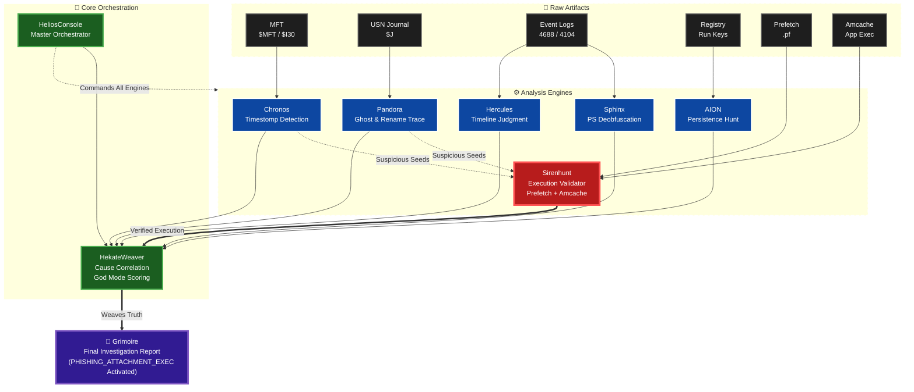

# SkiaHelios: Advanced DFIR Artifact Correlation Engine


**"Truth is a multi-layered tapestry. Weave it."**

SkiaHelios is a modular Digital Forensics & Incident Response (DFIR) framework designed to correlate disparate artifacts (Timeline, Registry, Network, USN Journal, SRUM, Prefetch) into a single, cohesive narrative. SkiaHelios reconstructs the *context* of user activity and generates professional, SANS-style investigation reports automatically.

**Current Version:** v1.8 (God Mode Final)

---

## 🏛️ Architecture & Workflow

SkiaHelios uses a **"Seed & Hunt"** architecture. Instead of processing logs linearly, it identifies potential threats (Seeds) in filesystem anomalies and "hunts" for their execution evidence across other artifacts.



---

## ⚡ Key Features (v1.8 God Mode)

* **🛡️ Precision Over Recall (適合率重視):**
    * 厳格なスコアリングロジックにより、正規プロセス（LOLBins）やWindows Updateの残骸などのノイズを徹底排除。
    * **"Criticality >= 90"** の確実な脅威のみを技術詳細に記載。
* **🏹 SirenHunt Integration (New!):**
    * **Seed Harvesting:** Chronos (MFT) と Pandora (USN) から「不審なファイル操作（リネーム、タイムスタンプ偽装）」を抽出。
    * **Execution Validation:** 抽出されたSeedが実際に実行されたかを **Prefetch** と **Amcache** で裏取り（Cross-Validation）。
    * **Signature Verification:** デジタル署名の有無を確認し、署名のない不審な実行ファイルを「確定クロ」としてマーク。
* **📝 Dynamic Attack Flow Generation:**
    * イベントカテゴリを解析し、攻撃のストーリーライン（侵入→実行→隠滅）をExecutive Summaryに自動生成。
* **🦁 Sphinx v1.9 Integration:**
    * PowerShell ScriptBlock (EID 4104) のBase64/XOR難読化を自動解除し、攻撃意図を可視化。

---

## 🛠️ Modules Overview

| Module | Role | Key Function |
| :--- | :--- | :--- |
| **SH_HeliosConsole** | Orchestrator | Pipeline & Timekeeper management. (指揮・統合) |
| **SH_Sirenhunt** | **Hunter** | **Cross-validates seeds from MFT/USN with Prefetch & Amcache.** (物理的実行証明) |
| **SH_HekateWeaver** | Weaver | Noise filtering & Grimoire generation. (相関分析・レポート作成) |
| **SH_HerculesReferee**| Judge | Sniper scanning & Verdict execution. (イベントログ判定) |
| **SH_Chronos** | Timekeeper | MFT Analysis & Timestomp detection ($SI < $FN). (時間異常検知) |
| **SH_Pandora** | Necromancer| USN Journal analysis for deleted/renamed files. (削除・痕跡復元) |
| **SH_SphinxDeciphering**| Decoder | PowerShell/Process deobfuscation. (難読化解除) |

---

## 🚀 Usage

### 1. Prerequisites
```bash
pip install -r requirements.txt
```

### 2. Execution (Helios Console v4.0)
```powershell
python SH_HeliosConsole.py --dir "C:\Case\KAPE_CSV" --raw "C:\Case\Raw_Artifacts"
```

**Arguments:**
* `--dir`: Path to KAPE module outputs (CSV files).
* `--raw`: Path to KAPE targets (Raw artifacts).
* `--mount`: (Optional) Mount Point for SHA256 hashing.
* `--start / --end`: (Optional) Time filter (YYYY-MM-DD).

### 3. Output (The Grimoire)
The **`Grimoire_[CaseName]_[Lang].md`** provides:
* **Executive Summary:** Attack flow and compromised accounts (w/ Verdict Flags like `[PHISHING_ATTACHMENT_EXEC]`).
* **Origin Analysis:** Correlation between File Drop, Web History, and Execution.
* **Timeline:** Phase-based chronological narrative.
* **Technical Findings:** Validated evidence (Score >= 90).

---

*Verified by SkiaHelios v1.8 (2025)*
