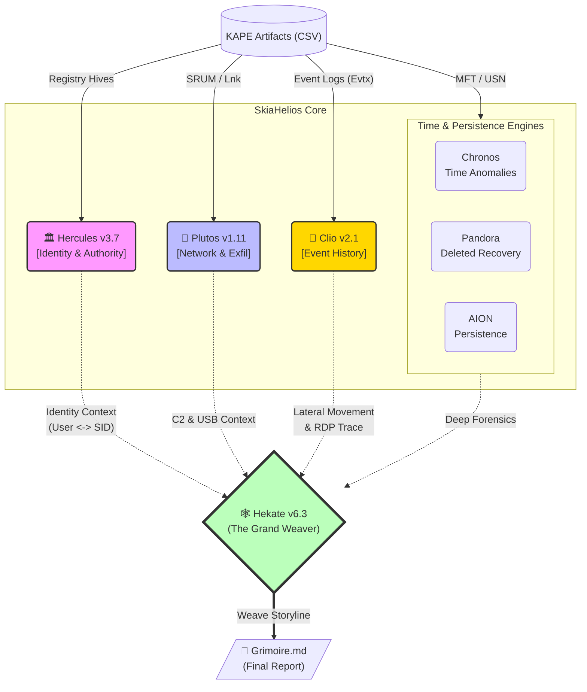

# SkiaHelios: Advanced DFIR Artifact Correlation Engine


**"Truth is a multi-layered tapestry."**

SkiaHelios is a modular Digital Forensics & Incident Response (DFIR) framework designed to correlate disparate artifacts (Timeline, Registry, Network, USN Journal) into a single, cohesive narrative. Unlike traditional parsers that output isolated CSVs, SkiaHelios reconstructs the *context* of user activity.

---

## 🧩 Architecture



---

## 🚀 Key Features & Updates

### 🏛️ Hercules: The Judge (v3.7 [Omnivore])
* **Oracle Mk.II Logic**: Automatically resolves the "Missing Link" between Username (`user`) and SID (`S-1-5-21...`) using heuristic inference, even when explicit mapping artifacts are fragmented.
* **Omnivore Capability**: No longer reliant on specific filenames. Hercules now scans *all* KAPE registry outputs to find identity mappings (`ProfileImagePath`), ensuring successful integration regardless of KAPE module naming.
* **Authority Audit**: Instantly detects Privilege Escalation and high-risk group modifications.

### 📜 Clio: The Historian (v2.1 [Event Walker])
* **Lateral Movement Tracking**: Correlates Security Event Logs (`4624`, `4648`) to visualize RDP and network logins.
* **Execution Trace**: Parses Process Creation events (`4688`) to identify tools executed by the attacker.
* **Log Gap Detection**: Identifies potential "Log Clearing" events (`1102`) or suspicious gaps in the timeline.

### 💸 Plutos: Network & Exfiltration Hunter (v1.11 [Net Clipper])
* **"Ex Umbra in Solem"**: Illuminates hidden data paths.
* **Dual-Core Analysis**: Correlates USB insertion events (`Lnk`/`LECmd`) with Network Traffic statistics (`SRUM`).
* **Time Clipper**: Implements strict time-window filtering to eliminate historical noise and focus on the incident timeframe.
* **Heuristic C2 Detection**: Calculates variance in traffic volume to identify potential C2 beacons and heavy data exfiltration.

### 🕸️ Hekate: The Grand Weaver (v6.3 [Final Fix])
* **Grimoire Generation**: Weaves all findings into a single, high-level Markdown report (`Grimoire.md`).
* **Storyline Fusion**: Merges Timeline, Web History, ShellBags, and Persistence artifacts into a chronological narrative.
* **Multilingual Support**: Fully supports Japanese and English reporting.

---

## 📂 Directory Structure

```text
SkiaHelios/
├── SH_HeliosConsole.py       # [ENTRY POINT] Main Command Console
├── README.md                 # This file
├── tools/
│   ├── SH_HerculesReferee.py # Identity & Privilege Audit Logic
│   ├── SH_Clioget.py         # Event Log Analyzer (Security/System)
│   ├── SH_PlutosGate.py      # Network & USB Exfiltration Analyzer
│   ├── SH_HekateWeaver.py    # Report Generator
│   ├── SH_Chronos.py         # Timestamp Anomaly Detector
│   ├── SH_Pandora.py         # Deleted File Recovery (USN/MFT)
│   ├── SH_AION_Detector.py   # Persistence Mechanism Hunter
│   └── ...
└── Helios_Output/            # Generated Reports & CSVs
```

---

## ⚡ Usage

### 1. Pre-processing (KAPE)
SkiaHelios requires CSV artifacts generated by **KAPE**. Ensure your KAPE targets include:
* **Registry**: `BasicSystemInfo`, `Software_ProfileList` (or `RECmd` equivalent).
* **FileSystem**: `MFT`, `J` ($UsnJrnl), `Lnk`.
* **Network**: `SRUM` (SrumECmd).
* **EventLogs**: `EvtxECmd` (Security, System, RDP).

**Recommended KAPE Module Command:**
```powershell
kape.exe --tsource C: --tdest C:\Temp\kape --target RegistryHives,FileSystem,EventLogs --module RECmd_BasicSystemInfo,RECmd_UserActivity,SrumECmd,EvtxECmd --mdest C:\Temp\out --vss
```

### 2. Execution (Helios Console)
Run the main console to trigger the full analysis pipeline.

```powershell
# Basic Run (Auto-detects artifacts in folder)
python SH_HeliosConsole.py

# Arguments will be prompted interactively:
# [?] KAPE Output Directory: C:\Temp\out
# [?] Start Time (Optional): 2025-12-01
```

### 3. Output
The tool generates a **`Grimoire_YYYYMMDD_jp.md`** report in the output directory.
* **Identity Summary**: Merged User/SID table.
* **Executive Summary**: Critical anomaly counts.
* **Storyline**: Time-sorted sequence of events.

---

## 📜 License
This project is for educational and DFIR training purposes.
Use responsibly during authorized investigations and CTFs.