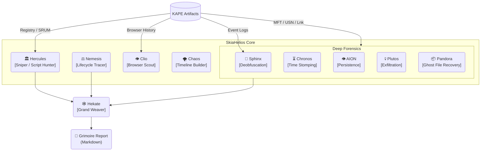

# SkiaHelios: Advanced DFIR Artifact Correlation Engine


**"Truth is a multi-layered tapestry. Weave it."**

SkiaHelios is a modular Digital Forensics & Incident Response (DFIR) framework designed to correlate disparate artifacts (Timeline, Registry, Network, USN Journal, SRUM) into a single, cohesive narrative. Unlike traditional parsers that output isolated CSVs, SkiaHelios reconstructs the *context* of user activity and generates professional, SANS-style investigation reports automatically.

**Current Version:** v17.0 (Core) / v15.37 (Hekate) / v4.0 (Console)

---

## ⚡ Key Features (v17 Update)

* **🛡️ Precision Over Recall (適合率重視):**
    * 厳格なスコアリングロジックにより、正規プロセス（LOLBins）やWindows Updateの残骸などのノイズを徹底排除。
    * **"Criticality >= 90"** の確実な脅威のみを技術詳細に記載。
* **📝 Dynamic Attack Flow Generation:**
    * イベントカテゴリ（Initial Access, Persistence, C2, etc.）を解析し、攻撃のストーリーラインをExecutive Summaryに自動生成。
* **🦁 Sphinx v1.9 Integration:**
    * PowerShell (EID 4104) / Process (EID 4688) の高度な解析。
    * Base64/XOR難読化の自動解除と、相対パスを含むスクリプト実行の検知。
* **🕸️ Nemesis Lifecycle Tracing:**
    * イベントログに残らない「ファイルの誕生・変名・削除」をUSNジャーナル/MFTから芋づる式に復元。
* **🎮 Helios Console v4.0:**
    * CLI引数 (`--start`, `--end`) の完全サポートと、各モジュールへの適切なフィルタ分配。

---

## 🧩 Architecture



---

## 🚀 Usage

### 1. Prerequisites
```bash
pip install -r requirements.txt
```

### 2. Execution (Helios Console v4.0)
The orchestrator ensures the correct execution order for **Project: CERBERUS** (Pandora Intel -> Hercules Sniper -> Deep Forensics -> Hekate Weaver).

```powershell
python SH_HeliosConsole.py --dir "C:\Case\KAPE_CSV" --raw "C:\Case\Raw_Artifacts" --start 2025-12-01 --end 2025-12-31
```

**Arguments:**
* `--dir`: Path to KAPE module outputs (CSV files).
* `--raw`: Path to KAPE targets (Raw artifacts like History files).
* `--mft`: (Optional) Direct path to MFT CSV.
* `--mount`: (Optional) Mount Point (e.g., `E:\`) for SHA256 hashing by AION.
* `--start / --end`: (Optional) Time filter (YYYY-MM-DD).
* `--case`: Case name for the report header.

### 3. Output (The Grimoire)
The **`Grimoire_[CaseName]_[Lang].md`** is an actionable report ready for submission.

* **Executive Summary:** High-level attack flow and conclusion.
* **Investigation Timeline:** Phase-based chronological events.
* **Technical Findings:** High-confidence artifacts (Score >= 90) with decoded commands and original paths.

---

## 🛠️ Modules Overview

| Module | Role | Key Function |
| :--- | :--- | :--- |
| **SH_HeliosConsole** | Orchestrator | Manages the pipeline and time filters (Timekeeper). |
| **SH_HekateWeaver** | Reporter | Correlates all findings, filters noise, generates the Grimoire. |
| **SH_HerculesReferee**| Judge | Analyzes Event Logs and Registry to verify execution verdicts. |
| **SH_SphinxDeciphering**| Decoder | Deep parsing of PowerShell/Process logs, Base64 deobfuscation. |
| **SH_AIONDetector** | Persistence | Scans Registry (Run/RunOnce) and Startup folders. |
| **SH_PandorasLink** | Recovery | Identifies deleted files (Ghosts) via USN/MFT analysis. |
| **SH_ChronosSift** | Anti-Forensics | Detects Time Stomping anomalies ($SI < $FN). |
| **SH_PlutosGate** | Network | Analyzes SRUM and Event Logs for C2/Exfiltration. |

---

> *"Non-rational thinking is a vice; rational thinking is a virtue."*