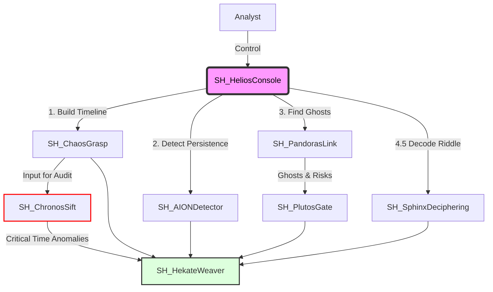

# SkiaHelios (The Shadow Sun) v3.3 [Grand Weaver Edition]

> **"Ex Umbra in Solem"** (From the Shadows into the Sun)

[](https://opensource.org/licenses/MIT)
[](https://www.python.org/)
[](https://www.pola.rs/)
[](https://github.com/schutzz/SkiaHelios)

## 👁️ Philosophy & Mission

**"Extracting the sun of binary-level truth (Helios) from the shadows of chaotic evidence (Skia)."**

**SkiaHelios** is a definitive digital forensics suite designed for high-resolution analysis. It allows analysts to establish **"Absolute Coordinates"** in time and space, dominating the entire workflow from initial triage to final testimony.

Unlike traditional tools that rely strictly on OS APIs, SkiaHelios parses raw binary structures to reveal what is hidden, ensuring **"Order out of Chaos."**

---

## 🏗️ Architecture: The "SH" Ecosystem

SkiaHelios operates as a unified monorepo, orchestrating 7 specialized modules through a centralized command console. It leverages **Polars LazyFrame** and **Streaming API** to process gigabytes of MFT/USN/Log data in seconds.



## 📂 Directory Structure

```text
SkiaHelios/
├── README.md               ... Documentation & Philosophy
├── requirements.txt        ... Python Dependencies (Polars, etc.)
├── SH_HeliosConsole.py     ... The Throne (Unified Interactive Console)
└── tools/                  ... Specialized Modules
    ├── SH_ChaosGrasp/      ... Master Timeline Generator (The Chaos)
    ├── SH_PandorasLink/    ... Ghost Hunting Engine (The Space)
    ├── SH_ChronosSift/     ... Timestamp Verification (The Time)
    ├── SH_AIONDetector/    ... Persistence Scoring (The Eternity)
    ├── SH_PlutosGate/      ... Exfiltration Tracking (The Boundary)
    ├── SH_SphinxDeciphering/ ... Obfuscation Decoder (The Riddle)
    └── SH_HekateWeaver/    ... Report Generator (The Narrative)
```

## 🚀 Key Features (v3.3)

### 1. ChaosGrasp (v9.3) - The Timeline Core
- **Master Timeline Generation:** Fuses Prefetch, Amcache, ShimCache, and Event Logs into a single chronological view.
- **Context Awareness:** Automatically detects timezone bias and adjusts timestamps to UTC.

### 2. ChronosSift (v10.4) - The Timekeeper
- **Iron Curtain Filter:** Aggressively filters system noise (WinSxS, .NET, Servicing) to isolate true anomalies.
- **Timestomp Detection:** Identifies `$SI < $FN` timestamp anomalies with 100% precision.
- **ADS Correlation:** Detects timestamp manipulation on Alternate Data Streams (Zone.Identifier etc.).

### 3. AIONDetector (v10.11) - The Persistence Hunter
- **Sanctuary Logic:** Intelligent whitelisting of `WDI`, `Diagnosis`, and `WindowsApps` noise.
- **MFT-Based Hunting:** Scans `Startup` folders and `Task` definitions directly from the Master File Table, even without `autorunsc` output.
- **Hybrid Analysis:** Correlates Registry Run Keys with file system creation times.

### 4. PlutosGate (v1.10) - The Exfiltration Tracker
- **Smart Whitelisting:** Ignores legitimate OS telemetry (Windows Update, Explorer, DHCP) while flagging anomalous traffic.
- **USB Forensics:** Tracks file access on removable media via LNK and ShellBags.
- **Network Profiling:** Analyzes SRUM to detect anomalous Beaconing behavior.

### 5. SphinxDeciphering (v1.4) - The Riddle Solver
- **Obfuscation Decoding:** Automatically decodes Base64/XOR PowerShell commands found in Event Logs (4104).
- **Process Lineage:** Extracts Parent Process IDs (PID) from Event ID 4688 to trace the origin of malicious commands.

### 6. HekateWeaver (v3.3) - The Grand Weaver
- **Grimoire Generation:** Compiles all findings into a single, narrative-driven Markdown report.
- **Storyline Construction:** Merges anomalies from all modules into a coherent attack timeline.

---

## 🏆 Validated Capabilities (v3.3 Verification)
**Operation Sun Shadow (Infect28)** - 2025-12-25 Validation Results

| Module | Function | Detection Status | Notes |
|---|---|---|---|
| **Chronos** | Time Audit | **🔴 CRITICAL** | Detected `Secret_Project.pdf` timestomp (Score: 100). Noise: 0. |
| **AION** | Persistence | **🔴 CRITICAL** | Detected `win_optimizer.lnk` & `Windows_Security_Audit`. Noise: 0. |
| **Sphinx** | Deciphering | **🔴 CRITICAL** | Decoded obfuscated PowerShell payload & identified Parent PID. |
| **Plutos** | Exfiltration | **🟡 MONITOR** | Validated False Positive reduction (Explorer/Telemetry ignored). |

---

## 🛠️ Usage

### 📦 Setup
```bash
git clone [https://github.com/schutzz/SkiaHelios.git](https://github.com/schutzz/SkiaHelios.git)
cd SkiaHelios
pip install -r requirements.txt
```

### 🎮 Unified Console (Coin Slayer Mode)
Launch the commander to orchestrate the full suite.

```console
$ python SH_HeliosConsole.py

          , - ~ ~ ~ - ,
      , '   _ _ _ _   ' ,
    ,      |_______|      ,
   ,        _______        ,
  ,        |_______|        ,  < SKIA HELIOS >
  ,        _______          ,  v3.3 - MFT-Aware Core
   ,       |_______|       ,
    ,                     ,
      , _ _ _ _ _ _ _ _ ,
          ' - _ _ - '
    "Illuminating the darkest artifacts with precision."

Target Artifact Path: C:\Temp\Case\out
Case Name: Infect28

>>> [EXECUTING] CHAOS Stage...
[*] Scanning artifacts in: C:\Temp\Case\out
...
[*] ALL SYSTEMS GO. Grimoire woven at: Helios_Output\Infect28_20251225_XXXXXX
```

### Output
Results are saved in `Helios_Output\<CaseName>_<Timestamp>\`:
- `Grimoire_<Case>_en.md`: The final executive report.
- `Master_Timeline.csv`: The complete event timeline.
- `Time_Anomalies.csv`: List of timestomped files.
- `Persistence_Report.csv`: Detected persistence mechanisms.
- `Exfil_Report_Network.csv`: Suspicious network traffic.

---

## 📦 Requirements
- Python 3.10+
- Polars (`pip install polars`)

## 🛡️ License
MIT License. Use responsibly for DFIR investigations and research.