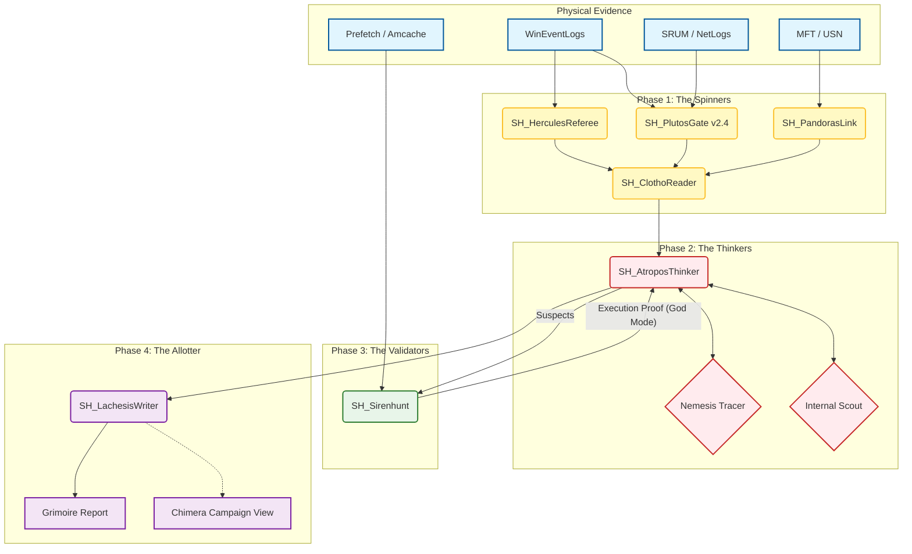

# SkiaHelios v1.9 - God Mode (Internal Scout Edition)

> *"Order restored. Truth revealed. The borders are internal."*

**SkiaHelios** is an advanced, automated DFIR (Digital Forensics & Incident Response) framework designed for high-resolution artifact correlation. It weaves together disparate logs into a single, cohesive narrative of the attack.

**Current Version:** v1.9 (Internal Scout / Triad Refactor)

---

## 🏛️ Architecture & Workflow (The Triad)

SkiaHelios operates on the **"Seed & Hunt"** architecture. It doesn't just parse logs; it traces the *physical causality* of an attack across the file system, network, and execution artifacts.



---

## ⚡ Key Features (v1.9 Updates)

### 1. Internal Scout & Lateral Movement Detection
The Gatekeeper (**Plutos**) has turned its eyes inward.
* **RFC1918 Patrol:** Automatically identifies internal IPs (10.x, 172.16.x, 192.168.x) and differentiates them from external C2.
* **Admin Share Watch:** Detects lateral tool drops into `\\*\C$`, `\\*\ADMIN$`, or `\\*\IPC$`.
* **SRUM Burst Scout:** Flags "Internal Burst Transfers" (>50MB) even without IP logs, exposing data staging via SMB/WMI.
* **Lateral Scoring:** Complex scoring engine for RDP, WMI, PsExec, and WinRM usage patterns.

### 2. The Hekate Triad (Modular Core)
The monolithic correlation engine (`HekateWeaver`) has been refactored into three goddesses for maximum scalability:
* **🧶 Clotho (The Reader):** Normalizes and ingests all artifact streams.
* **✂️ Atropos (The Thinker):** The brain. Handles correlation, `Nemesis` tracing, and `Siren` validation integration.
* **✍️ Lachesis (The Writer):** Weaves the final verdict into a SANS-style markdown report.

### 3. God Mode Validation (Siren Integration)
* **Execution Proof:** Cross-references file system events with **Prefetch** and **Amcache** via `SH_Sirenhunt`.
* **Anti-False Positive:** Only flags artifacts that *actually executed*, reducing analyst fatigue.

---

## 🛠️ Modules Overview

| Module | Role | Key Function |
| :--- | :--- | :--- |
| **SH_PlutosGate** | Network Hunter | **(v2.4)** Internal Scout, C2 detection, Lateral Movement scoring. |
| **SH_HerculesReferee** | EventLog Sniper | **(v3.6)** Identity tracking, Script block analysis, Hostname extraction. |
| **SH_PandorasLink** | File System Tracer | USN/MFT analysis for file drops and deletions (Timestomping detection). |
| **SH_ChronosSift** | Time Anomaly | `$SI < $FN` timestamp comparison for NTFS timestomping. |
| **SH_Sirenhunt** | Validator | Verifies execution using Prefetch/Amcache ("Did it run?"). |
| **SH_HekateWeaver** | Orchestrator | **(v16.0)** The Triad controller. Merges all above into the `Grimoire`. |

---

## 🚀 Usage

### Standard Analysis (Single Host)
```bash
# Run the Triad Controller (Hekate)
python tools/SH_HekateWeaver.py \
  --input "KAPE/Timeline.csv" \
  --plutos "KAPE/Plutos_Report.csv" \
  --pandora "KAPE/Pandora_Ghosts.csv" \
  --siren "KAPE/Siren_Hunt.json" \
  --out "Reports/Grimoire_HostA.md" \
  --case "Operation Chimera"
```

### Network & Lateral Hunting (Plutos Standalone)
```bash
# Scan for Lateral Movement & Internal Exfiltration
python tools/SH_PlutosGate.py \
  --dir "KAPE_Output/" \
  --pandora "KAPE/Pandora_Ghosts.csv" \
  --out "Lateral_Report.csv"
```

---

## 🔮 Roadmap: Project Chimera
* **SH_ChimeraFusion:** Multi-host report integration (Coming Soon).
* **Attack Graph:** Visualizing lateral movement paths across the network.

---
*Powered by Python, Polars, and Paranoia.*
