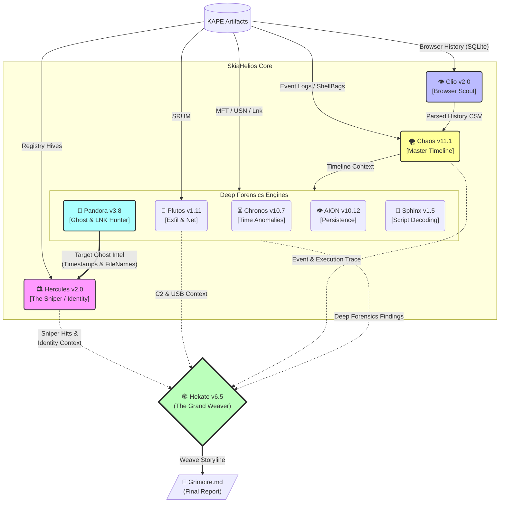

# SkiaHelios: Advanced DFIR Artifact Correlation Engine


**"Truth is a multi-layered tapestry."**

SkiaHelios is a modular Digital Forensics & Incident Response (DFIR) framework designed to correlate disparate artifacts (Timeline, Registry, Network, USN Journal) into a single, cohesive narrative. Unlike traditional parsers that output isolated CSVs, SkiaHelios reconstructs the *context* of user activity.

---

## 🧩 Architecture



---

## 🚀 Key Features & Updates

### 🏛️ Hercules: The Judge (v2.0 [Sniper Edition])
* **Sniper Mode**: Focuses on the ±5-minute window of "Ghost Timestamps" identified by Pandora. Automatically correlates file deletions with USB insertion events (EID: 6416/2003) and process executions (EID: 4688).
* **Oracle Mk.II Logic**: Heuristically resolves the "Missing Link" between Usernames and SIDs using ProfileList scanning.
* **Authority Audit**: Instantly detects Privilege Escalation and activity from deleted user accounts.

### 👻 Pandora: Ghost Recovery (v3.8 [The Missing Link])
* **Intelligent Noise Reduction**: Zero-cost filtering of massive FP noise from Splunk (`.tsidx`), Browser Cache, and Windows Update logs based on physical pathing.
* **LNK Destruction Detection**: Specifically targets the deletion of `.lnk` files in `Recent` and `Desktop` folders, flagging them as `LNK_DEL` to reveal evidence destruction attempts.
* **Gap Analysis**: Reconstructs "Ghost" artifacts (deleted/hidden) using MFT/USN Journal differential analysis.

### 🕸️ Hekate: The Grand Weaver (v6.5 [Cerberus Integration])
* **Grimoire Generation**: Automatically weaves findings into a high-resolution Markdown report.
* **Storyline Fusion**: Prioritizes `SNIPER_HIT` alerts to visualize the direct link between physical file manipulation and event logs.
* **Multilingual Engine**: Full support for Japanese and English reporting.

### 💸 Plutos: Network & Exfiltration Hunter (v1.11)
* **Heuristic C2 Detection**: Calculates traffic variance to identify stealthy C2 beacons and bulk data exfiltration.
* **USB & Net Correlation**: Bridges the gap between USB mounting and SRUM network statistics.

---

## 📂 Directory Structure

```text
SkiaHelios/
├── SH_HeliosConsole.py       # [ENTRY POINT] Pipeline Orchestrator (v1.2)
├── README.md                 # This file
├── tools/
│   ├── SH_PandorasLink.py        # File System Ghost Hunter (v3.8)
│   ├── SH_HerculesReferee.py     # Sniper Event Auditor (v2.0)
│   ├── SH_HekateWeaver.py        # Report Generator (v6.5)
│   ├── SH_ChaosGrasp.py      # Master Timeline & Event Log Analyzer
│   ├── SH_ClioGet.py         # Browser History Extractor (SQLite)
│   ├── SH_PlutosGate.py      # Network & USB Exfiltration Analyzer
│   ├── SH_ChronosSift.py     # Timestamp Anomaly Detector
│   ├── SH_AIONDetector.py    # Persistence Mechanism Hunter
│   ├── SH_SphinxDeciphering.py # Obfuscation Decoder
│   └── ...
└── Helios_Output/            # Final Reports & Evidence CSVs
```

---

## ⚡ Usage

### 1. Execution (Helios Console v1.2)
The orchestrator ensures the correct execution order for **Project: CERBERUS** (Pandora Intel -> Hercules Sniper).

```powershell
python SH_HeliosConsole.py -k <KAPE_DIR> -t <TIMELINE_CSV> -o <OUT_DIR> --start YYYY-MM-DD --end YYYY-MM-DD
```

**Pipeline Flow:**
1.  **Pandora**: Identifies suspicious deleted files and LNK destruction.
2.  **Hercules**: Sniper-scans Event Logs using Pandora's timestamp intel.
3.  **Hekate**: Weaves all findings into the final Grimoire report.

### 2. Output Highlights
The **`SkiaHelios_Report.md`** exposes critical tactical indicators:
* **LNK_DEL**: Intentional destruction of file access evidence.
* **SNIPER_HIT**: Confirmed correlation between physical file action and Event Log entry.
* **EXEC**: Execution trace of a confirmed "Ghost" file.

---

## 📜 License
This project is for educational and DFIR training purposes.
Use responsibly during authorized investigations and CTFs.
