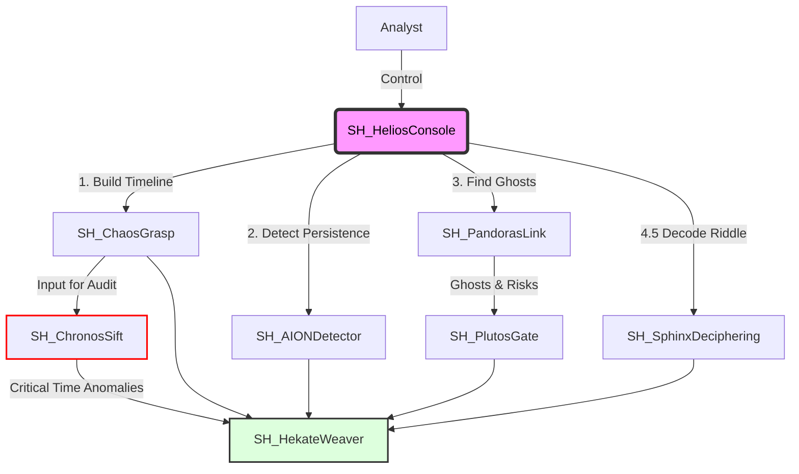

# SkiaHelios (The Shadow Sun) v3.5 [Grand Weaver Edition]

> **"Ex Umbra in Solem"** (From the Shadows into the Sun)

[](https://opensource.org/licenses/MIT)
[](https://www.python.org/)
[](https://www.pola.rs/)
[](https://github.com/schutzz/SkiaHelios)

## 👁️ Philosophy & Mission

**"Extracting the sun of binary-level truth (Helios) from the shadows of chaotic evidence (Skia)."**

**SkiaHelios** is a definitive digital forensics suite designed for high-resolution analysis. It allows analysts to establish **"Absolute Coordinates"** in time and space, dominating the entire workflow from initial triage to final testimony.

Unlike traditional tools that rely strictly on OS APIs, SkiaHelios parses raw binary structures to reveal what is hidden, ensuring **"Order out of Chaos."**

---

## 🏗️ Architecture: The "SH" Ecosystem

SkiaHelios operates as a unified monorepo, orchestrating 7 specialized modules through a centralized command console. It leverages **Polars LazyFrame** and **Streaming API** to process gigabytes of MFT/USN/Log data in seconds.



## 📂 Directory Structure

```text
SkiaHelios/
├── README.md               ... Documentation & Philosophy
├── requirements.txt        ... Python Dependencies (Polars, etc.)
├── SH_HeliosConsole.py     ... The Throne (Unified Interactive Console)
└── tools/                  ... Specialized Modules
    ├── SH_ChaosGrasp/      ... Master Timeline Generator (The Chaos)
    ├── SH_PandorasLink/    ... Ghost Hunting Engine (The Space)
    ├── SH_ChronosSift/     ... Timestamp Verification (The Time)
    ├── SH_AIONDetector/    ... Persistence Scoring (The Eternity)
    ├── SH_PlutosGate/      ... Exfiltration Tracking (The Boundary)
    ├── SH_SphinxDeciphering/ ... Obfuscation Decoder (The Riddle)
    └── SH_HekateWeaver/    ... Report Generator (The Narrative)
```

## 🚀 Key Features (v3.5)

### 0. Time Clipper (New in v3.4)
- **Surgical Filtering:** Allows analysts to specify an incident time window (Start/End).
- **Noise Elimination:** Instantly cuts out years of irrelevant logs from "dirty" environments, isolating only the incident artifacts.

### 1. ChaosGrasp (v9.3) - The Timeline Core
- **Master Timeline Generation:** Fuses Prefetch, Amcache, ShimCache, and Event Logs into a single chronological view.
- **Context Awareness:** Automatically detects timezone bias and adjusts timestamps to UTC.

### 2. ChronosSift (v10.7) - The Timekeeper
- **Sanctuary Update:** Whitelists known forensic tools (`/Tools/`, `FTK Imager`) to prevent false positives in analysis environments.
- **Anomaly Bypass:** Force-includes critical timestomp artifacts (Score > 80) even if they fall outside the specified Time Clipper range.
- **Timestomp Detection:** Identifies `$SI < $FN` timestamp anomalies with precision.

### 3. AIONDetector (v10.12) - The Persistence Hunter
- **MFT-Based Hunting:** Scans `Startup` folders and `Task` definitions directly from the Master File Table.
- **Hybrid Analysis:** Correlates Registry Run Keys with file system creation times.
- **Time Keeper:** Applies time filtering to persistence artifacts to identify recent implants.

### 4. PlutosGate (v1.11) - The Exfiltration Tracker
- **Smart Whitelisting:** Ignores legitimate OS telemetry while flagging anomalous traffic.
- **USB Forensics:** Tracks file access on removable media via LNK and ShellBags.
- **Net Clipper:** Profiles network traffic (SRUM) within the incident window.

### 5. SphinxDeciphering (v1.5) - The Riddle Solver
- **Obfuscation Decoding:** Automatically decodes Base64/XOR PowerShell commands found in Event Logs (4104).
- **Process Lineage:** Extracts Parent Process IDs (PID) from Event ID 4688.

### 6. HekateWeaver (v3.5) - The Grand Weaver
- **Script Hunter:** Aggressively scans command-line arguments for hidden script executions (`.ps1`, `.bat`, `.vbs`).
- **Grimoire Generation:** Compiles all findings into a single, narrative-driven Markdown report ready for professional review.

---

## 🏆 Validated Capabilities
**Operation Apple of Discord (Dirty Environment Test)** - 2025-12-25 Validation Results

| Module | Function | Detection Status | Notes |
|---|---|---|---|
| **Time Clipper** | Noise Filtering | **🟢 SUCCESS** | Reduced 10,000+ artifacts to 99 relevant events in a dirty environment. |
| **Chronos** | Sanctuary | **🟢 SUCCESS** | Successfully ignored legacy forensic tools while flagging critical anomalies. |
| **Sphinx** | Decoding | **🔴 CRITICAL** | Decoded obfuscated PowerShell dropper (`HostApplication=...`). |
| **AION** | Persistence | **🔴 CRITICAL** | Detected `Trigger3.lnk` in Startup folder. |
| **Plutos** | Exfiltration | **🔴 CRITICAL** | Identified `Cleanup.ps1` and data staging folders. |

---

## 🛠️ Usage

### 📦 Setup
```bash
git clone [https://github.com/schutzz/SkiaHelios.git](https://github.com/schutzz/SkiaHelios.git)
cd SkiaHelios
pip install -r requirements.txt
```

### 🎮 Unified Console (Coin Slayer Mode)
Launch the commander to orchestrate the full suite.

```console
$ python SH_HeliosConsole.py

Target Artifact Path: C:\Temp\Case\out
Case Name: AppleOfDiscord
Start Date [Enter to skip]: 2025-12-25 00:00:00
End Date   [Enter to skip]: 2025-12-25 23:59:59

>>> [EXECUTING] CHAOS Stage...
...
[*] ALL SYSTEMS GO. Grimoire woven at: Helios_Output\AppleOfDiscord_20251225_XXXXXX
```

### Output
Results are saved in `Helios_Output\<CaseName>_<Timestamp>\`:
- `Grimoire_<Case>_<Lang>.md`: The final executive report (EN/JP).
- `Master_Timeline.csv`: The complete event timeline.
- `Time_Anomalies.csv`: List of timestomped files.
- `Persistence_Report.csv`: Detected persistence mechanisms.
- `Exfil_Report_Network.csv`: Suspicious network traffic.

---

## 📦 Requirements
- Python 3.10+
- Polars (`pip install polars`)
- python-docx (Optional, for report conversion)

## 🛡️ License
MIT License. Use responsibly for DFIR investigations and research.