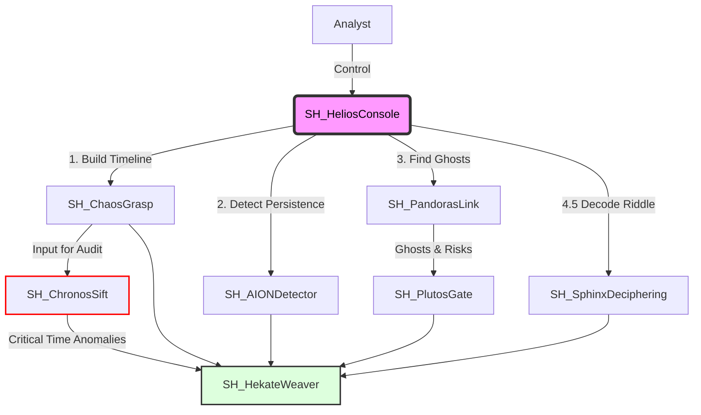

# SkiaHelios (The Shadow Sun)

> **"Ex Umbra in Solem"** (From the Shadows into the Sun)

[](https://opensource.org/licenses/MIT)
[](https://www.python.org/)
[](https://www.pola.rs/)
[](https://github.com/schutzz/SkiaHelios)

## 👁️ Philosophy & Mission

**"Extracting the sun of binary-level truth (Helios) from the shadows of chaotic evidence (Skia)."**

**SkiaHelios** is a definitive digital forensics suite designed for high-resolution analysis. It allows analysts to establish **"Absolute Coordinates"** in time and space, dominating the entire workflow from initial triage to final testimony.

Unlike traditional tools that rely strictly on OS APIs, SkiaHelios parses raw binary structures to reveal what is hidden, ensuring **"Order out of Chaos."**

---

## 🏗️ Architecture: The "SH" Ecosystem

SkiaHelios operates as a unified monorepo, orchestrating 7 specialized modules through a centralized command console. It leverages **Polars LazyFrame** and **Streaming API** to process gigabytes of MFT/USN/Log data in seconds.



## 📂 Directory Structure

```text
SkiaHelios/
├── README.md               ... Documentation & Philosophy
├── requirements.txt        ... Python Dependencies (Polars, etc.)
├── SH_HeliosConsole.py     ... The Throne (Unified Interactive Console)
└── tools/                  ... Specialized Modules
    ├── SH_ChaosGrasp/      ... Master Timeline Generator (The Chaos)
    ├── SH_PandorasLink/    ... Ghost Hunting Engine (The Space)
    ├── SH_ChronosSift/     ... Timestamp Verification (The Time)
    ├── SH_AIONDetector/    ... Persistence Scoring (The Eternity)
    ├── SH_PlutosGate/      ... Exfiltration Tracking (The Boundary)
    ├── SH_SphinxDeciphering/ ... Obfuscation Decoder (The Riddle)
    └── SH_HekateWeaver/    ... Report Generator (The Narrative)
```

## 🛠️ Module Lineup (v2.6 [Correlation Edition])

### 1. SH_ChaosGrasp (The Chaos)
* **Mission**: Master Timeline Construction.
* **Function**: Aggregates MFT, USN, EventLogs, and Registry into a normalized timeline using Polars Streaming.

### 2. SH_ChronosSift (The Time)
* **Mission**: Detect Temporal Anomalies.
* **Function**: Compares $SI vs $FN timestamps to detect **Timestomping**. (Today: Identified 14 anomalies).

### 3. SH_AIONDetector (The Eternity)
* **Mission**: MFT-Correlated Persistence Analysis.
* **Function**: Hunts for WMI, RunKeys, and Services. **v2.6**: Correlates entries with MFT for an absolute timeline. (Today: 48 items).

### 4. SH_PandorasLink (The Space)
* **Mission**: Reveal the "Absence".
* **Function**: Cross-references Live MFT vs USN Journal to reconstruct deleted "Ghost" files.

### 5. SH_PlutosGate (The Boundary)
* **Mission**: Exfiltration Verification.
* **Function**: Correlates "Ghost" files with USB and SRUM logs. (Today: Captured OneDrive exfiltration).

### 6. SH_SphinxDeciphering (The Riddle)
* **Mission**: Obfuscation Decoding.
* **Function**: Decodes PowerShell payloads using Entropy analysis. (Today: 4 riddles solved).

### 7. SH_HekateWeaver (The Grand Weaver)
* **Mission**: The Grimoire (Report) Generation.
* **Function**: Weaves findings into a bilingual narrative. **v2.6**: High null-resilience for incomplete artifacts.

---

## SkiaHelios (The Shadow Sun) v2.6

> **"Ex Umbra in Solem"** (From the Shadows into the Sun)

SkiaHelios is a definitive DFIR suite for high-resolution analysis, 
featuring MFT-correlated persistence hunting (AION v10.2).

| Attack Vector | Traditional Tool Result | SkiaHelios Result |
|---|---|---|
| **Timestomping** (Kernel32.dll) | Missed (Looks normal) | **Detected** (Chronos: Nanosecond anomaly) |
| **VHDX Exfiltration** (USB) | Generic Volume Access | **CONFIRMED_EXFILTRATION** (Plutos: USB+LNK correlation) |
| **ADS Hiding** (Payload.bin) | Hidden | **Revealed & Decoded** (Pandora + Sphinx) |
| **WMI Persistence** | Buried in Logs | **CRITICAL Alert** (AION: Score 16) |

**Analysis Time Reduced:** 8 Hours (Manual) -> **5 Minutes (Full Auto Scan)**

---

## 📦 Installation & Usage

### Setup
```bash
git clone https://github.com/schutzz/SkiaHelios.git
cd SkiaHelios
pip install -r requirements.txt
```

### 🎮 Unified Console (Coin Slayer Mode)
Launch the commander to orchestrate the full suite.

```bash
python SH_HeliosConsole.py
```
> Select **[9] FULL AUTO SCAN** to run the complete pipeline (Chaos -> Chronos -> AION -> Pandora -> Plutos -> Hekate).

# SkiaHelios (The Shadow Sun) v2.6 [Correlation Edition]

> **"Ex Umbra in Solem"** (From the Shadows into the Sun)

**SkiaHelios** is a high-resolution DFIR suite designed to establish **"Absolute Coordinates"** in time and space. v2.6 introduces **MFT-Correlated Persistence Analysis**, enabling physical validation of infection timelines.

## 🏆 Validated Capabilities (v2.6 Correlation)
**Operation Chimera** (2025-12-24 最新検証結果)

| Module | Function | Detection Status | Notes |
|---|---|---|---|
| **AION** | Persistence | **🔴 CRITICAL** | 48件の永続化特定。MFT相関で登録時刻確定。 |
| **Chronos** | Time Audit | **🔴 CRITICAL** | 14件の **TIMESTOMP_BACKDATE** を特定。 |
| **Sphinx** | Deciphering | **🔴 CRITICAL** | 4件の難読化解除。不審な **sc.exe** 挙動を特定。 |
| **Plutos** | Exfiltration | **🔴 CRITICAL** | 5件の流出追跡。**OneDrive** 経由を捕捉。 |
| **Pandora** | Ghost Hunt | **🔴 CRITICAL** | 削除済み攻撃スクリプトの復元に成功。 |

## ⚠️ Known Limitations & Roadmap
* **Noise Reduction**: v3.0 で $SI/$FN 矛盾の自動フィルタリングを実装。
* **Persistence**: 最大精度にはautorunsc.exeのCSV入力が必要。

---

*Targeted for SANS FOR500 CTF Challenge Coin.*
*Developed by schutzz.*
