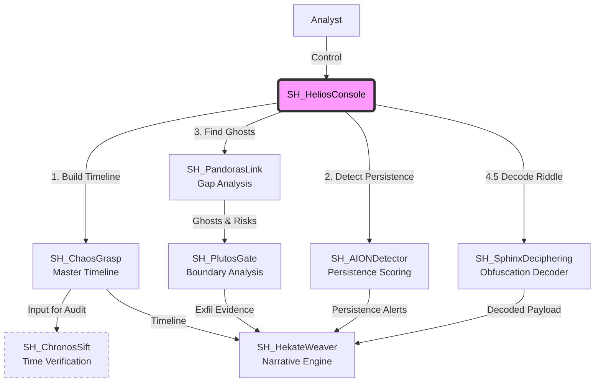

# SkiaHelios (The Shadow Sun)

> **"Ex Umbra in Solem"** (From the Shadows into the Sun)

[](https://opensource.org/licenses/MIT)
[](https://www.python.org/)
[](https://www.pola.rs/)
[](https://github.com/schutzz/SkiaHelios)

## 👁️ Philosophy & Mission

**"Extracting the sun of binary-level truth (Helios) from the shadows of chaotic evidence (Skia)."**

**SkiaHelios** is a definitive digital forensics suite designed for high-resolution analysis. It allows analysts to establish **"Absolute Coordinates"** in time and space, dominating the entire workflow from initial triage to final testimony.

Unlike traditional tools that rely strictly on OS APIs, SkiaHelios parses raw binary structures to reveal what is hidden, ensuring **"Order out of Chaos."**

---

## 🏗️ Architecture: The "SH" Ecosystem

SkiaHelios operates as a unified monorepo, orchestrating 7 specialized modules through a centralized command console. It leverages **Polars LazyFrame** and **Streaming API** to process gigabytes of MFT/USN/Log data in seconds.



## 📂 Directory Structure

```text
SkiaHelios/
├── README.md               ... Documentation & Philosophy
├── requirements.txt        ... Python Dependencies (Polars, etc.)
├── SH_HeliosConsole.py     ... The Throne (Unified Interactive Console)
└── tools/                  ... Specialized Modules
    ├── SH_ChaosGrasp/      ... Master Timeline Generator (The Chaos)
    ├── SH_PandorasLink/    ... Ghost Hunting Engine (The Space)
    ├── SH_ChronosSift/     ... Timestamp Verification (The Time)
    ├── SH_AIONDetector/    ... Persistence Scoring (The Eternity)
    ├── SH_PlutosGate/      ... Exfiltration Tracking (The Boundary)
    ├── SH_SphinxDeciphering/ ... Obfuscation Decoder (The Riddle)
    └── SH_HekateWeaver/    ... Report Generator (The Narrative)
```

## 🛠️ Module Lineup (v2.3)

### 1. SH_ChaosGrasp (The Chaos)
* **Mission**: Master Timeline Construction.
* **Function**: Aggregates disparate artifacts (MFT, USN, EventLogs, Prefetch, Registry) into a single, normalized timeline using Polars Streaming.

### 2. SH_ChronosSift (The Time)
* **Mission**: Detect Temporal Anomalies.
* **Function**: Compares `$STANDARD_INFORMATION` vs `$FILE_NAME` timestamps at nanosecond precision to detect **Timestomping**.

### 3. SH_AIONDetector (The Eternity)
* **Mission**: Persistence Analysis.
* **Function**: Hunts for persistence mechanisms (WMI, RunKeys, Services) and scores them based on "Live off the Land" (LoLBin) usage.

### 4. SH_PandorasLink (The Space)
* **Mission**: Reveal the "Absence".
* **Function**: Cross-references **Live MFT** vs **USN Journal** vs **VSS** to reconstruct deleted "Ghost" files and tag them with risk levels.

### 5. SH_PlutosGate (The Boundary)
* **Mission**: Exfiltration Verification.
* **Function**: Correlates "Ghost" files with **USB connection history** and **Network traffic** to prove data exfiltration (e.g., files accessed on mounted VHDX).

### 6. SH_SphinxDeciphering (The Riddle)
* **Mission**: Obfuscation Decoding.
* **Function**: Decodes obfuscated PowerShell scripts and ADS payloads using Entropy analysis, Base64/Gzip decompression, and string peeling.

### 7. SH_HekateWeaver (The Grand Weaver)
* **Mission**: The Grimorie (Report) Generation.
* **Function**: Weaves all findings into a human-readable Markdown report. Supports **Bilingual Output (EN/JP)** for team consensus.

---

## 🦁 The "Chimera" Benchmark

SkiaHelios has been rigorously tested against **"The Chimera"** - a custom Atomic Red Team scenario designed to defeat traditional forensics.

| Attack Vector | Traditional Tool Result | SkiaHelios Result |
|---|---|---|
| **Timestomping** (Kernel32.dll) | Missed (Looks normal) | **Detected** (Chronos: Nanosecond anomaly) |
| **VHDX Exfiltration** (USB) | Generic Volume Access | **CONFIRMED_EXFILTRATION** (Plutos: USB+LNK correlation) |
| **ADS Hiding** (Payload.bin) | Hidden | **Revealed & Decoded** (Pandora + Sphinx) |
| **WMI Persistence** | Buried in Logs | **CRITICAL Alert** (AION: Score 16) |

**Analysis Time Reduced:** 8 Hours (Manual) -> **5 Minutes (Full Auto Scan)**

---

## 📦 Installation & Usage

### Setup
```bash
git clone https://github.com/schutzz/SkiaHelios.git
cd SkiaHelios
pip install -r requirements.txt
```

### 🎮 Unified Console (Coin Slayer Mode)
Launch the commander to orchestrate the full suite.

```bash
python SH_HeliosConsole.py
```
> Select **[9] FULL AUTO SCAN** to run the complete pipeline (Chaos -> Chronos -> AION -> Pandora -> Plutos -> Hekate).

---

*Targeted for SANS FOR500 CTF Challenge Coin.*
*Developed by schutzz.*
