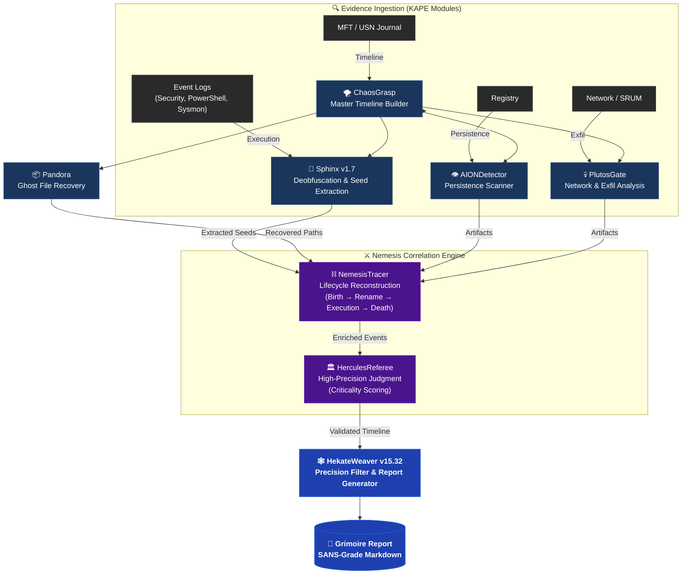

# SkiaHelios: Advanced DFIR Artifact Correlation Engine


**"Truth is a multi-layered tapestry. Weave it."**

SkiaHelios is a modular Digital Forensics & Incident Response (DFIR) framework designed to correlate disparate artifacts (Timeline, Registry, Network, USN Journal, SRUM) into a single, cohesive narrative. SkiaHelios reconstructs the *context* of user activity and generates professional, SANS-style investigation reports automatically.

**Current Version:** v17.0 (Core) / v15.37 (Hekate) / v4.0 (Console)

---

## ⚡ Key Features (v17 Update)

* **🛡️ Precision Over Recall (適合率重視):**
    * 厳格なスコアリングロジックにより、正規プロセス（LOLBins）やWindows Updateの残骸などのノイズを徹底排除。
    * **"Criticality >= 90"** の確実な脅威のみを技術詳細に記載。
* **📝 Dynamic Attack Flow Generation:**
    * イベントカテゴリを解析し、攻撃のストーリーラインをExecutive Summaryに自動生成。
* **🦁 Sphinx v1.9 Integration:**
    * PowerShell (4104) / Process (4688) のBase64難読化を自動解除し、相対パス実行も検知。
* **🕸️ Nemesis Lifecycle Tracing:**
    * MFT/USNから「ファイルの誕生・変名・削除」を芋づる式に完全復元。

---

## 🧩 Architecture: The Cerberus Pipeline



---

## 🚀 Usage

### 1. Prerequisites
```bash
pip install -r requirements.txt
```

### 2. Execution (Helios Console v4.0)
```powershell
python SH_HeliosConsole.py --dir "C:\Case\KAPE_CSV" --raw "C:\Case\Raw_Artifacts" --start 2025-12-01 --end 2025-12-31
```

**Arguments:**
* `--dir`: Path to KAPE module outputs (CSV files).
* `--raw`: Path to KAPE targets (Raw artifacts).
* `--mount`: (Optional) Mount Point for SHA256 hashing.
* `--start / --end`: (Optional) Time filter (YYYY-MM-DD).

### 3. Output (The Grimoire)
The **`Grimoire_[CaseName]_[Lang].md`** provides:
* **Executive Summary:** Attack flow and compromised accounts.
* **Timeline:** Phase-based chronological narrative.
* **Technical Findings:** Validated evidence (Score >= 90).

---

## 🛠️ Modules Overview

| Module | Role | Key Function |
| :--- | :--- | :--- |
| **SH_HeliosConsole** | Orchestrator | Pipeline & Timekeeper management. |
| **SH_HekateWeaver** | Weaver | Noise filtering & Grimoire generation. |
| **SH_HerculesReferee**| Judge | Sniper scanning & Verdict execution. |
| **SH_SphinxDeciphering**| Decoder | PowerShell/Process deobfuscation. |
| **SH_AIONDetector** | Persistence | Registry & Startup folder scanning. |
| **SH_PandorasLink** | Recovery | Deleted file (Ghost) identification. |
| **SH_ChronosSift** | Anti-Forensics | Timestomp anomaly detection. |
| **SH_PlutosGate** | Network | SRUM & C2 beacon analysis. |

---

> *"Non-rational thinking is a vice; rational thinking is a virtue."*
