# SkiaHelios v4.50 - The Causality & Justice Engine


> *"From Shadows to Sun. From Data to Gold."*
> *"We don't just read logs; we judge them."*

**SkiaHelios** is a high-resolution, modular DFIR (Digital Forensics & Incident Response) framework built for **speed**, **causality**, **origin tracing**, and **visual narrative**.

Unlike traditional monolithic tools, it uses a specialized **"Triad Architecture" (Clotho-Atropos-Lachesis)** supported by **"Chronos" (The Time Lord)**, **"Hercules" (The Referee)**, and the newly evolved **"Tartaros" (Story Inference)** to detect advanced anti-forensics techniques like **Time Paradoxes (System Rollbacks)** and **File Masquerading**.

**Current Version:** v4.50 (Operation Justice / Time Paradox / Deep LNK Hunter)

---

## 🏛️ Architecture Overview

```mermaid
graph TD
    %% Define Styles
    classDef input fill:#e1f5fe,stroke:#01579b,stroke-width:2px;
    classDef engine fill:#fff3e0,stroke:#ff6f00,stroke-width:2px;
    classDef judge fill:#ffebee,stroke:#b71c1c,stroke-width:3px;
    classDef report fill:#f3e5f5,stroke:#4a148c,stroke-width:2px;

    %% Input Stage
    Input[("KAPE Artifacts\n(CSV)")]:::input --> Clotho[("🌀 Clotho\n(Ingestion)")]:::engine
    
    %% Analysis Stage (Themis Logic)
    Clotho --> Atropos{{"⚖️ Atropos\n(Logic & Routing)"}}:::engine
    Rules[("📜 Themis Rules\n(YAML)")] -.-> Atropos
    
    %% Specialized Modules
    Atropos --> Chronos["⏳ Chronos\n(Time Lord)\nDetects Time Paradox"]:::judge
    Atropos --> Pandora["📦 Pandora\n(File & Masquerade)"]:::engine
    Atropos --> Hercules["⚖️ Hercules\n(Justice V3 Engine)\nLNK & CRX Hunter"]:::judge
    Atropos --> Aion["👁️ AION\n(Persistence)"]:::engine
    
    %% Origin Tracing
    LNKs["Phishing LNKs"] -.-> Tartaros["⛓️ Tartaros v3.0\n(Story Inference)"]:::engine
    History["Browser History"] -.-> Tartaros
    Tartaros --> Lachesis
    
    %% Reporting Stage
    Chronos --> Lachesis[("🕸️ Lachesis\n(Allotter)\nCausality Repair")]:::report
    Pandora --> Lachesis
    Hercules --> Lachesis
    Aion --> Lachesis
    
    %% Output
    Lachesis --> Report[("📜 Grimoire.md\n(Narrative Report)")]:::report
    Lachesis --> Pivot[("🎯 Pivot_Config.json\n(Deep Dive)")]:::report
    Lachesis --> Mermaid[("📊 Attack Flow\n(Visual Graph)")]:::report
```



---

## 🚀 Module Breakdown & Features

### 1. The Triad Architecture (Time, Space, Narrative)
* **Clotho (Parser):** High-speed ingestion of KAPE artifacts (MFT, USN, EventLogs, Registry) using Rust-based Polars. Optimized for large datasets (millions of rows).
* **Atropos (Analyzer):** "Themis" rule-based logic to cut the thread of life (separate Signal from Noise). Uses a dual-pass scoring system.
* **Lachesis (Weaver):** Generates the "Grimoire" (Report) with **Smart Scope Calculation** (Auto-detecting incident window) and **Visual IOCs**.
    * **Dynamic Analyst Notes (v4.50):** Automatically generates human-readable insights explaining *why* an artifact is critical (e.g., *"LNK targets PowerShell execution"*).
    * **Causality Visualization:** Annotates "Fake Time" nodes in Mermaid graphs when Time Paradox is detected.

### 2. The Judges (Chronos & Hercules) - **[NEW]**
* **Chronos (The Time Lord):**
    * **Time Paradox Detection:** Detects system clock rollbacks (Timestomping) by analyzing USN Journal physical offsets versus timestamps.
    * **Rollback Calculation:** precise calculation of the time delta (e.g., `-35997 seconds`).
* **Hercules (The Referee - Justice V3):**
    * **LNK Malice Hunter:** Parses LNK Target Paths and Arguments to detect PowerShell/CMD attacks. Visualizes the actual command line.
    * **Masquerade Killer:** Instantly identifies `.crx` backdoors hiding in non-browser directories (e.g., Adobe Reader folders).
    * **Strict Evidence Hierarchy:** Eliminates "Dual-Use Tool" false positives by demanding execution evidence (Prefetch/Process) before flagging.

### 3. Intelligent Noise Filtering (Hestia)
* **Hestia (Gatekeeper):** Aggressive whitelisting of OS noise.
* **Robust Noise Filter (v4.50):** Regex-based sanitization of `Windows\Notifications`, `INetCache`, and `Temp` folders to remove 99% of false positives.
* **Inverted Tool Filter:** Whitelists known binaries inside tool folders (e.g., `C:\Program Files\`). Anything else is flagged.

### 4. Origin Tracing (Tartaros v3.0)
* **Tartaros (The Story Inference Engine):** Connects isolated artifacts back to their source using advanced heuristics.
    * **Hybrid Matching:** Combines Direct Name Match with Time Cluster Inference.
    * **Time Clustering:** Infers origin even if filenames change by correlating access times with browser download clusters.
    * **Output:** Populates the **Initial Access Vector** section with precise URLs and time-gap analysis.

### 5. Identity & Context Awareness
* **Registry Sovereign:** Parses `SOFTWARE` hive directly to identify OS Version (e.g., *Windows 8.1 Enterprise Build 9600*).
* **Sniper Mode:** Correlates `UserAssist` and `ShellBags` to identify the "Patient Zero" user.

---

## 🛠️ Installation & Configuration

### Prerequisites
* Python 3.10+
* Polars (`pip install polars`)
* Pandas (`pip install pandas`) - *Legacy support*
* Colorama (`pip install colorama`)

### Configuration (`triage_rules.yaml`)
SkiaHelios uses an external configuration file for "Themis" rules.
```yaml
dual_use_tools:
  - teamviewer
  - nmap
  - anydesk
  - mimikatz
  # Add tools here to prevent them from being filtered
```

### Standard Triage Execution
To run the full pipeline including **Justice V3 Engine** and **Time Paradox Detection**:

```bash
python SH_HekateTriad.py \
  --case "Case2_Incident_X" \
  --outdir "C:\Work\Case2\Helios_Output" \
  --timeline "C:\Work\Case2\KAPE\Timeline.csv" \
  --kape "C:\Work\Case2\KAPE\Registry_Dump"
```

### Deep Dive (Pivot)
After Triage, use the generated `Pivot_Config.json` to investigate specific targets:

```bash
python SH_HeliosConsole.py --deep "Helios_Output\Case2\Pivot_Config.json"
```

---

## 📜 Complete Changelog

### v4.50 - Operation Justice (Current) ⚖️
* **[Critical]** **Time Paradox Detection:** Implemented USN Journal rollback logic in `Chronos`. Physically proves if the attacker rolled back the system clock.
* **[Critical]** **Justice V3 Engine:**
    * **LNK Enrichment:** `Target_Path` and Arguments are now visualized in the summary (e.g., `🎯 Target: cmd.exe /c powershell...`).
    * **CRX Detection:** Strict whitelist-based masquerade detection for Chrome Extensions.
    * **Evidence Hierarchy:** Scores are now weighted by Execution (Prefetch) vs Existence (File).
* **[Report]** **Dynamic Analyst Notes:** Lachesis now generates specific insights for each threat type.
* **[Core]** **Robust Noise Filter:** Regex-based cleaning of `Notifications` and `Cache` folders.

### v4.43 - The Story Inference Update
* **[Tartaros]** Upgraded to **v3.0 Story Inference Mode**. Implemented "Time Cluster" logic.
* **[Lachesis]** Implemented **Deep History Hunter**: Recursive disk scanning for Browser History.

### v4.32 - The Robustness Update
* **[Core]** Removed all silent `try-except-pass` blocks.
* **[Lachesis]** **Scope Self-Correction:** Calculation of incident window now includes "Visual IOCs".

### v4.28 - The Synapse (Tartaros Integration)
* **[Logic]** Implemented memory-to-memory data passing between Lachesis and Tartaros.
* **[Report]** "Initial Access Vector" section now displays download URLs.

### v4.25 - The Critical Bypass
* **[Logic]** Artifacts with Score >= 250 or "MASQUERADE" tag now **bypass** the Hestia noise filter.

### v4.20 - Hercules "The Sovereign"
* **[Hercules]** Added native Registry parsing for OS identification.

### v4.12 - The Silencer (Legacy)
* **[Hestia]** Introduced "Inverted Tool Filter".
* **[Chronos]** 95% noise reduction in timeline generation.

### v4.0 - Two-Pass Strategy (Legacy)
* **[Architecture]** Split Pandora into Pass 1 (Triage) and Pass 2 (Deep Dive).

---

## 🔮 Roadmap

* [x] **v1.0:** Core Logic (Clotho/Atropos/Lachesis)
* [x] **v1.9:** Internal Scout & Lateral Movement Logic (Chimera)
* [x] **v2.0:** Visual Reporting (Mermaid Integration)
* [x] **v2.5:** Modular Architecture (Nemesis/Themis)
* [x] **v2.7:** AION-Sigma Integration
* [x] **v4.0:** **Hestia Censorship & Two-Pass Strategy**
* [x] **v4.12:** System Silencer & Inverted Filters
* [x] **v4.20:** Registry-based OS Identity (Hercules)
* [x] **v4.28:** Origin Tracing (Tartaros)
* [x] **v4.32:** **Robustness & Full JSON/Pivot Export**
* [x] **v4.43:** **Tartaros v3.0 (Story Inference) & Deep Hunter**
* [x] **v4.50:** **Operation Justice (Time Paradox & Masquerade Killer)**
* [ ] **v5.0:** **"Nemesis" (Automated Remediation Suggestion)** - *Planned*
* [ ] **v5.x:** **LLM Integration** (Auto-summarization of Technical Findings) - *Planned*

---

## ⚠️ Known Issues & Solutions

* **Encoding:** Some KAPE CSVs use inconsistent encoding (UTF-8 vs CP1252). Tartaros v1.3+ now attempts `utf-8`, `utf-8-sig`, and `cp1252` automatically.
* **Mermaid Rendering:** Special characters in filenames (e.g., `{}`) previously broke graphs. Lachesis v4.31+ sanitizes these to `()` automatically.
* **Polars Version:** Requires Polars 0.20+ for `read_csv` compatibility.

---

*Powered by Python, Polars, and Paranoia.*