# SkiaHelios: Advanced DFIR Artifact Correlation Engine


**"Truth is a multi-layered tapestry."**

SkiaHelios is a modular Digital Forensics & Incident Response (DFIR) framework designed to correlate disparate artifacts (Timeline, Registry, Network, USN Journal) into a single, cohesive narrative. Unlike traditional parsers that output isolated CSVs, SkiaHelios reconstructs the *context* of user activity.

---

## 🧩 Architecture

```mermaid
graph TD
    %% Input Layer
    Input[("KAPE Artifacts")] -->|"Registry Hives"| Hercules
    Input -->|"Browser History (SQLite)"| Clio
    Input -->|"Event Logs / ShellBags"| Chaos
    Input -->|"MFT / USN / Lnk"| Engines
    Input -->|"SRUM"| Plutos

    %% Processing Layer (The Pantheon)
    subgraph SkiaHelios Core
        direction TB
        Clio("👁️ Clio v2.0<br/>[Browser Scout]")
        Chaos("🌪️ Chaos v11.1<br/>[Master Timeline]")
        Hercules("🏛️ Hercules v3.7<br/>[Identity & Authority]")
        
        subgraph Engines [Deep Forensics Engines]
            Plutos("💸 Plutos v1.11<br/>[Exfil & Net]")
            Chronos("⏳ Chronos v10.7<br/>[Time Anomalies]")
            Pandora("👻 Pandora v3.6<br/>[Ghost Recovery]")
            AION("👁️ AION v10.12<br/>[Persistence]")
            Sphinx("🦁 Sphinx v1.5<br/>[Script Decoding]")
        end
    end

    %% Logic Flow
    Clio -->|"Parsed History CSV"| Chaos
    Chaos -->|"Timeline Context"| Hercules
    Chaos -->|"Timeline Context"| Engines
    
    Hercules -.->|"Identity Context<br/>(User <-> SID)"| Hekate
    Plutos -.->|"C2 & USB Context"| Hekate
    Chaos -.->|"Event & Execution Trace"| Hekate
    Engines -.->|"Deep Forensics Findings"| Hekate

    %% Output Layer
    Hekate{"🕸️ Hekate v6.3<br/>(The Grand Weaver)"}
    Hekate ==>|"Weave Storyline"| Report[/"📜 Grimoire.md<br/>(Final Report)"/]

    %% Styling
    style Hercules fill:#f9f,stroke:#333,stroke-width:2px
    style Chaos fill:#ff9,stroke:#333,stroke-width:2px
    style Clio fill:#bbf,stroke:#333,stroke-width:2px
    style Hekate fill:#bfb,stroke:#333,stroke-width:4px
```



---

## 🚀 Key Features & Updates

### 🏛️ Hercules: The Judge (v3.7 [Omnivore])
* **Oracle Mk.II Logic**: Automatically resolves the "Missing Link" between Username (`user`) and SID (`S-1-5-21...`) using heuristic inference.
* **Omnivore Capability**: Scans *all* KAPE registry outputs to find identity mappings (`ProfileList`), ensuring successful integration regardless of KAPE module naming.
* **Authority Audit**: Instantly detects Privilege Escalation, deleted user activity, and high-risk group modifications.

### 🌪️ Chaos: The Timekeeper (v11.1 [Identity Correction])
* **Master Timeline**: Ingests Event Logs, ShellBags, Prefetch, and Web History to construct a unified chronological view.
* **Lateral Movement**: Correlates Security Event Logs (`4624`, `4648`) to visualize RDP and network logins.
* **Execution Trace**: Parses Process Creation events (`4688`) and Prefetch to identify tools executed by the attacker.

### 👁️ Clio: The Browser Scout (v2.0 [Native SQLite])
* **Native Parsing**: Directly parses Chrome/Edge/Brave `History` SQLite databases (locked files supported via temp copy).
* **History Extraction**: Extracts URLs, page titles, and timestamps to feed the Chaos timeline.
* **Profile Awareness**: Distinguishes between different browser profiles and users.

### 💸 Plutos: Network & Exfiltration Hunter (v1.11 [Net Clipper])
* **Dual-Core Analysis**: Correlates USB insertion events (`Lnk`/`LECmd`) with Network Traffic statistics (`SRUM`).
* **Time Clipper**: Implements strict time-window filtering to focus on the incident timeframe.
* **Heuristic C2 Detection**: Calculates variance in traffic volume to identify potential C2 beacons and heavy data exfiltration.

### 🕸️ Hekate: The Grand Weaver (v6.3 [Final Fix])
* **Grimoire Generation**: Weaves all findings into a single, high-level Markdown report (`Grimoire.md`).
* **Storyline Fusion**: Merges Timeline, Web History, ShellBags, and Persistence artifacts into a chronological narrative.
* **Multilingual Support**: Fully supports Japanese and English reporting.

### 🔮 Advanced Engines
* **⏳ Chronos (v10.7)**: Detects timestomping (`$SI` < `$FN`) and zero-precision anomalies in MFT.
* **👁️ AION (v10.12)**: Correlates Autoruns with MFT timestamps to identify persistence in "Hotspot" directories.
* **👻 Pandora (v3.6)**: Recovers "Ghost" files (deleted/hidden) using USN Journal and VSS gap analysis.
* **🦁 Sphinx (v1.5)**: Decodes obfuscated PowerShell/Base64 scripts found in Event Logs while preserving process context.

---

## 📂 Directory Structure

```text
SkiaHelios/
├── SH_HeliosConsole.py       # [ENTRY POINT] Main Command Console (Dual Path System)
├── README.md                 # This file
├── tools/
│   ├── SH_ChaosGrasp.py      # Master Timeline & Event Log Analyzer
│   ├── SH_HerculesReferee.py # Identity & Privilege Audit Logic
│   ├── SH_ClioGet.py         # Browser History Extractor (SQLite)
│   ├── SH_PlutosGate.py      # Network & USB Exfiltration Analyzer
│   ├── SH_HekateWeaver.py    # Report Generator
│   ├── SH_ChronosSift.py     # Timestamp Anomaly Detector
│   ├── SH_PandorasLink.py    # Deleted File Recovery (USN/MFT/VSS)
│   ├── SH_AIONDetector.py    # Persistence Mechanism Hunter
│   ├── SH_SphinxDeciphering.py # Obfuscation Decoder
│   └── ...
└── Helios_Output/            # Generated Reports & CSVs
```

---

## ⚡ Usage

### 1. Pre-processing (KAPE)
SkiaHelios requires CSV artifacts generated by **KAPE**. Ensure your KAPE targets include:
* **Registry**: `BasicSystemInfo`, `Software_ProfileList`, `NTUSER`, `Amcache`.
* **FileSystem**: `MFT`, `J` ($UsnJrnl), `Lnk`.
* **Network**: `SRUM` (SrumECmd).
* **EventLogs**: `EvtxECmd` (Security, System, RDP, PowerShell).
* **Browsers**: `Chrome`, `Edge` (History files - Raw or Parsed).

**Recommended KAPE Module Command:**
```powershell
kape.exe --tsource C: --tdest C:\Temp\kape --target RegistryHives,FileSystem,EventLogs,WebBrowsers --module RECmd_BasicSystemInfo,RECmd_UserActivity,SrumECmd,EvtxECmd --mdest C:\Temp\out --vss
```

### 2. Execution (Helios Console)
Run the main console to trigger the full analysis pipeline.

```powershell
# Basic Run (Auto-detects artifacts in folder)
python SH_HeliosConsole.py

# Arguments will be prompted interactively:
# [1] Parsed CSV Directory: C:\Temp\out  (For Timeline/Reg)
# [2] Raw Artifact Directory: C:\Temp\kape (For Browser History SQLite)
# [?] Case Name: Incident_Alpha
# [?] Start Time (Optional): 2025-12-01
```

### 3. Output
The tool generates a **`Grimoire_YYYYMMDD_jp.md`** report in the output directory.
* **Identity Summary**: Merged User/SID table.
* **Executive Summary**: Critical anomaly counts.
* **Critical Breakdown**: Top hits from AION, Sphinx, Plutos.
* **Storyline**: Time-sorted sequence of events (Top 100).
* **Ghosts**: Recovered deleted artifacts.

---

## 📜 License
This project is for educational and DFIR training purposes.
Use responsibly during authorized investigations and CTFs.