# SkiaHelios v4.43 - The Story Inference Engine (Tartaros v3.0)


> *"From Shadows to Sun. From Data to Gold."*
> *"Tracing the Thread (LNK) back to the Spider (Web)."*

**SkiaHelios** is a high-resolution, modular DFIR (Digital Forensics & Incident Response) framework built for **speed**, **causality**, **origin tracing**, and **visual narrative**.

Unlike traditional monolithic tools, it uses a specialized **"Triad Architecture" (Clotho-Atropos-Lachesis)** supported by **"Hestia" (The Gatekeeper)**, **"Hercules" (The Referee)**, and the newly evolved **"Tartaros" (The Story Inference Engine)** to deconstruct artifacts, trace physical execution chains, and weave a cohesive narrative across multiple hosts.

**Current Version:** v4.43 (Story Inference / Deep Hunter / Hybrid Matching)

---

## 🏛️ Architecture Overview

```mermaid
graph TD
    %% Input Stage
    Input[("KAPE Artifacts\n(CSV)")] --> Clotho[("🌀 Clotho\n(Ingestion)")]
    
    %% Analysis Stage (Themis Logic)
    Clotho --> Atropos{{"⚖️ Atropos\n(Judgment)"}}
    Rules[("📜 Themis Rules\n(YAML)")] -.-> Atropos
    
    %% Specialized Modules
    Atropos --> Chronos["⏳ Chronos\n(Timeline & Timestomp)"]
    Atropos --> Pandora["📦 Pandora\n(File & Masquerade)"]
    Atropos --> Hercules["🦁 Hercules\n(Identity & Registry)"]
    Atropos --> Aion["👁️ AION\n(Persistence)"]
    
    %% Origin Tracing (Evolved in v4.40+)
    LNKs["Phishing LNKs"] -.-> Tartaros["⛓️ Tartaros v3.0\n(Story Inference Engine)"]
    History["Browser History"] -.-> Tartaros
    Tartaros --> Lachesis
    
    %% Reporting Stage
    Chronos --> Lachesis[("🕸️ Lachesis\n(Narrative Weaver)")]
    Pandora --> Lachesis
    Hercules --> Lachesis
    Aion --> Lachesis
    
    %% Output
    Lachesis --> Report[("📜 Grimoire.md\n(Final Report)")]
    Lachesis --> Pivot[("🎯 Pivot_Config.json\n(Deep Dive)")]
    Lachesis --> Mermaid[("📊 Attack Flow\n(Visual Graph)")]
```



---

## 🚀 Module Breakdown & Features

### 1. The Triad Architecture (Time, Space, Narrative)
* **Clotho (Parser):** High-speed ingestion of KAPE artifacts (MFT, USN, EventLogs, Registry) using Rust-based Polars. Optimized for large datasets (millions of rows).
* **Atropos (Analyzer):** "Themis" rule-based logic to cut the thread of life (separate Signal from Noise). Uses a dual-pass scoring system.
* **Lachesis (Weaver):** Generates the "Grimoire" (Report) with **Smart Scope Calculation** (Auto-detecting incident window) and **Visual IOCs**.
    * **Deep History Hunter (v4.40):** Recursively scans the entire KAPE output directory tree to find Browser History CSVs, ensuring no evidence is left behind regardless of folder structure.

### 2. Intelligent Noise Filtering (Hestia)
* **Hestia (Gatekeeper):** Aggressive whitelisting of OS noise.
* **Inverted Tool Filter (v4.12):** Instead of blacklisting garbage, Hestia whitelists known binaries inside tool folders (e.g., `C:\Program Files\`). Anything else is flagged.
* **Result:** 95% noise reduction in Chronos timelines.

### 3. Critical Bypass Logic (v4.25+)
* **Concept:** A safety net for high-threat artifacts that might reside in noisy locations.
* **Mechanism:** Artifacts are exempt from Hestia's filtering if:
    1.  Threat Score >= 250 (Critical)
    2.  Tag contains "MASQUERADE" or "TIMESTOMP"
    3.  Filename matches a "Dual-Use Tool" (e.g., `teamviewer.exe`, `nmap.exe`)
* **Benefit:** Ensures hidden threats in `AppData/.../Notifications/` or `Adobe` folders are reported.

### 4. Origin Tracing (Tartaros v3.0 - Evolved)
* **Tartaros (The Story Inference Engine):** Connects isolated artifacts back to their source using advanced heuristics.
    * **Hybrid Matching:** Combines **Direct Name Match** (High Confidence) with **Time Cluster Inference** (Medium Confidence).
    * **Time Clustering:** Can infer the origin of a file even if the name has changed, by correlating LNK access times with clusters of Browser Download events (Time Window Analysis).
    * **Stem Logic:** Automatically handles browser auto-numbering (e.g., `cat[1].jpg` vs `cat.jpg`) and extension mismatches to robustness linking.
    * **Output:** Populates the **Initial Access Vector** section with precise URLs and time-gap analysis (e.g., *"Gap: 2h 15m"*).

### 5. Identity & Context Awareness (Hercules)
* **Hercules (Referee v4.20):**
    * **Registry Sovereign:** Parses `SOFTWARE` hive directly to identify OS Version (e.g., *Windows 8.1 Enterprise Build 9600*), removing reliance on Event ID 6009.
    * **Sniper Mode:** Correlates `UserAssist` and `ShellBags` with file artifacts to identify the "Patient Zero" user.
* **System Silencer (v4.12):** Identified a "Noise Chain" where Pandora's false positives were correlated with System events. Implemented `S-1-5-18` ignore rules.

### 6. Persistence Detection (AION)
* **AION (The Eye):** Scans Registry Run Keys, Services, and Tasks.
* **Integration:** Cross-references persistence mechanisms with file artifacts found by Pandora.

---

## 🛠️ Installation & Configuration

### Prerequisites
* Python 3.10+
* Polars (`pip install polars`)
* Pandas (`pip install pandas`) - *Legacy support*
* Colorama (`pip install colorama`)

### Configuration (`triage_rules.yaml`)
SkiaHelios uses an external configuration file for "Themis" rules.
```yaml
dual_use_tools:
  - teamviewer
  - nmap
  - anydesk
  - mimikatz
  - procmon
  # Add tools here to prevent them from being filtered
```

### Standard Triage Execution
To run the full pipeline including **Tartaros v3.0** and **Hercules OS Detection**:

```bash
python SH_HekateTriad.py \
  --case "Case2_Incident_X" \
  --outdir "C:\Work\Case2\Helios_Output" \
  --timeline "C:\Work\Case2\KAPE\Timeline.csv" \
  --kape "C:\Work\Case2\KAPE\Registry_Dump"
```

*Note: Hekate/Lachesis will automatically recursively search for `Browser_History` CSVs in the KAPE directory and feed them to Tartaros.*

### Deep Dive (Pivot)
After Triage, use the generated `Pivot_Config.json` to investigate specific targets:

```bash
python SH_HeliosConsole.py --deep "Helios_Output\Case2\Pivot_Config.json"
```

---

## 📜 Complete Changelog

### v4.43 (Current) - The Story Inference Update
* **[Tartaros]** Upgraded to **v3.0 Story Inference Mode**. Implemented "Time Cluster" logic to infer download origins even when file names do not strictly match (e.g., LNK created hours after download).
* **[Tartaros]** Added **Stem Matching** to ignore browser duplicate numbering (e.g., `[1]`) and extension mismatches.
* **[Lachesis]** Implemented **Deep History Hunter (v4.40)**: Recursive disk scanning to locate History CSVs in subdirectories.
* **[Core]** Fixed path relaying between Hekate and Lachesis to ensure remote evidence folders are correctly scanned.

### v4.32 - The Robustness Update
* **[Core]** Removed all silent `try-except-pass` blocks. Errors are now logged with full tracebacks.
* **[Lachesis]** Implemented **Safe Casting** for AION/Chronos scores to prevent `str` vs `int` crashes.
* **[Lachesis]** **Scope Self-Correction:** Calculation of incident window now includes "Visual IOCs" (Bypassed artifacts), fixing "Unknown Range" errors.

### v4.28 - The Synapse (Tartaros Integration)
* **[Module]** Added **TartarosTracer** class.
* **[Logic]** Implemented memory-to-memory data passing between Lachesis and Tartaros for real-time origin analysis (LNK -> URL).
* **[Report]** "Initial Access Vector" section now displays download URLs and source domains.

### v4.25 - The Critical Bypass
* **[Logic]** Implemented **`super_critical`** logic in Lachesis.
    * Artifacts with Score >= 250, "MASQUERADE" tag, or "TIMESTOMP" tag now **bypass** the Hestia noise filter.
    * This ensures hidden threats in noisy folders (e.g., `AppData/.../Notifications/malware.jpg`) are reported.

### v4.20 - Hercules "The Sovereign"
* **[Hercules]** Added native Registry parsing (RECmd output) to identify `ProductName` and `BuildLab`.
* **[Fix]** Fixed OS identification reporting "Unknown" or relying on inconsistent EventLogs.

### v4.12 - The Silencer (Legacy)
* **[Hestia]** Introduced "Inverted Tool Filter" (Whitelisting binaries).
* **[Chronos]** 95% noise reduction in timeline generation.
* **[Plan I]** System Silencer implemented to ignore `S-1-5-18` noise chains.

### v4.1 - Narrative Reporting (Legacy)
* **[Lachesis]** The Editor: Transformed report from "Phonebook of Logs" to "Intelligence Brief".
* **[Config]** Externalized Dual-Use tools to `triage_rules.yaml`.

### v4.0 - Two-Pass Strategy (Legacy)
* **[Architecture]** Split Pandora into Pass 1 (Triage) and Pass 2 (Deep Dive) to resolve dependency deadlocks.

### v2.7 - AION Integration (Legacy)
* **[Module]** AION added for persistence hunting.
* **[Report]** Added DOCX export (Midas Touch) - *Deprecated in v4 in favor of Markdown.*

### v2.0 - Visual Reporting (Legacy)
* **[Feature]** MermaidJS integration for attack flow graphs.

### v1.0 - Core Logic (Legacy)
* **[Core]** Clotho/Atropos/Lachesis trinity established.

---

## 🔮 Roadmap

* [x] **v1.0:** Core Logic (Clotho/Atropos/Lachesis)
* [x] **v1.9:** Internal Scout & Lateral Movement Logic (Chimera)
* [x] **v2.0:** Visual Reporting (Mermaid Integration)
* [x] **v2.5:** Modular Architecture (Nemesis/Themis)
* [x] **v2.7:** AION-Sigma Integration
* [x] **v4.0:** **Hestia Censorship & Two-Pass Strategy** (Deadlock Resolution)
* [x] **v4.12:** System Silencer & Inverted Filters
* [x] **v4.20:** Registry-based OS Identity (Hercules)
* [x] **v4.28:** Origin Tracing (Tartaros)
* [x] **v4.32:** **Robustness & Full JSON/Pivot Export**
* [x] **v4.43:** **Tartaros v3.0 (Story Inference) & Deep Hunter**
* [ ] **v5.0:** **"Nemesis" (Automated Remediation Suggestion)** - *Planned*
* [ ] **v5.x:** **LLM Integration** (Auto-summarization of Technical Findings) - *Planned*

---

## ⚠️ Known Issues & Solutions

* **Encoding:** Some KAPE CSVs use inconsistent encoding (UTF-8 vs CP1252). Tartaros v1.3+ now attempts `utf-8`, `utf-8-sig`, and `cp1252` automatically.
* **Mermaid Rendering:** Special characters in filenames (e.g., `{}`) previously broke graphs. Lachesis v4.31+ sanitizes these to `()` automatically.
* **Polars Version:** Requires Polars 0.20+ for `read_csv` compatibility.

---

*Powered by Python, Polars, and Paranoia.*