# SkiaHelios v5.6 - The Causality & Justice Engine (Account Takeover / Evidence Wiping)


> *"From Shadows to Sun. From Data to Gold."*
> *"We don't just read logs; we judge them."*

**SkiaHelios** is a high-resolution, modular DFIR (Digital Forensics & Incident Response) framework built for **speed**, **causality**, **origin tracing**, and **visual narrative**.

Unlike traditional monolithic tools, it uses a specialized **"Triad Architecture" (Clotho-Atropos-Lachesis)** orchestrated by **"Hekate"**, supported by **"Chronos" (The Time Lord feat. Icarus Paradox)**, **"Hercules" (The Referee)**, the **"PlutosGate" (Network Hunter)**, and the **"YARA WebShell Scanner"** to detect advanced threats including **Account Takeover**, **Privilege Escalation**, **Evidence Wiping**, **Web Intrusion Chains**, and **Cross-Artifact Tampering**.

**Current Version:** v5.6.3 (The Deep Carver: Context Carving & Binary Reporting)

---

## 🏛️ Architecture Overview

```mermaid
graph TD
    %% Define Styles
    classDef input fill:#e1f5fe,stroke:#01579b,stroke-width:2px;
    classDef core fill:#e8f5e9,stroke:#2e7d32,stroke-width:3px;
    classDef engine fill:#fff3e0,stroke:#ff6f00,stroke-width:2px;
    classDef judge fill:#ffebee,stroke:#b71c1c,stroke-width:3px;
    classDef report fill:#f3e5f5,stroke:#4a148c,stroke-width:2px;
    classDef submod fill:#ede7f6,stroke:#512da8,stroke-width:1px,stroke-dasharray: 5 5;

    %% Input Stage
    Input[("KAPE Artifacts\n(CSV)")]:::input --> Hekate{{"🔥 Hekate\n(The Orchestrator)"}}:::core
    
    %% Ingestion & Analysis
    Hekate --> Clotho[("🌀 Clotho\n(Ingestion)")]:::engine
    Clotho --> Atropos{{"⚖️ Atropos\n(High-Speed Logic)"}}:::engine
    Rules[("📜 Themis Rules\n(YAML)")] -.-> Atropos
    
    %% Specialized Modules
    Atropos --> Chronos["⏳ Chronos\n(Time Lord)\nfeat. Icarus Paradox"]:::judge
    Atropos --> Pandora["📦 Pandora\n(File & Masquerade)"]:::engine
    Atropos --> Hercules["⚖️ Hercules\n(Justice V3 Engine)\nLNK & CRX Hunter"]:::judge
    Atropos --> Aion["👁️ AION\n(Persistence)"]:::engine
    Atropos --> Plutos["⚡ PlutosGate\n(Network & Exfil)\nThermodynamics Engine"]:::judge
    
    %% Origin Tracing
    LNKs["Phishing LNKs"] -.-> Tartaros["⛓️ Tartaros v4.1\n(Adaptive Origin Tracing)"]:::engine
    History["Browser History"] -.-> Tartaros
    
    %% Reporting Stage (Modular Lachesis)
    subgraph Lachesis_Module ["🕸️ Lachesis v5.3 (The Weaver)"]
        direction TB
        L_Core[("Core Controller")]:::report
        L_Intel["Intel (Knowledge Base)"]:::submod
        L_Enrich["Enricher (Data Fusion)"]:::submod
        L_Analyzer["Analyzer (Event Scoring)"]:::submod
        L_Render["Renderer (Smart Grouping)"]:::submod
        
        L_Core --> L_Intel
        L_Core --> L_Enrich
        L_Core --> L_Analyzer
        L_Analyzer --> L_Render
    end

    Chronos --> L_Core
    Pandora --> L_Core
    Hercules --> L_Core
    Aion --> L_Core
    Tartaros --> L_Core
    Plutos --> L_Core
    
    %% Output
    L_Render --> Report[("📜 Grimoire.md\n(Narrative Report)")]:::report
    L_Render --> Pivot[("🎯 Pivot_Config.json\n(Deep Dive)")]:::report
    L_Render --> Mermaid[("📊 Attack Flow\n(Visual Graph)")]:::report
```



---

## 🚀 Module Breakdown & Features

### 0. The Orchestrator (Hekate)
* **Hekate (Triad Controller):** The central command unit (`SH_HekateTriad.py`). It orchestrates the flow of data between all modules, manages arguments, and initiates the final reporting phase.

### 1. The Triad Architecture (Time, Space, Narrative)
* **Clotho (Parser):** High-speed ingestion of KAPE artifacts (MFT, USN, EventLogs, Registry, SRUM) using Rust-based Polars. Optimized for large datasets (millions of rows).
* **Atropos (Analyzer):** "Themis" rule-based logic to cut the thread of life (separate Signal from Noise). Uses a dual-pass scoring system.
* **Lachesis (The Weaver - Modular v5.3):** The reporting engine has been refactored into a modular architecture for scalability:
    * **Smart Grouping (v5.2):** Automatically differentiates "High Interest" LNKs (e.g., Confirmed Downloads) from generic noise-like artifacts.
    * **Remediation Engine:** Generates a prioritized "Recommended Actions" table (P0/P1) compliant with NIST SP 800-61.
    * **Enricher:** Fuses data from multiple sources (e.g., matching LNK targets with Process execution).
    * **Renderer:** Generates the "Grimoire" (Markdown) with **Mermaid Visuals** and **Aggregated Critical Tables**.

### 2. The Judges (Chronos, Hercules & Plutos) - **[UPDATED]**
* **Chronos (The Time Lord) feat. Icarus Paradox v1.4:**
    * **Time Paradox Detection:** Detects system clock rollbacks (Timestomping) by analyzing USN Journal physical offsets versus timestamps.
    * **Rollback Calculation:** Precise calculation of the time delta (e.g., `-35997 seconds`).
* **[NEW] Icarus Paradox Engine Integration:**
    * **Cross-Artifact Correlation:** Goes beyond single MFT analysis to cross-check consistency with Prefetch, ShimCache ($AppCompatCache$), and USN Journal.
    * **Sun & Wax Logic:** Defines MFT as the "Immutable Sun" and other artifacts as the "Wax Wings", identifying execution records (paradoxes) that exist before the MFT creation timestamp.
    * **Robust Column Mapping:** Implements aliasing to auto-detect and normalize column name variations (`FileName` vs `Name`, `Created0x10` vs `Timestamp_UTC`) across different parsing tools.
    * **Match Quality Scoring:** Implements confidence-based deduction scoring for matches with missing path information.
* **Hercules (The Referee - Justice V3):**
    * **The Linker (Phase 4):** Correlates file artifacts (LNK, Prefetch) with **Browser History** to confirm "Execution Success" vs "Attempt".
    * **Deep LNK Analysis:** Extracts Target Paths and Arguments to detect **PowerShell encoding**, **Hidden Windows**, and **Script Chaining**.
    * **Anti-Forensics Detection:** Detects usage of wiping tools (e.g., `BCWipe`, `CCleaner`) and flags missing artifacts as "Deleted Evidence".
    * **Masquerade Killer:** Instantly identifies `.crx` backdoors hiding in non-browser directories.
* **PlutosGate (The Network Hunter - v3.4):**
    * **Network Thermodynamics:** Uses **SRUM** to calculate "Heat Scores" based on data burst volume (BytesSent/Received).
    * **Exfil Correlation (The Trinity):** Correlates **SRUM (Heat)**, **Browser History (URL)**, and **MFT (File Creation)** to prove data theft intent.
    * **Email Hunter:** Detects `.pst/.ost` theft (Local MFT scan) and "Sent" actions in Webmail (History scan).
    * **Safe-Mode Map:** Generates Mermaid network topology without encoding errors.

### 3. Intelligent Noise Filtering (Hestia)
* **Hestia (Gatekeeper):** Aggressive whitelisting of OS noise.
* **Robust Noise Filter (v4.50):** Regex-based sanitization of `Windows\Notifications`, `INetCache`, and `Temp` folders to remove 99% of false positives.
* **Inverted Tool Filter:** Whitelists known binaries inside tool folders (e.g., `C:\Program Files\`). Anything else is flagged.

### 4. Origin Tracing (Tartaros v4.1) - **[UPDATED]**
* **Tartaros (The Adaptive Origin Tracer):** Connects isolated artifacts back to their source using advanced heuristics.
    * **Confidence Hierarchy:** Distinguishes between **Confirmed** (ID/Filename Match) and **Inferred** (Temporal Proximity) origins.
    * **Adaptive Time Window:** Allows up to **3 hours gap** for strong ID matches (e.g., specific image IDs in LNKs), while keeping strict windows for generic files.
    * **Honest Reporting:** Explicitly reports `❓ No Trace Found` when evidence is missing, avoiding false positives.
    * **Output:** Populates the **Initial Access Vector** section with precise URLs, Confidence levels, and time-gap analysis.

### 5. Identity & Context Awareness
* **Registry Sovereign:** Parses `SOFTWARE` hive directly to identify OS Version (e.g., *Windows 8.1 Enterprise Build 9600*).
* **Sniper Mode:** Correlates `UserAssist` and `ShellBags` to identify the "Patient Zero" user.

---

## 🛠️ Installation & Configuration

### Prerequisites
* Python 3.10+
* Polars (`pip install polars`)
* Pandas (`pip install pandas`) - *Legacy support*
* Colorama (`pip install colorama`)

### Configuration (`triage_rules.yaml`)
SkiaHelios uses an external configuration file for "Themis" rules.
```yaml
dual_use_tools:
  - teamviewer
  - nmap
  - anydesk
  - mimikatz
  # Add tools here to prevent them from being filtered
```

### Standard Triage Execution
To run the full pipeline including **PlutosGate**, **Justice V3 Engine** and **Time Paradox Detection**:

```bash
python SH_HekateTriad.py \
  --case "Case2_Incident_X" \
  --outdir "C:\Work\Case2\Helios_Output" \
  --timeline "C:\Work\Case2\KAPE\Timeline.csv" \
  --kape "C:\Work\Case2\KAPE\Registry_Dump"
```

### Deep Dive (Pivot)
After Triage, use the generated `Pivot_Config.json` to investigate specific targets:

```bash
python SH_HeliosConsole.py --deep "Helios_Output\Case2\Pivot_Config.json"
```

---

## 📜 Complete Changelog

### v5.6.3 - The Deep Carver (Context & Binary Reporting) 🦁
* **[Chain Scavenger]** **Context Carving:** Now extracts and reports the **Binary Context (Hex Dump)** surrounding carved user accounts. Helps analysts distinguish valid accounts from random data patterns.
* **[Chain Scavenger]** **Relaxed Scavenging:** Regex engine now supports short usernames (3+ chars) to capture elusive accounts like `Gues`, `Adm`, etc.
* **[Lachesis]** **Binary Context Display:** The Analyst Note in the report now natively renders the **Binary Hex Dump** of the carved artifact (`[HEX: 720065...]`).
* **[Hercules]** **Automated Impact Analysis:** Automatically tags `SAM_SCAVENGE` events with `[LOG_WIPE_INDUCED_MISSING_EVENT]` to guide analysts to check for evidence wiping correlations.

### v5.6 - The Dirty Hive Hunter & Justice Refined
* **[Chain Scavenger]** **Dirty Hive Hunter (v1.0):** Binary-level SAM hive analyzer that triggers when RECmd fails. Extracts hidden user accounts from corrupted/dirty hives using "Anchor Search" and "Context Carving".
* **[Chain Scavenger]** **Anchor Extension (v5.6.2):** Enhanced detection using **"Users" key** and **RID-like Hex Patterns** to capture fragmented account traces (e.g., `hacker`) that evade standard parsing.
* **[Hercules]** **User Creation Detection:** Detects `net user /add`, EID 4720 (User Created), EID 4732/4728 (Group Membership), PowerShell `New-LocalUser`.
* **[Hercules]** **Log Deletion Analysis:** Correlates Log Deletion (EID 1102) with missing User Creation events (`[LOG_WIPE_INDUCED_MISSING_EVENT]`).
* **[Hercules]** **Evidence Wiping Detection:** Detects USN Journal deletion (`fsutil usn deletejournal`), MFT manipulation, `cipher /w`.
* **[Hercules]** **Privilege Escalation:** Detects Admin/RDP group additions and SAM registry tampering.
* **[Lachesis]** **Full Bilingual Support:** Grimoire reports now fully localized in English (`--lang en`) and Japanese.
* **[Lachesis]** **Scope Auto-Correction:** Incident scope now intelligently includes Chain Scavenger and Anti-Forensics events (relaxed year filter).

### v5.5 - Web Forensics 🕷️
* **[PlutosGate]** **IIS Log Analyzer:** Implemented web server log analysis with SQLi/WebShell signature detection, 500-error burst detection, and 404 reconnaissance scanning.
* **[NEW]** **SH_YaraScanner.py:** Created YARA-like WebShell scanner module with built-in signatures (China Chopper, b374k, c99, r57, WSO). Supports dual-mode scanning (live files + ghost entries).
* **[Hercules]** **C2/Lateral Movement Detection:** Added new verdicts: `POTENTIAL_C2_CALLBACK`, `LATERAL_MOVEMENT_DETECTED`, `WEB_INTRUSION_CHAIN`.
* **[Lachesis]** **Attack Chain Mermaid:** Implemented causality visualization showing Web Anomalies → File System Changes → Process Execution chains.
* **[HeliosConsole]** **YARA Flag:** Added `--enable-yara-webshell` optional flag for WebShell scanning.

### v5.4 - Icarus Flight ☀️
* **[Chronos]** **Icarus Paradox Engine:** Implemented. Detects timeline inconsistencies between artifacts (MFT vs Prefetch/ShimCache/USNJ) to physically prove Timestomping.
* **[Chronos]** **Targeted USNJ Scan:** Introduced efficient USN record tracking logic focused on suspicious files (Suspects).
* **[HeliosConsole]** **Auto-Detection:** Added auto-detection of ShimCache/Prefetch/USN files from KAPE CSV directory for Chronos integration.
* **[Lachesis]** **Bilingual Report (EN/JP):** Implemented EN/JP bilingual Grimoire reports. Language selectable via interactive prompt or `--lang en/jp`.
* **[Fix]** **Dynamic Column Aliasing:** Added fallback to use `Name` column when `FileName` column is missing in USN parse results.
* **[Fix]** **Flexible Timestamp Detection:** Implemented flexible timestamp column detection supporting both MFT (`Created0x10`) and Master_Timeline (`Timestamp_UTC`).
* **[Fix]** **Match Quality Scoring:** Implemented confidence-based deduction scoring (Match Quality) for USN record matches with missing path information.

### v5.3 - Operation Dragnet ⚡
* **[PlutosGate]** **Exfil Hunter:** Implemented "Trinity Correlation" (SRUM x Browser x MFT) to detect confirmed data exfiltration events (e.g., zipping and uploading source code).
* **[PlutosGate]** **Email Forensics:** Added detection logic for `.pst/.ost` file theft and webmail "Sent" activities.
* **[Lachesis]** **Safe-Mode Visuals:** Fixed Mermaid Lexical Errors by switching to Named Colors (#ffffff -> white).
* **[Lachesis]** **Aggregated Reporting:** "Critical Threats" table now aggregates high-volume events (like mass email copying) into single summary lines.

### v5.2 - Operation Perfection 🦁
* **[Lachesis]** **Smart LNK Grouping:** Automatically differentiates "High Interest" LNKs (e.g., Confirmed Downloads, DEFCON Masquerade) from generic noise-like artifacts to prevent report clutter.
* **[Lachesis]** **Medium Event Breakdown:** Provides detailed category distribution and "Top 5" examples for medium confidence events.
* **[Core]** **Statistics Fix:** Corrected the calculation logic for "Filtered Noise" percentage (now treated as "Excluded" rather than part of the analysis base).
* **[Status]** Achieved **100/100 Perfect Score** in automated report evaluation.

### v5.1 - The Hybrid & Warning System
* **[Report]** **Unified Critical Chain:** Merged previously disjointed tables into a single chronological "Critical Chain".
* **[Report]** **Enhanced Warnings:** Executive Summary now prominently alerts on "System Time Manipulation" and "Evidence Destruction".
* **[Vis]** **Mermaid Rollback Node:** Visual graph now explicitly shows the "Time Paradox" rollback event.

### v5.0 - The Refactor (Hybrid Engine)
* **[Core]** **Hybrid Statistics:** Engine now prioritizes actual event counts over legacy estimates.
* **[Lachesis]** Full refactoring of the Renderer module for stability, localization support (JP/EN), and modularity.
* **[Feature]** **Automated Remediation:** Introduced "Recommended Actions" table with Priority (P0/P1) and Timeline.

### v4.55 - Operation Omniscience & Modular Lachesis 👁️
* **[Architecture]** **Modular Lachesis:** Decomposition of the massive `SH_LachesisWriter.py` into scalable sub-modules (`Core`, `Intel`, `Enricher`, `Analyzer`, `Renderer`).
* **[Critical]** **Adaptive Origin Tracing (Tartaros v4.1):** Implemented logic to match artifacts with browser history even with significant time gaps (up to 3 hours) if a unique ID is present.
* **[Critical]** **The Linker (Phase 4):** Added Network Correlation Analysis to confirm communication success by linking LNK targets to browser history.
* **[Critical]** **Deep LNK Analysis:** Enhanced LNK parsing to extract target paths and arguments, detecting obfuscated PowerShell commands.
* **[Critical]** **Anti-Forensics Detection:** Added detection for evidence wiping tools (`BCWipe`, `CCleaner`) and missing artifact flagging.

### v4.50 - Operation Justice ⚖️
* **[Critical]** **Time Paradox Detection:** Implemented USN Journal rollback logic in `Chronos`. Physically proves if the attacker rolled back the system clock.
* **[Critical]** **Justice V3 Engine:**
    * **LNK Enrichment:** `Target_Path` and Arguments are now visualized in the summary.
    * **CRX Detection:** Strict whitelist-based masquerade detection for Chrome Extensions.
    * **Evidence Hierarchy:** Scores are now weighted by Execution (Prefetch) vs Existence (File).
* **[Report]** **Dynamic Analyst Notes:** Lachesis now generates specific insights for each threat type.
* **[Core]** **Robust Noise Filter:** Regex-based cleaning of `Notifications` and `Cache` folders.

### v4.43 - The Story Inference Update
* **[Tartaros]** Upgraded to **v3.0 Story Inference Mode**. Implemented "Time Cluster" logic.
* **[Lachesis]** Implemented **Deep History Hunter**: Recursive disk scanning for Browser History.

### v4.32 - The Robustness Update
* **[Core]** Removed all silent `try-except-pass` blocks.
* **[Lachesis]** **Scope Self-Correction:** Calculation of incident window now includes "Visual IOCs".

### v4.28 - The Synapse (Tartaros Integration)
* **[Logic]** Implemented memory-to-memory data passing between Lachesis and Tartaros.
* **[Report]** "Initial Access Vector" section now displays download URLs.

### v4.25 - The Critical Bypass
* **[Logic]** Artifacts with Score >= 250 or "MASQUERADE" tag now **bypass** the Hestia noise filter.

### v4.20 - Hercules "The Sovereign"
* **[Hercules]** Added native Registry parsing for OS identification.

### v4.12 - The Silencer (Legacy)
* **[Hestia]** Introduced "Inverted Tool Filter".
* **[Chronos]** 95% noise reduction in timeline generation.

### v4.0 - Two-Pass Strategy (Legacy)
* **[Architecture]** Split Pandora into Pass 1 (Triage) and Pass 2 (Deep Dive).

---

## 🔮 Roadmap

* [x] **v1.0:** Core Logic (Clotho/Atropos/Lachesis)
* [x] **v1.9:** Internal Scout & Lateral Movement Logic (Chimera)
* [x] **v2.0:** Visual Reporting (Mermaid Integration)
* [x] **v2.5:** Modular Architecture (Nemesis/Themis)
* [x] **v2.7:** AION-Sigma Integration
* [x] **v4.0:** **Hestia Censorship & Two-Pass Strategy**
* [x] **v4.12:** System Silencer & Inverted Filters
* [x] **v4.20:** Registry-based OS Identity (Hercules)
* [x] **v4.28:** Origin Tracing (Tartaros)
* [x] **v4.32:** **Robustness & Full JSON/Pivot Export**
* [x] **v4.43:** **Tartaros v3.0 (Story Inference) & Deep Hunter**
* [x] **v4.50:** **Operation Justice (Time Paradox & Masquerade Killer)**
* [x] **v4.55:** **The Linker, Deep LNK, & Modular Lachesis (Refactored)**
* [x] **v5.0:** **"Nemesis" (Automated Remediation Suggestion)**
* [x] **v5.2:** **Operation Perfection (Smart Reporting & Statistical Accuracy)**
* [x] **v5.3:** **Operation Dragnet (PlutosGate v3.4 - Network Thermodynamics & Exfil Hunter)**
* [x] **v5.4:** **Icarus Flight (Cross-Artifact Paradox Detection / Paradox Breaker)**
* [x] **v5.6:** **The Deep Carver (Dirty Hive Hunter & Binary Context Reporting)**
* [ ] **v5.x:** **LLM Integration** (Auto-summarization of Technical Findings) - *Planned*

---

## ⚠️ Known Issues & Solutions

* **Encoding:** Some KAPE CSVs use inconsistent encoding (UTF-8 vs CP1252). Tartaros v1.3+ now attempts `utf-8`, `utf-8-sig`, and `cp1252` automatically.
* **Mermaid Rendering:** Special characters in filenames (e.g., `{}`) previously broke graphs. Lachesis v4.31+ sanitizes these to `()` automatically.
* **Polars Version:** Requires Polars 0.20+ for `read_csv` compatibility.

---

*Powered by Python, Polars, and Paranoia.*