# SkiaHelios v1.9 - God Mode (The Chimera Edition)


> *"From Shadows to Sun. Order restored. Truth revealed."*

**SkiaHelios** is a high-resolution, modular DFIR (Digital Forensics & Incident Response) framework built for **speed** and **causality**. Unlike traditional monolithic tools, it uses a specialized **"Triad Architecture" (Clotho-Atropos-Lachesis)** to deconstruct artifacts, trace physical execution chains, and weave a cohesive narrative across multiple hosts.

**Current Version:** v1.9 (Chimera Fusion / Lateral Movement Aware)

---

## ⚡ Key Features (Why SkiaHelios?)

* **🚀 Hyperspeed Ingestion:** Powered by **Polars (Rust-based DataFrame library)** to handle massive CSV timelines (KAPE/Plaso) instantly.
* **🦁 Operation Chimera (Multi-Host):** **New in v1.9!** Seamlessly integrates timelines from multiple compromised hosts (`SH_ChimeraFusion`) to visualize Lateral Movement chains.
* **🔮 Physics-Based Detection:**
    * **Chronos:** Detects NTFS Timestomping via `$SI < $FN` logic (ms precision).
    * **Plutos:** Analyzes "Network Thermodynamics" (Heat Score) to find data exfiltration and internal lateral movement.
    * **Atropos:** Correlates "Execution" with "File Drops" to prove causality (not just existence).
* **🛡️ Noise Cancellation:** Aggressive "Iron Curtain" filtering logic to remove OS noise (WinSxS, .NET, Updates) and focus on the 1% of critical anomalies.

---

## 🧪 Validation & Benchmarks (Proven Capability)

SkiaHelios is not just a concept. It is validated against complex attack scenarios.

### 🏆 Operation "TwinSnakes" (Lateral Movement Scenario)
**Status:** ✅ **PASSED (S-Rank)**
* **Scenario:** Phishing Entry (Host A) → Persistence → Lateral Movement (PsExec) → Target Access (Host B) → Timestomping & Exfiltration.
* **Result:**
    * Detected **100%** of attack phases.
    * **Automatic Correlation:** Identified the attack flow across 2 distinct hosts without manual timeline merging.
    * **Verdict:** Correctly flagged `[LATERAL_MOVEMENT_CONFIRMED]` and pinpointed `Conf.7z` (Timestomped Archive).

### ⚔️ Atomic Red Team (Infect28 / SunShadow)
**Status:** ✅ **PASSED**
* **Vectors Detected:**
    * PowerShell Obfuscation (Base64/XOR) via `SH_Sphinx`.
    * Persistence (Registry RunKeys, Scheduled Tasks) via `SH_AION`.
    * Data Exfiltration (OneDrive/Bitsadmin) via `SH_Plutos`.

---

## 🏛️ Architecture (The Triad)

SkiaHelios separates concerns into three divine roles to ensure modularity and logic isolation.

```mermaid
graph TD
    %% Style Definitions
    classDef inputClass fill:#2D1B3A,stroke:#E0B0FF,stroke-width:2px,color:#E0B0FF;
    classDef phaseClass fill:#1E0B2A,stroke:#B19CD9,stroke-width:3px,color:#FFFFFF,rx:15,ry:15;
    classDef coreClass fill:#3A1B4F,stroke:#D8BFD8,stroke-width:2px,color:#FFFFFF;
    classDef moduleClass fill:#4A2B5F,stroke:#9370DB,stroke-width:2px,color:#E6E6FA;
    classDef outputClass fill:#2F1B3A,stroke:#BA55D3,stroke-width:2px,color:#DDA0DD;
    classDef fusionClass fill:#1A0033,stroke:#FF69B4,stroke-width:3px,color:#FFB6C1;

    %% Title
    title[("⚡️ SkiaHelios v1.9 Triad Architecture ⚡️\nFrom Shadows to Sun")]:::inputClass

    %% Input
    Evidence[📂 Raw Artifacts<br/>KAPE CSVs / EVTX / MFT / Prefetch]:::inputClass

    %% Phase 1: Clotho
    subgraph Phase1 ["🧶 Phase 1: Clotho (The Spinner) - Ingestion & Enrichment"]
        direction TB
        Clotho[SH_ClothoReader<br/>Universal Ingestion<br/>5W1H Enrichment<br/>Session Awareness]:::coreClass
        Hunters[🐍 Specialized Hunters<br/>• PlutosGate • HerculesReferee<br/>• Pandora • ChronosSift<br/>• Sirenhunt • Sphinx • AION]:::moduleClass
    end

    %% Phase 2: Atropos
    subgraph Phase2 ["✂️ Phase 2: Atropos (The Thinker) - Correlation & Judgment"]
        direction TB
        Atropos[SH_AtroposThinker<br/>Physics Time Sort<br/>Heat Correlation<br/>Privilege Escalation Detection]:::coreClass
        Nemesis[Nemesis Tracing<br/>File Lifecycle Reconstruction]:::moduleClass
        Chronos[Chronos Time Lord<br/>Timestomp Detection]:::moduleClass
        Scout[Internal Scout<br/>Lateral Movement Analysis<br/>RFC1918 Patrol]:::moduleClass
    end

    %% Phase 3: Lachesis
    subgraph Phase3 ["✍️ Phase 3: Lachesis (The Allotter) - Reporting"]
        direction TB
        Lachesis[SH_LachesisWriter<br/>Grimoire Generation<br/>IOC Extraction]:::coreClass
        Report[📜 Grimoire Report<br/>SANS-Style Markdown]:::outputClass
        JSONData[📊 Structured JSON Dump<br/>Machine-Readable Evidence]:::outputClass
    end

    %% Phase 4: Chimera
    subgraph Phase4 ["🦁 Phase 4: Chimera (The Beast) - Multi-Host Fusion"]
        direction TB
        Chimera[SH_ChimeraFusion v1.9<br/>Campaign-Level Integration<br/>Lateral Chain Visualization]:::fusionClass
        Campaign[🏛️ Campaign Report<br/>Cross-Host Attack Narrative]:::outputClass
    end

    %% Flow
    Evidence --> Clotho
    Hunters -.->|Feed Seeds & Insights| Clotho
    Clotho -->|Enriched Polars DataFrame| Atropos
    Atropos --> Nemesis
    Atropos --> Chronos
    Atropos --> Scout
    Atropos --> Lachesis
    Lachesis --> Report
    Lachesis --> JSONData
    JSONData --> Chimera
    Chimera --> Campaign

    %% Overall Layout
    Phase1 --> Phase2 --> Phase3 --> Phase4

    %% Footer
    footer[("Powered by Python • Polars • Pure Logic\n© schutzz - God Mode Final Achieved")]:::inputClass
```



---

## 🛠️ Installation

```bash
# Clone the repository
git clone [https://github.com/schutzz/SkiaHelios.git](https://github.com/schutzz/SkiaHelios.git)
cd SkiaHelios

# Install dependencies (Polars is the only heavy requirement)
pip install -r requirements.txt
```

---

## 🚀 Usage

### 1. Full Auto Scan (Single Host)
The `SH_HeliosConsole.py` acts as the commander, running all modules in sequence.

```bash
python SH_HeliosConsole.py \
  --dir "C:\Case\KAPE_Output\HostA" \
  --case "Incident_Alpha_HostA" \
  --out "Helios_Output"
```

### 2. Manual Triad Execution (Granular Control)
For advanced analysts who want to debug specific logic steps.

```bash
# Step 1: Run specialized detectors
python tools/SH_AIONDetector.py --dir "KAPE/" --out "Persistence.csv"
python tools/SH_PlutosGate.py --dir "KAPE/" --out "Network.csv"

# Step 2: Weave the Grimoire (Report)
python tools/SH_HekateWeaver.py \
  -i "KAPE/Timeline.csv" \
  -o "Reports/HostA_Grimoire.md" \
  --aion "Persistence.csv" \
  --plutos "Network.csv" \
  --case "Manual_Analysis"
```

### 3. Operation Chimera (Multi-Host Fusion)
Combine reports from multiple hosts to visualize the entire campaign.

```bash
# Point to the directory containing multiple Grimoire_*.json files
python tools/SH_ChimeraFusion.py \
  -d "Helios_Output/" \
  -o "Helios_Output/Campaign_Master_Report.md"
```

---

## 🧩 Module Breakdown

| Module | Role | Functionality |
| :--- | :--- | :--- |
| **Hercules** | The Referee | Event Log analysis, Identity tracking (SID resolution), and initial triage. |
| **Plutos** | Gatekeeper | Network & SRUM analysis. Detects C2, Lateral Movement, and Data Exfiltration using "Heat Scores". |
| **Pandora** | The Link | NTFS/USN analysis. Recovers deleted file history ("Ghosts") and anti-forensics traces. |
| **Chronos** | Time Lord | Detects **Timestomping** by comparing `$SI` and `$FN` attributes with ms-level precision. |
| **AION** | The Eye | Persistence hunting (Registry, Tasks, Services). Calculates SHA256 for evidence. |
| **Sphinx** | Decipherer | Decodes obfuscated command lines (Base64, PowerShell) and extracts IOCs. |
| **Siren** | Validator | Cross-validates file events with **Prefetch** & **Amcache** to confirm execution. |

---

## 🔮 Roadmap
* [x] **v1.9:** Internal Scout & Lateral Movement Logic (Completed)
* [x] **v1.9:** Chimera Fusion (Multi-Host Reporting) (Completed)
* [ ] **v2.0:** GUI / Web Dashboard (React based)
* [ ] **v2.1:** SIGMA Rule Integration

---
*Created by the SkiaHelios Team. Powered by Polars.*