# SkiaHelios v2.2 - God Mode (Visual & Legacy Edition)


> *"From Shadows to Sun. Order restored. Truth visualized."*

**SkiaHelios** is a high-resolution, modular DFIR (Digital Forensics & Incident Response) framework built for **speed**, **causality**, and **visual narrative**.

Unlike traditional monolithic tools, it uses a specialized **"Triad Architecture" (Clotho-Atropos-Lachesis)** to deconstruct artifacts, trace physical execution chains, and weave a cohesive narrative across multiple hosts.

**Current Version:** v2.2 (Visual Reporting / Legacy OS Support / Interactive Mode / Chimera Fusion)

---

## ⚡ Key Features (v2.2 Updates)

* **🏹 Visual Attack Flow:** [NEW] Automatically generates **Mermaid diagrams** visualizing the attack chain (Initial Access -> Execution -> Persistence) in the report.
* **🕰️ Hybrid Time Logic:** [NEW] Specialized **`--legacy` mode** for older OS environments (XP/Vista/2008) to eliminate install-time noise vs. Modern OS optimization.
* **🦁 Interactive Wizard:** [NEW] No command memorization needed. Just run `SH_HeliosConsole.py` and follow the prompts.
* **👻 Ghost Hunting & Threat Intel:** Recovers deleted files (`$UsnJrnl` vs `$MFT`) and detects **WebShells (c99, r57)**, **Rootkits**, and **C2 IP traces** with heavy weighting.
* **🔥 Chimera Fusion:** Correlates Lateral Movement across multiple hosts to visualize the entire campaign.

---

## ⚡ Quick Start (30 Seconds)

Get started immediately. No complex databases, just pure Python & Polars power.

### 1. Installation
```bash
# Clone the repository
git clone [https://github.com/schutzz/SkiaHelios.git](https://github.com/schutzz/SkiaHelios.git)
cd SkiaHelios

# Install dependencies (Polars, Pandas, etc.)
pip install -r requirements.txt
```

### 2. Interactive Mode (Wizard) 🆕
Simply run the script without arguments. It will guide you through directory selection and mode toggling.

```bash
python SH_HeliosConsole.py
# Follow the prompts to select Input Dir, Output Dir, and Legacy Mode.
```

### 3. Command Line Mode (Automation)
Ideal for CI/CD pipelines or scripted analysis.

**Standard Scan (Modern OS - Win10/11/Server 2016+):**
```bash
python SH_HeliosConsole.py \
  --dir "C:\Cases\Case_001\KAPE_Output" \
  --case "Ransomware_Investigation"
```

**Legacy Scan (Old OS - XP/Vista/2008/2012 or High Noise):**
*Use this flag to ignore System32/Program Files timestamps and focus on User/Web spaces.*
```bash
python SH_HeliosConsole.py \
  --dir "C:\Cases\GrrCON_2014\KAPE_Output" \
  --case "Legacy_Breach" \
  --legacy
```

### 4. Operation Chimera (Multi-Host Fusion)
Combine reports from multiple hosts to visualize the entire campaign.

```bash
# Point to the directory containing multiple Grimoire_*.json files
python tools/SH_ChimeraFusion.py \
  -d "Helios_Output/" \
  -o "Helios_Output/Campaign_Master_Report.md"
```

---

## 🏛️ Architecture (The Triad)

SkiaHelios separates concerns into three divine roles to ensure modularity and logic isolation.

```mermaid
graph TD
    %% Style Definitions
    classDef inputClass fill:#2D1B3A,stroke:#E0B0FF,stroke-width:2px,color:#E0B0FF;
    classDef phaseClass fill:#1E0B2A,stroke:#B19CD9,stroke-width:3px,color:#FFFFFF,rx:15,ry:15;
    classDef coreClass fill:#3A1B4F,stroke:#D8BFD8,stroke-width:2px,color:#FFFFFF;
    classDef moduleClass fill:#4A2B5F,stroke:#9370DB,stroke-width:2px,color:#E6E6FA;
    classDef outputClass fill:#2F1B3A,stroke:#BA55D3,stroke-width:2px,color:#DDA0DD;
    classDef fusionClass fill:#1A0033,stroke:#FF69B4,stroke-width:3px,color:#FFB6C1;

    %% Title
    title[("⚡️ SkiaHelios v2.2 Triad Architecture ⚡️\nFrom Shadows to Sun")]:::inputClass

    %% Input
    Evidence[📂 Raw Artifacts<br/>KAPE CSVs / EVTX / MFT / Prefetch]:::inputClass

    %% Phase 1: Clotho
    subgraph Phase1 ["🧶 Phase 1: Clotho (The Spinner) - Ingestion & Enrichment"]
        direction TB
        Clotho[SH_ClothoReader<br/>Universal Ingestion<br/>5W1H Enrichment<br/>Session Awareness]:::coreClass
        Hunters[🐍 Specialized Hunters<br/>• PlutosGate • HerculesReferee<br/>• Pandora • ChronosSift<br/>• Sirenhunt • Sphinx • AION]:::moduleClass
    end

    %% Phase 2: Atropos
    subgraph Phase2 ["✂️ Phase 2: Atropos (The Thinker) - Correlation & Judgment"]
        direction TB
        Atropos[SH_AtroposThinker<br/>Physics Time Sort<br/>Heat Correlation<br/>Privilege Escalation Detection]:::coreClass
        Nemesis[Nemesis Tracing<br/>File Lifecycle Reconstruction]:::moduleClass
        Chronos[Chronos Time Lord<br/>Timestomp & Legacy Hybrid Logic]:::moduleClass
        Scout[Internal Scout<br/>Lateral Movement Analysis<br/>RFC1918 Patrol]:::moduleClass
    end

    %% Phase 3: Lachesis
    subgraph Phase3 ["✍️ Phase 3: Lachesis (The Allotter) - Reporting"]
        direction TB
        Lachesis[SH_LachesisWriter<br/>Grimoire Generation<br/>Visual Mermaid Charts<br/>IOC Folding]:::coreClass
        Report[📜 Grimoire Report<br/>Visual Markdown]:::outputClass
        JSONData[📊 Structured JSON Dump<br/>Machine-Readable Evidence]:::outputClass
    end

    %% Phase 4: Chimera
    subgraph Phase4 ["🦁 Phase 4: Chimera (The Beast) - Multi-Host Fusion"]
        direction TB
        Chimera[SH_ChimeraFusion v1.9<br/>Campaign-Level Integration<br/>Lateral Chain Visualization]:::fusionClass
        Campaign[🏛️ Campaign Report<br/>Cross-Host Attack Narrative]:::outputClass
    end

    %% Flow
    Evidence --> Clotho
    Hunters -.->|Feed Seeds & Insights| Clotho
    Clotho -->|Enriched Polars DataFrame| Atropos
    Atropos --> Nemesis
    Atropos --> Chronos
    Atropos --> Scout
    Atropos --> Lachesis
    Lachesis --> Report
    Lachesis --> JSONData
    JSONData --> Chimera
    Chimera --> Campaign

    %% Overall Layout
    Phase1 --> Phase2 --> Phase3 --> Phase4

    %% Footer
    footer[("Powered by Python • Polars • Pure Logic\n© schutzz - God Mode Final Achieved")]:::inputClass
```



---

## 🧩 Module Breakdown

| Module | Role | Functionality |
| :--- | :--- | :--- |
| **Lachesis** | The Weaver | **[UPDATED]** Generates **Visual Reports** with Mermaid charts, IOC tables, and noise folding (`<details>`). |
| **Pandora** | The Link | **[UPDATED]** Threat Intel integration (WebShell/Rootkit detection) & Surgical Noise Reduction. Recovers deleted "Ghosts". |
| **Chronos** | Time Lord | **[UPDATED]** Hybrid Logic. Detects **Timestomping** ($SI < $FN) with ms-level precision. Adapts to Legacy OS with `--legacy`. |
| **Hercules** | The Referee | Event Log analysis, Identity tracking (SID resolution), and initial triage. |
| **Plutos** | Gatekeeper | Network & SRUM analysis. Detects C2, Lateral Movement, and Data Exfiltration using "Heat Scores". |
| **AION** | The Eye | Persistence hunting (Registry, Tasks, Services). Calculates SHA256 for evidence. |
| **Sphinx** | Decipherer | Decodes obfuscated command lines (Base64, PowerShell) and extracts IOCs. |
| **Siren** | Validator | Cross-validates file events with **Prefetch** & **Amcache** to confirm execution. |

---

## 📊 Report Sample (Grimoire)

SkiaHelios generates a `Grimoire_[CaseName]_jp.md` that renders beautifully in VS Code or GitHub.

```mermaid
graph TD
    %% [Visual Style v1.0 Restoration with Syntax Guard]
    Attacker[🦁 Attacker] -->|Exploit/Access| Initial[Initial Access]
    
    Initial -->|Detected Exploit| Ex_1["xss_s[1].htm"]
    Initial -->|File Upload| WS_1["tmpbrjvl.php <br/>(WebShell)"]
    
    WS_1 -->|Execution| Cmd_1{{Command Exec}}
    Cmd_1 -->|Install| RK_1["mxdwdui.BUD <br/>(Rootkit)"]
    
    Attacker -.->|Remote Trace| IP_1("192.168.56.102")

    %% Styles (Original Orange Palette)
    classDef threat fill:#f96,stroke:#333,stroke-width:2px;
    class Attacker,Initial,WS_1,RK_1,Ex_1,IP_1 threat;
```



---

## 🔮 Roadmap

* [x] **v1.0:** Core Logic (Clotho/Atropos/Lachesis)
* [x] **v1.9:** Internal Scout & Lateral Movement Logic (Chimera)
* [x] **v2.0:** **Visual Reporting (Mermaid Integration)**
* [x] **v2.1:** **Legacy OS Support & Threat Intelligence**
* [x] **v2.2:** **Interactive Mode & Syntax Guards**
* [ ] **v2.5:** Volatility 3 Integration (Memory Forensics)
* [ ] **v3.0:** AI-Driven Narrative Generation (LLM Integration)

---

## 🛡️ License

MIT License - Built for the Defenders.