# SkiaHelios v2.5 - God Mode (Visual & Modular Edition)


> *"From Shadows to Sun. Order restored. Truth visualized."*

**SkiaHelios** is a high-resolution, modular DFIR (Digital Forensics & Incident Response) framework built for **speed**, **causality**, and **visual narrative**.

Unlike traditional monolithic tools, it uses a specialized **"Triad Architecture" (Clotho-Atropos-Lachesis)** to deconstruct artifacts, trace physical execution chains, and weave a cohesive narrative across multiple hosts.

**Current Version:** v2.5 (Omni-Visual Reporting / Modular Architecture / Themis Rule Engine / Legacy Support)

---

## ⚡ Key Features (v2.5 Updates)

* **🏹 Omni-Visual Attack Flow:** [NEW] Lachesis now generates **Mermaid diagrams** that visualize not just files, but **Network IPs** and **Critical Executions** extracted by Atropos.
* **⚖️ Themis Rule Engine:** [NEW] Logic is now externalized in `rules/triage_rules.yaml`. Customize **Threat Signatures** and **Noise Filters** without touching the code.
* **🛡️ Golden Rule Logic:** [NEW] Implemented "Threat > Noise" logic. Critical artifacts (e.g., WebShells in Cache) pierce through noise filters.
* **✂️ Nemesis Tracer:** [NEW] Modularized logic to aggressively deduplicate USN/MFT events and trace artifact lifecycles with sub-second precision.
* **🕰️ Hybrid Time Logic:** Specialized **`--legacy` mode** for older OS environments to eliminate install-time noise.
* **🔥 Chimera Fusion:** Correlates Lateral Movement across multiple hosts to visualize the entire campaign.

---

## ⚡ Quick Start (30 Seconds)

Get started immediately. No complex databases, just pure Python & Polars power.

### 1. Installation
```bash
# Clone the repository
git clone [https://github.com/schutzz/SkiaHelios.git](https://github.com/schutzz/SkiaHelios.git)
cd SkiaHelios

# Install dependencies (Polars, Pandas, PyYAML, etc.)
pip install -r requirements.txt
```

### 2. Interactive Mode (Wizard) 🆕
Simply run the script without arguments. It will guide you through directory selection and mode toggling.

```bash
python SH_HeliosConsole.py
# Follow the prompts to select Input Dir, Output Dir, and Legacy Mode.
```

### 3. Command Line Mode (Automation)
Ideal for CI/CD pipelines or scripted analysis.

**Standard Scan (Modern OS - Win10/11/Server 2016+):**
```bash
python SH_HeliosConsole.py \
  --dir "C:\Cases\Case_001\KAPE_Output" \
  --case "Ransomware_Investigation"
```

**Legacy Scan (Old OS - XP/Vista/2008/2012 or High Noise):**
*Use this flag to ignore System32/Program Files timestamps and focus on User/Web spaces.*
```bash
python SH_HeliosConsole.py \
  --dir "C:\Cases\GrrCON_2014\KAPE_Output" \
  --case "Legacy_Breach" \
  --legacy
```

### 4. Operation Chimera (Multi-Host Fusion)
Combine reports from multiple hosts to visualize the entire campaign.

```bash
# Point to the directory containing multiple Grimoire_*.json files
python tools/SH_ChimeraFusion.py \
  -d "Helios_Output/" \
  -o "Helios_Output/Campaign_Master_Report.md"
```

---

## 🏛️ Architecture (The Triad v2.5)

SkiaHelios separates concerns into divine roles to ensure modularity and logic isolation.

```mermaid
graph TD
    %% Style Definitions
    classDef inputClass fill:#2D1B3A,stroke:#E0B0FF,stroke-width:2px,color:#E0B0FF;
    classDef phaseClass fill:#1E0B2A,stroke:#B19CD9,stroke-width:3px,color:#FFFFFF,rx:15,ry:15;
    classDef coreClass fill:#3A1B4F,stroke:#D8BFD8,stroke-width:2px,color:#FFFFFF;
    classDef moduleClass fill:#4A2B5F,stroke:#9370DB,stroke-width:2px,color:#E6E6FA;
    classDef outputClass fill:#2F1B3A,stroke:#BA55D3,stroke-width:2px,color:#DDA0DD;
    classDef fusionClass fill:#1A0033,stroke:#FF69B4,stroke-width:3px,color:#FFB6C1;
    classDef ruleClass fill:#4B0082,stroke:#FFD700,stroke-width:2px,color:#FFFFFF,stroke-dasharray: 5 5;

    %% Title
    title[("⚡️ SkiaHelios v2.5 Triad Architecture ⚡️\nGod Mode: Modular & Visual")]:::inputClass

    %% Input
    Evidence[📂 Raw Artifacts<br/>KAPE CSVs / EVTX / MFT / Prefetch]:::inputClass
    ThemisFile[📜 triage_rules.yaml<br/>(External Logic)]:::ruleClass

    %% Phase 1: Clotho
    subgraph Phase1 ["🧶 Phase 1: Clotho (The Spinner) - Ingestion & Enrichment"]
        direction TB
        Clotho[SH_ClothoReader<br/>Universal Ingestion<br/>5W1H Enrichment]:::coreClass
        Hunters[🐍 Specialized Hunters<br/>• PlutosGate • HerculesReferee<br/>• Pandora • ChronosSift<br/>• Sirenhunt • Sphinx • AION]:::moduleClass
    end

    %% Phase 2: Atropos
    subgraph Phase2 ["✂️ Phase 2: Atropos (The Thinker) - Correlation & Judgment"]
        direction TB
        Atropos[SH_AtroposThinker<br/>Physics Time Sort<br/>Heat Correlation]:::coreClass
        Nemesis[Nemesis Tracer (Standalone)<br/>Deep Lifecycle & Dedup]:::moduleClass
        Themis[⚖️ Themis Loader<br/>Rule Application & Scoring]:::moduleClass
    end

    %% Phase 3: Lachesis
    subgraph Phase3 ["✍️ Phase 3: Lachesis (The Allotter) - Reporting"]
        direction TB
        Lachesis[SH_LachesisWriter<br/>Omni-Visual Reporting<br/>Mermaid & JSON Generation]:::coreClass
        Report[📜 Grimoire Report<br/>Visual Markdown]:::outputClass
        JSONData[📊 Structured JSON Dump<br/>Machine-Readable Evidence]:::outputClass
    end

    %% Phase 4: Chimera
    subgraph Phase4 ["🦁 Phase 4: Chimera (The Beast) - Multi-Host Fusion"]
        direction TB
        Chimera[SH_ChimeraFusion<br/>Campaign-Level Integration]:::fusionClass
        Campaign[🏛️ Campaign Report<br/>Cross-Host Attack Narrative]:::outputClass
    end

    %% Flow
    Evidence --> Clotho
    ThemisFile -.->|Inject Rules| Themis
    Themis -.->|Filter & Score| Pandora
    Themis -.->|Filter & Score| Atropos
    
    Hunters -.->|Feed Seeds| Clotho
    Clotho -->|Enriched Data| Atropos
    Atropos --> Nemesis
    Atropos --> Lachesis
    Lachesis --> Report
    Lachesis --> JSONData
    JSONData --> Chimera
    Chimera --> Campaign

    %% Footer
    footer[("Powered by Python • Polars • Pure Logic\n© schutzz - v2.5 Complete")]:::inputClass
```

---

## 🧩 Module Breakdown

| Module | Role | Functionality |
| :--- | :--- | :--- |
| **Themis** | The Law | **[NEW]** Loads `triage_rules.yaml` to define Noise Filters and Threat Signatures dynamically. |
| **Lachesis** | The Weaver | **[UPDATED]** Omni-Visual reporting. Now visualizes IP addresses, critical executions, and file drops in Mermaid diagrams. |
| **Atropos** | The Thinker | **[UPDATED]** "Golden Rule" logic (Threat > Noise). Aggressive deduplication of USN/MFT events. |
| **Nemesis** | The Tracer | **[NEW]** Standalone module for tracing artifact lifecycles (Birth -> Rename -> Death) and command-line seeds. |
| **Pandora** | The Link | **[UPDATED]** Recovers deleted "Ghosts" with Threat Intel scoring. Implements the "Golden Rule" to save critical evidence from noise filters. |
| **Chronos** | Time Lord | Hybrid Logic. Detects **Timestomping** ($SI < $FN) with ms-level precision. |
| **Hercules** | The Referee | Event Log analysis, Identity tracking (SID resolution), and initial triage. |
| **Plutos** | Gatekeeper | Network & SRUM analysis. Detects C2 and Lateral Movement using "Heat Scores". |
| **Sphinx** | Decipherer | Decodes obfuscated command lines (Base64, PowerShell) and extracts IOCs. |

---

## 📊 Report Sample (Grimoire)

SkiaHelios generates a `Grimoire_[CaseName]_jp.md` that renders beautifully in VS Code or GitHub.

```mermaid
graph TD
    %% [Visual Style v2.5 - Omni-Visual]
    Attacker[🦁 Attacker] -->|Exploit/Access| Initial[Initial Access]
    
    Initial -->|Drop/Upload| WS_1["c99.php"]
    WS_1 -->|Exec| Cmd_1((Shell))
    
    Initial -->|Drop/Upload| WS_2["tmpudvfh.php"]
    WS_2 -->|Exec| Cmd_2((Shell))
    
    Cmd_1 -->|Persistence| RK_1["mxdwdui.BUD <br/>(Rootkit)"]
    
    Attacker -.->|C2/Lateral| IP_1("192.168.56.102")

    %% Styles
    classDef threat fill:#f96,stroke:#333,stroke-width:2px;
    class Attacker,Initial,WS_1,WS_2,RK_1,IP_1 threat;
```



---

## 🔮 Roadmap

* [x] **v1.0:** Core Logic (Clotho/Atropos/Lachesis)
* [x] **v1.9:** Internal Scout & Lateral Movement Logic (Chimera)
* [x] **v2.0:** Visual Reporting (Mermaid Integration)
* [x] **v2.1:** Legacy OS Support & Threat Intelligence
* [x] **v2.2:** Interactive Mode & Syntax Guards
* [x] **v2.5:** **Modular Architecture (Nemesis/Themis) & Omni-Visual Reporting**
* [ ] **v3.0:** Volatility 3 Integration (Memory Forensics)
* [ ] **v4.0:** Rust Rewrite (Project: *Ares*)

---

## 🛡️ License

MIT License - Built for the Defenders.