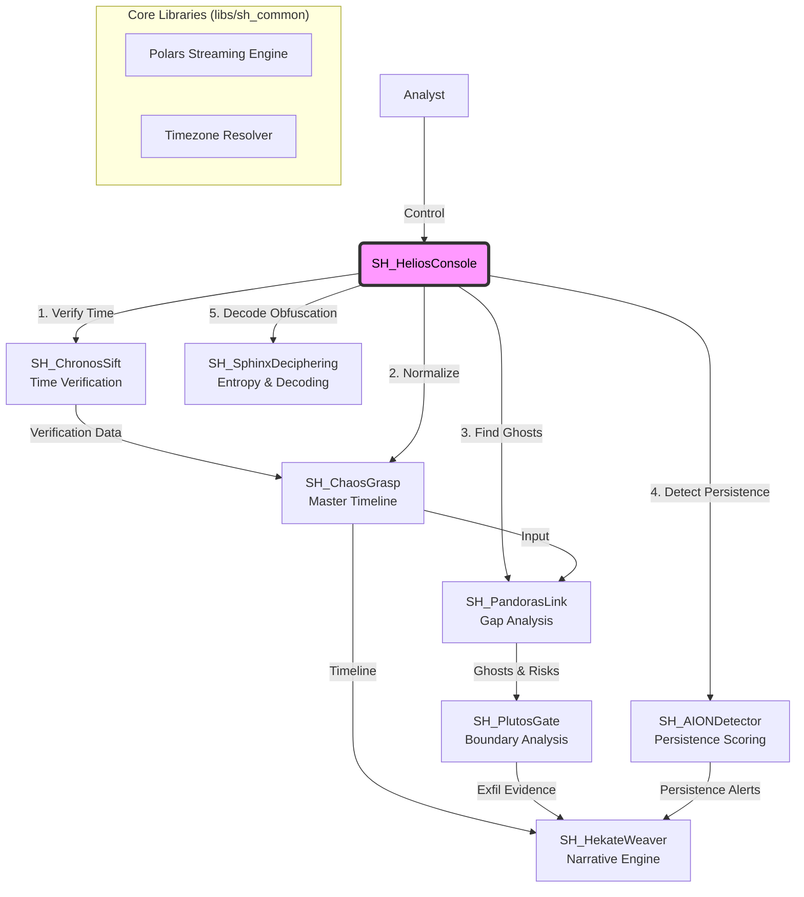

# SkiaHelios (The Shadow Sun)
> **"Ex Umbra in Solem"** (From the Shadows into the Sun)

[](https://opensource.org/licenses/MIT)
[](https://www.python.org/)
[](https://www.pola.rs/)

## 👁️ Philosophy & Mission
**"Extracting the sun of binary-level truth (Helios) from the shadows of chaotic evidence (Skia)."**

**SkiaHelios** is a definitive digital forensics suite designed for high-resolution analysis. It allows analysts to establish **"Absolute Coordinates"** in time and space, dominating the entire workflow from initial triage to final testimony.

Unlike traditional tools that rely strictly on OS APIs, SkiaHelios parses raw binary structures to reveal what is hidden, ensuring **"Order out of Chaos."**

## 🏗️ Architecture: The "SH" Ecosystem

SkiaHelios operates as a unified monorepo, orchestrating specialized modules through a centralized command console. It leverages **Polars LazyFrame** and **Streaming API** to process gigabytes of MFT/USN data with minimal memory footprint.



## 📂 Directory Structure

```text
SkiaHelios/
├── README.md               ... Documentation & Philosophy
├── requirements.txt        ... Python Dependencies (Polars, etc.)
├── SH_HeliosConsole.py     ... The Throne (Unified Interactive Console)
└── tools/                  ... Specialized Modules
    ├── SH_ChaosGrasp/      ... Master Timeline Generator (The Chaos)
    ├── SH_PandorasLink/    ... Ghost Hunting Engine (The Space)
    ├── SH_ChronosSift/     ... Timestamp Verification (The Time)
    ├── SH_AIONDetector/    ... Persistence Scoring (The Eternity)
    ├── SH_PlutosGate/      ... Exfiltration Tracking (The Boundary)
    └── SH_SphinxDeciphering/ ... Obfuscation Decoder (The Riddle)
```

## 🛠️ Module Lineup

### 1. SH_ChronosSift (The Time)
* **Mission**: Detect Temporal Anomalies.
* **Function**: `$STANDARD_INFORMATION` と `$FILE_NAME` 属性をナノ秒精度で比較し、「Timestomping（タイムスタンプ偽装）」を特定。物理的なログシーケンスとの整合性を検証。
* **Key Tech**: ナノ秒精度比較, ゼロ埋め（Zero-precision）検知。

### 2. SH_ChaosGrasp (The Chaos)
* **Mission**: Aggregate, Align, and Prepare.
* **Function**: Registry, Prefetch, Amcache, UserAssistなどの異種アーティファクトから、正規化「マスタータイムライン」を生成。**ChronosSiftの結果を取り込み、偽装された時刻を自動修正する。**
* **Key Tech**: Timezone Biasの自動検出, ChronosSift連携アルゴリズム, Polars Streaming。

### 3. SH_PandorasLink (The Space)
* **Mission**: Reveal the "Absence", "Intent" & "Risk".
* **Function**: **MFT (Live/VSS)** と **USN Journal** をクロスリファレンスし、削除済みファイルの履歴（Ghost）を再構築。ChaosGraspの実行ログと相関させ、悪意ある意図を立証。
* **Key Tech**: NTFS `$MFT`/`$J` ギャップ分析, 親ディレクトリ再構築, リスクアセスメント。

### 4. SH_AIONDetector (The Eternity)
* **Mission**: Persistence Analysis.
* **Function**: WMI, COM Hijack, Services, RunKeysなどの永続化メカニズムをスコアリング。ファイルレス脅威や高度なAPT手法を検知。
* **Key Tech**: 永続化スコアリングアルゴリズム, レジストリ相互参照。

### 5. SH_PlutosGate (The Boundary)
* **Mission**: Exfiltration Verification.
* **Function**: LNKファイルやShellBagsを、Pandoraが特定した「Ghostファイル」にリンク。境界（USB、ネットワーク）を越えたデータ移動を追跡。
* **Key Tech**: ボリュームシリアル番号(VSN)追跡, ShellBag解析。

### 6. SH_SphinxDeciphering (The Riddle)
* **Mission**: Obfuscation Decoding.
* **Function**: イベントログやスクリプトから難読化された文字列を抽出。エントロピー解析と多層デコード戦略を用いて復号。
* **Key Tech**: エントロピー計算, 自動エンコーディング検出 (Base64/XOR/ROT13)。

## 🚀 Capabilities & Outcomes

* **Process Gigabytes of Data in Seconds**: RustベースのPolarsストリーミングエンジンにより、数ギガのMFTを数秒で処理。
* **Defeat Anti-Forensics**: ChronosSift連携により、偽装されたタイムスタンプを無効化し、真実のイベント順序を復元。
* **Reveal Hidden Intent**: 削除後に実行されたバイナリを自動的にタグ付け (`[EXEC]`, `[ANOMALY]`)。
* **Establish Attribution**: インシデントレスポンスにおいて、バイナリレベルの反論不可能な証拠を提供。

## 📦 Installation & Usage

### Setup
```bash
git clone [https://github.com/schutzz/SkiaHelios.git](https://github.com/schutzz/SkiaHelios.git)
cd SkiaHelios
pip install -r requirements.txt
```

### 🎮 Unified Console (Recommended)
統合コンソールを起動し、すべてのツールを自動的に連携させます。

```bash
python SH_HeliosConsole.py
```

---
*Developed by schutzz. Targeted for SANS FOR500 CTF Challenge Coin.*
