# SkiaHelios v2.7 - AION-Sigma (Intelligence & Midas Edition)


> *"From Shadows to Sun. From Data to Gold."*

**SkiaHelios** is a high-resolution, modular DFIR (Digital Forensics & Incident Response) framework built for **speed**, **causality**, and **visual narrative**.

Unlike traditional monolithic tools, it uses a specialized **"Triad Architecture" (Clotho-Atropos-Lachesis)** to deconstruct artifacts, trace physical execution chains, and weave a cohesive narrative across multiple hosts.

**Current Version:** v2.7 (AION-Sigma Integration / Intelligent Summarization / Midas Touch)

---

## ⚡ Key Features (v2.7 Updates)

* **🧠 AION-Sigma Pipeline:** [NEW] Bridges world-standard **Sigma Rules** (YAML) directly into AION's physical regex engine via `CharonBridge`.
* **📉 Intelligent Noise Reduction:** [NEW] Implemented **Strict Confidence Thresholds** (Score >= 80). Low-confidence events are automatically summarized into **"Detection Statistics"** tables to prevent alert fatigue.
* **👑 Midas Touch (Docx/PDF):** Automatically converts Markdown reports into **Executive Docx** files. Renders **Mermaid diagrams** into high-res PNGs and embeds them seamlessly.
* **🦁 Team Sync Mode:** Packages all evidence (CSVs, Source Code, Reports) into a **Hash-verified Zip** (`manifest.json` included) for forensic soundness and team collaboration.
* **🏹 Omni-Visual Attack Flow:** Lachesis generates **Mermaid diagrams** that visualize not just files, but **Network IPs** and **Critical Executions** extracted by Atropos.
* **⚖️ Themis Rule Engine:** Multi-Bank Loading support. Dynamically loads specialized rules (Process, File, Registry) for each module. Features **Tag Normalizer** to translate complex Sigma IDs into readable tags (e.g., `WEBSHELL`).
* **🛡️ Golden Rule Logic:** Implemented "Threat > Noise" logic. Critical artifacts (e.g., WebShells in Cache) pierce through noise filters.
* **✂️ Nemesis Tracer:** Modularized logic to aggressively deduplicate USN/MFT events and trace artifact lifecycles with sub-second precision.
* **🕰️ Hybrid Time Logic:** Specialized **`--legacy` mode** for older OS environments to eliminate install-time noise.
* **🔥 Chimera Fusion:** Correlates Lateral Movement across multiple hosts to visualize the entire campaign.

---

## ⚡ Quick Start (30 Seconds)

Get started immediately. No complex databases, just pure Python & Polars power.

### 1. Installation
```bash
# Clone the repository
git clone [https://github.com/schutzz/SkiaHelios.git](https://github.com/schutzz/SkiaHelios.git)
cd SkiaHelios

# Install dependencies
pip install -r requirements.txt

# [Optional] For Docx & Diagram generation:
# Install Pandoc & Mermaid-CLI (npm install -g @mermaid-js/mermaid-cli)
```

### 2. Sigma Integration Setup (Optional) 🆕
Import global threat intelligence (Sigma Rules) into AION's brain.

```bash
# 1. Clone Sigma Rules
git clone [https://github.com/SigmaHQ/sigma.git](https://github.com/SigmaHQ/sigma.git)

# 2. Convert Rules using CharonBridge
python tools/SH_CharonBridge.py sigma/rules/windows/process_creation/ -o rules/sigma_process_creation.yaml
python tools/SH_CharonBridge.py sigma/rules/windows/file/ -o rules/sigma_file_event.yaml
python tools/SH_CharonBridge.py sigma/rules/windows/registry/ -o rules/sigma_registry.yaml
```

### 3. Interactive Mode (Wizard)
Simply run the script. It now asks if you want to generate a **Golden Report (Docx)**.

```bash
python SH_HeliosConsole.py
# Follow the prompts: "Generate Docx Report? [y/N]"
```

### 4. Command Line Mode (Automation)
Ideal for CI/CD pipelines or scripted analysis.

**Standard Scan + Golden Report:**
```bash
python SH_HeliosConsole.py \
  --dir "C:\Cases\Case_001\KAPE_Output" \
  --case "Ransomware_Inv" \
  --docx
```

**Legacy Scan (Old OS - XP/Vista/2008/2012 or High Noise):**
*Use this flag to ignore System32/Program Files timestamps and focus on User/Web spaces.*
```bash
python SH_HeliosConsole.py \
  --dir "C:\Cases\GrrCON_2014\KAPE_Output" \
  --case "Legacy_Breach" \
  --legacy
```

### 5. Operation Chimera (Multi-Host Fusion)
Combine reports from multiple hosts to visualize the entire campaign.

```bash
# Point to the directory containing multiple Grimoire_*.json files
python tools/SH_ChimeraFusion.py \
  -d "Helios_Output/" \
  -o "Helios_Output/Campaign_Master_Report.md"
```

---

## 🏛️ Architecture (The Triad + Midas + Sigma)

SkiaHelios separates concerns into divine roles to ensure modularity and logic isolation.

```mermaid
graph TD
    %% Style Definitions
    classDef inputClass fill:#2D1B3A,stroke:#E0B0FF,stroke-width:2px,color:#E0B0FF;
    classDef phaseClass fill:#1E0B2A,stroke:#B19CD9,stroke-width:3px,color:#FFFFFF,rx:15,ry:15;
    classDef coreClass fill:#3A1B4F,stroke:#D8BFD8,stroke-width:2px,color:#FFFFFF;
    classDef moduleClass fill:#4A2B5F,stroke:#9370DB,stroke-width:2px,color:#E6E6FA;
    classDef outputClass fill:#2F1B3A,stroke:#BA55D3,stroke-width:2px,color:#DDA0DD;
    classDef fusionClass fill:#1A0033,stroke:#FF69B4,stroke-width:3px,color:#FFB6C1;
    classDef goldClass fill:#B8860B,stroke:#FFD700,stroke-width:3px,color:#FFFFFF;
    classDef ruleClass fill:#4B0082,stroke:#FFD700,stroke-width:2px,color:#FFFFFF,stroke-dasharray: 5 5;

    %% Title
    title[("⚡️ SkiaHelios v2.7 Architecture ⚡️\nGod Mode: AION-Sigma & Midas")]:::inputClass

    %% Input
    Evidence[📂 Raw Artifacts<br/>KAPE CSVs / EVTX / MFT / Prefetch]:::inputClass
    SigmaRules[📜 Sigma Rules (YAML)]:::ruleClass
    ThemisFile[📜 triage_rules.yaml<br/>External Logic]:::ruleClass

    %% Phase 0: Charon
    subgraph Phase0 ["🌉 Phase 0: Charon (The Ferryman) - Rule Ingestion"]
        direction TB
        Charon[SH_CharonBridge<br/>Sigma to AION Conversion]:::coreClass
    end

    %% Phase 1: Clotho
    subgraph Phase1 ["🧶 Phase 1: Clotho (The Spinner) - Ingestion & Enrichment"]
        direction TB
        Clotho[SH_ClothoReader<br/>Universal Ingestion<br/>5W1H Enrichment]:::coreClass
        Hunters[🐍 Specialized Hunters<br/>• PlutosGate • HerculesReferee<br/>• Pandora • ChronosSift<br/>• Sirenhunt • Sphinx • AION]:::moduleClass
    end

    %% Phase 2: Atropos
    subgraph Phase2 ["✂️ Phase 2: Atropos (The Thinker) - Correlation & Judgment"]
        direction TB
        Atropos[SH_AtroposThinker<br/>Physics Time Sort<br/>Heat Correlation]:::coreClass
        Nemesis[Nemesis Tracer Standalone<br/>Deep Lifecycle & Dedup]:::moduleClass
        Themis[⚖️ Themis Loader<br/>Multi-Bank Rule Engine]:::moduleClass
    end

    %% Phase 3: Lachesis
    subgraph Phase3 ["✍️ Phase 3: Lachesis (The Allotter) - Reporting"]
        direction TB
        Lachesis[SH_LachesisWriter<br/>Omni-Visual Reporting<br/>Detection Statistics]:::coreClass
        Report[📜 Grimoire Report<br/>Visual Markdown]:::outputClass
        JSONData[📊 Structured JSON Dump<br/>Machine-Readable Evidence]:::outputClass
    end

    %% Phase 4: Chimera
    subgraph Phase4 ["🦁 Phase 4: Chimera (The Beast) - Multi-Host Fusion"]
        direction TB
        Chimera[SH_ChimeraFusion<br/>Campaign-Level Integration]:::fusionClass
        Campaign[🏛️ Campaign Report<br/>Cross-Host Attack Narrative]:::outputClass
    end

    %% Phase 5: Midas
    subgraph Phase5 ["👑 Phase 5: Midas (The Alchemist) - Final Polish"]
        direction TB
        Midas[SH_MidasTouch<br/>Docx Converter & Evidence graph TD
    %% Style Definitions
    classDef inputClass fill:#2D1B3A,stroke:#E0B0FF,stroke-width:2px,color:#E0B0FF;
    classDef phaseClass fill:#1E0B2A,stroke:#B19CD9,stroke-width:3px,color:#FFFFFF,rx:15,ry:15;
    classDef coreClass fill:#3A1B4F,stroke:#D8BFD8,stroke-width:2px,color:#FFFFFF;
    classDef moduleClass fill:#4A2B5F,stroke:#9370DB,stroke-width:2px,color:#E6E6FA;
    classDef outputClass fill:#2F1B3A,stroke:#BA55D3,stroke-width:2px,color:#DDA0DD;
    classDef fusionClass fill:#1A0033,stroke:#FF69B4,stroke-width:3px,color:#FFB6C1;
    classDef goldClass fill:#B8860B,stroke:#FFD700,stroke-width:3px,color:#FFFFFF;
    classDef ruleClass fill:#4B0082,stroke:#FFD700,stroke-width:2px,color:#FFFFFF,stroke-dasharray: 5 5;

    %% Title Node
    Title["⚡️ SkiaHelios v2.7 Architecture ⚡️<br/>God Mode: AION-Sigma & Midas"]:::inputClass

    %% Input
    Evidence[📂 Raw Artifacts<br/>KAPE CSVs / EVTX / MFT / Prefetch]:::inputClass
    SigmaRules[📜 Sigma Rules (YAML)]:::ruleClass
    ThemisFile[📜 triage_rules.yaml<br/>External Logic]:::ruleClass

    %% Phase 0: Charon
    subgraph Phase0 ["🌉 Phase 0: Charon (The Ferryman) - Rule Ingestion"]
        Charon[SH_CharonBridge<br/>Sigma to AION Conversion]:::coreClass
    end

    %% Phase 1: Clotho
    subgraph Phase1 ["🧶 Phase 1: Clotho (The Spinner) - Ingestion & Enrichment"]
        Clotho[SH_ClothoReader<br/>Universal Ingestion<br/>5W1H Enrichment]:::coreClass
        Hunters[🐍 Specialized Hunters<br/>• PlutosGate • HerculesReferee<br/>• Pandora • ChronosSift<br/>• Sirenhunt • Sphinx • AION]:::moduleClass
    end

    %% Phase 2: Atropos
    subgraph Phase2 ["✂️ Phase 2: Atropos (The Thinker) - Correlation & Judgment"]
        Atropos[SH_AtroposThinker<br/>Physics Time Sort<br/>Heat Correlation]:::coreClass
        Nemesis[Nemesis Tracer Standalone<br/>Deep Lifecycle & Dedup]:::moduleClass
        Themis[⚖️ Themis Loader<br/>Multi-Bank Rule Engine]:::moduleClass
    end

    %% Phase 3: Lachesis
    subgraph Phase3 ["✍️ Phase 3: Lachesis (The Allotter) - Reporting"]
        Lachesis[SH_LachesisWriter<br/>Omni-Visual Reporting<br/>Detection Statistics]:::coreClass
        Report[📜 Grimoire Report<br/>Visual Markdown]:::outputClass
        JSONData[📊 Structured JSON Dump<br/>Machine-Readable Evidence]:::outputClass
    end

    %% Phase 4: Chimera
    subgraph Phase4 ["🦁 Phase 4: Chimera (The Beast) - Multi-Host Fusion"]
        Chimera[SH_ChimeraFusion<br/>Campaign-Level Integration]:::fusionClass
        Campaign[🏛️ Campaign Report<br/>Cross-Host Attack Narrative]:::outputClass
    end

    %% Phase 5: Midas
    subgraph Phase5 ["👑 Phase 5: Midas (The Alchemist) - Final Polish"]
        Midas[SH_MidasTouch<br/>Docx Converter & Evidence Packager]:::goldClass
        GoldReport[🏆 Golden Docx Report]:::goldClass
        SyncPack["📦 Team Sync Zip<br/>(Hash Verified)"]:::goldClass
    end

    %% Footer Node
    Footer["Powered by Python • Polars • Pure Logic<br/>© schutzz - v2.7 Complete"]:::inputClass

    %% Flow
    Title --> Evidence
    Title --> SigmaRules

    SigmaRules --> Charon
    Charon --> ThemisFile
    
    Evidence --> Clotho
    ThemisFile -.->|Inject Rules| Themis
    Themis -.->|Filter & Score| Atropos
    
    Clotho -->|Enriched Data| Atropos
    Clotho --> Hunters
    Atropos --> Nemesis
    Atropos --> Lachesis
    Lachesis --> Report
    Lachesis --> JSONData
    JSONData --> Chimera
    Chimera --> Campaign

    %% Midas Connections
    Report --> Midas
    Campaign --> Midas
    Midas --> GoldReport
    Midas --> SyncPack

    %% Overall Layout
    Phase0 --> Phase1 --> Phase2 --> Phase3 --> Phase4 --> Phase5
    Phase5 --> Footer

    %% Phase Styling (optional for emphasis)
    class Phase0,Phase1,Phase2,Phase3,Phase4,Phase5 phaseClass;
```

---

## 🧩 Module Breakdown

| Module | Role | Functionality |
| :--- | :--- | :--- |
| **Charon** | The Ferryman | **[NEW]** Converts external **Sigma Rules** (YAML) into AION's internal regex format. |
| **Themis** | The Law | **[UPDATE]** Multi-Bank Logic Engine. Loads specialized rulesets for Process, File, and Registry. Includes **Tag Normalizer**. |
| **Lachesis** | The Weaver | **[UPDATE]** Omni-Visual reporting with **Detection Statistics** (Low-confidence summaries) and **Aggregated Findings**. |
| **Midas** | The Alchemist | Converts MD to Docx, renders Mermaid to PNG, and creates Evidence Packages (Team Sync). |
| **Atropos** | The Thinker | "Golden Rule" logic (Threat > Noise). Aggressive deduplication of USN/MFT events. |
| **Nemesis** | The Tracer | Standalone module for tracing artifact lifecycles (Birth -> Rename -> Death) and command-line seeds. |
| **Pandora** | The Link | Recovers deleted "Ghosts". Implements **Score >= 80** strict threshold to separate Criticals from Medium noise. |
| **Chronos** | Time Lord | Hybrid Logic. Detects **Timestomping** ($SI < $FN) with ms-level precision. |
| **Hercules** | The Referee | Event Log analysis. Now integrates **Sigma Process Creation** rules via Themis. |
| **Plutos** | Gatekeeper | Network & SRUM analysis. Detects C2 and Lateral Movement using "Heat Scores". |
| **Sphinx** | Decipherer | Decodes obfuscated command lines (Base64, PowerShell) and extracts IOCs. |
| **AION** | The Eye | Persistence detection (RunKeys, Services) fully powered by Themis rules. |

---

## 📊 Report Sample (Grimoire)

SkiaHelios generates a `Grimoire_[CaseName]_jp.md` that renders beautifully in VS Code or GitHub.

```mermaid
graph TD
    %% [Visual Style v2.5 - Omni-Visual]
    Attacker[🦁 Attacker] -->|Exploit/Access| Initial[Initial Access]
    
    Initial -->|Drop/Upload| WS_1["c99.php"]
    WS_1 -->|Exec| Cmd_1((Shell))
    
    Initial -->|Drop/Upload| WS_2["tmpudvfh.php"]
    WS_2 -->|Exec| Cmd_2((Shell))
    
    Cmd_1 -->|Persistence| RK_1["mxdwdui.BUD <br/>(Rootkit)"]
    
    Attacker -.->|C2/Lateral| IP_1("192.168.56.102")

    %% Styles
    classDef threat fill:#f96,stroke:#333,stroke-width:2px;
    class Attacker,Initial,WS_1,WS_2,RK_1,IP_1 threat;
```



---

## 🔮 Roadmap

* [x] **v1.0:** Core Logic (Clotho/Atropos/Lachesis)
* [x] **v1.9:** Internal Scout & Lateral Movement Logic (Chimera)
* [x] **v2.0:** Visual Reporting (Mermaid Integration)
* [x] **v2.1:** Legacy OS Support & Threat Intelligence
* [x] **v2.2:** Interactive Mode & Syntax Guards
* [x] **v2.5:** Modular Architecture (Nemesis/Themis) & Omni-Visual Reporting
* [x] **v2.6:** Midas Touch (Docx Generation & Evidence Packaging)
* [x] **v2.7:** **AION-Sigma Integration & Intelligent Summarization**
* [ ] **v3.0:** Volatility 3 Integration (Memory Forensics)
* [ ] **v4.0:** Rust Rewrite (Project: *Ares*)

---

## 🛡️ License

MIT License - Built for the DFIR Community.
