# SkiaHelios v4.12 - The Silencer & The Inverted Filter (Noise Kill Strategy)


> *"From Shadows to Sun. From Data to Gold."*

**SkiaHelios** is a high-resolution, modular DFIR (Digital Forensics & Incident Response) framework built for **speed**, **causality**, and **visual narrative**.

Unlike traditional monolithic tools, it uses a specialized **"Triad Architecture" (Clotho-Atropos-Lachesis)** supported by **"Hestia" (The Gatekeeper)** to deconstruct artifacts, trace physical execution chains, and weave a cohesive narrative across multiple hosts.

**Current Version:** v4.12 (System Silencer / Inverted Tool Filter / YAML Config / Noise Chain Break)

---

## ⚡ Key Features (v4.12 Updates)

* **🛡️ Inverted Tool Filter (逆転フィルタ - Plan H):** A paradigm shift in noise reduction.
    * Instead of blacklisting "garbage" inside tool folders (Nmap, Python, Wireshark), Chronos now **whitelists only the binaries (EXE)** and nukes everything else.
    * Result: 10,000+ library files vanished, leaving only the execution evidence.
* **🤫 System Silencer (システム黙殺 - Plan I):** Breaks the "Negative Chain" of false positives.
    * **Hercules Update:** Excludes `LocalSystem (S-1-5-18)`, `LocalService`, and `NetworkService` from timeline correlation logic.
    * Prevents harmless background system activity from being flagged as "Sniper Hits" when coincidental timestamp matches occur.
* **🧹 Junk Killer (ゴミ掃除):** Pandora now aggressively purges browser/app artifacts like `.ldb`, `-journal`, `.log`, and `.lock` to prevent them from being misidentified as "Credentials".
* **⚙️ Externalized Dual-Use Config:** Moved "Dual-Use Tool" definitions (Nmap, PsExec, etc.) from Python code to `triage_rules.yaml` for easier updates without touching the core engine.
* **🏛️ Two-Pass Strategy (往復ビンタ方式):** Resolves the "Chicken and Egg" problem.
    * **Pass 1:** Pandora identifies "Ghost" files.
    * **Sniper Mode:** Hercules targets specific logs based on Ghosts.
    * **Pass 2:** Pandora re-runs to boost scores for correlated artifacts.
* **👑 Midas Touch (Docx/PDF):** Automatically converts Markdown reports into **Executive Docx** files with embedded high-res Mermaid diagrams.

---

## ⚡ Quick Start (30 Seconds)

Get started immediately. No complex databases, just pure Python & Polars power.

### 1. Installation
```bash
# Clone the repository
git clone [https://github.com/schutzz/SkiaHelios.git](https://github.com/schutzz/SkiaHelios.git)
cd SkiaHelios

# Install dependencies (Rust/Polars required)
pip install -r requirements.txt

# [Optional] For Docx & Diagram generation:
# Install Pandoc & Mermaid-CLI (npm install -g @mermaid-js/mermaid-cli)
```

### 2. Sigma Integration Setup (Optional)
Import global threat intelligence (Sigma Rules) into AION's brain.

```bash
# 1. Clone Sigma Rules
git clone [https://github.com/SigmaHQ/sigma.git](https://github.com/SigmaHQ/sigma.git)

# 2. Convert Rules using CharonBridge
python tools/SH_CharonBridge.py sigma/rules/windows/process_creation/ -o rules/sigma_process_creation.yaml
python tools/SH_CharonBridge.py sigma/rules/windows/file/ -o rules/sigma_file_event.yaml
python tools/SH_CharonBridge.py sigma/rules/windows/registry/ -o rules/sigma_registry.yaml
```

### 3. Interactive Mode (Wizard)
Simply run the script. It now asks if you want to generate a **Golden Report (Docx)**.

```bash
python SH_HeliosConsole.py
# Follow the prompts: "Generate Docx Report? [y/N]"
```

### 4. Command Line Mode (Automation)
Ideal for CI/CD pipelines or scripted analysis.

**Standard Scan + Two-Pass Mode:**
```bash
python SH_HeliosConsole.py \
  --dir "C:\Cases\Case_001\KAPE_Output" \
  --case "Case2_52" \
  --docx
```

**Legacy Scan (Old OS - XP/Vista/2008/2012 or High Noise):**
*Use this flag to ignore System32/Program Files timestamps and focus on User/Web spaces.*
```bash
python SH_HeliosConsole.py \
  --dir "C:\Cases\Legacy_Breach\KAPE_Output" \
  --case "Legacy_Inv" \
  --legacy
```

---

## 🏛️ Architecture (The Triad + Hestia + Two-Pass)

SkiaHelios separates concerns into divine roles to ensure modularity, logic isolation, and deadlock resolution.

```mermaid
graph TD
    %% Style Definitions
    classDef inputClass fill:#2D1B3A,stroke:#E0B0FF,stroke-width:2px,color:#E0B0FF;
    classDef phaseClass fill:#1E0B2A,stroke:#B19CD9,stroke-width:3px,color:#FFFFFF,rx:15,ry:15;
    classDef coreClass fill:#3A1B4F,stroke:#D8BFD8,stroke-width:2px,color:#FFFFFF;
    classDef moduleClass fill:#4A2B5F,stroke:#9370DB,stroke-width:2px,color:#E6E6FA;
    classDef outputClass fill:#2F1B3A,stroke:#BA55D3,stroke-width:2px,color:#DDA0DD;
    classDef fusionClass fill:#1A0033,stroke:#FF69B4,stroke-width:3px,color:#FFB6C1;
    classDef goldClass fill:#B8860B,stroke:#FFD700,stroke-width:3px,color:#FFFFFF;
    classDef hestiaClass fill:#ff4444,stroke:#333,stroke-width:2px,color:#FFFFFF;

    %% Title Node
    Title["⚡️ SkiaHelios v4.12 Architecture ⚡️<br/>System Silencer & Inverted Filters"]:::inputClass

    %% Input
    Evidence["📂 Raw Artifacts<br/>KAPE CSVs / EVTX / MFT"]:::inputClass
    
    %% Phase 0: Hestia (The Gatekeeper)
    subgraph Phase0 ["🔥 Phase 0: Hestia (The Gatekeeper) - Censorship"]
        Hestia["SH_HestiaCensorship<br/>Zone of Death Filtering"]:::hestiaClass
    end

    %% Phase 1: Clotho & Physical
    subgraph Phase1 ["🧶 Phase 1: Clotho & Physical Analysis"]
        Clotho["SH_ClothoReader<br/>Identity Aware (v2.2)"]:::coreClass
        Chronos["SH_ChronosSift<br/>Inverted Tool Filter (Plan H)"]:::moduleClass
        Pandora1["SH_PandorasLink (Pass 1)<br/>Junk Killer (Plan I)"]:::moduleClass
    end

    %% Phase 2: Event Logic (Hercules)
    subgraph Phase2 ["⚔️ Phase 2: Hercules (Sniper Mode)"]
        Hercules["SH_HerculesReferee<br/>System Silencer (S-1-5-18 Ignore)"]:::moduleClass
        Pandora2["SH_PandorasLink (Pass 2)<br/>Cross-Correlation Feedback"]:::moduleClass
    end

    %% Phase 3: Lachesis (Reporting)
    subgraph Phase3 ["✍️ Phase 3: Lachesis (The Editor) - Narrative"]
        AION["SH_AIONDetector<br/>Persistence"]:::moduleClass
        Lachesis["SH_LachesisWriter<br/>YAML Configured Reporting"]:::coreClass
        Report["📜 Grimoire Report<br/>Visual Markdown"]:::outputClass
    end

    %% Phase 5: Midas
    subgraph Phase5 ["👑 Phase 5: Midas (The Alchemist)"]
        Midas["SH_MidasTouch<br/>Docx Converter"]:::goldClass
        GoldReport["🏆 Golden Docx Report"]:::goldClass
    end

    %% Flow
    Title --> Evidence
    Evidence --> Hestia
    Hestia --> Clotho
    
    Clotho --> Chronos
    Clotho --> Pandora1
    
    Pandora1 --> Hercules
    Hercules -->|Feedback Loop| Pandora2
    
    Pandora2 --> AION
    Hercules --> AION
    AION --> Lachesis
    Lachesis --> Report
    Report --> Midas
    Midas --> GoldReport

    %% Overall Layout
    Phase0 --> Phase1 --> Phase2 --> Phase3 --> Phase5

    %% Phase Styling
    class Phase0,Phase1,Phase2,Phase3,Phase5 phaseClass;
```



---

## 🧩 Module Breakdown

| Module | Role | Functionality | v4.12 Update |
| :--- | :--- | :--- | :--- |
| **Hestia** | The Gatekeeper | Centralized noise censorship. Defines "Zone of Death". | **v1.2:** Expanded Windows/Intel noise lists. |
| **Clotho** | The Spinner | Ingestion & Enrichment. | **v2.2:** Identity Aware (OS/User extraction). |
| **Pandora** | The Link | File System (MFT/USN) analysis. Recovers "Ghosts". | **v18.14:** **Plan I:** Explicitly kills `.ldb`/`.log` junk to prevent Credential false positives. |
| **Hercules** | The Referee | Event Log analysis. Integrates Sigma Rules. | **v4.6:** **Plan I:** System Silencer. Ignores S-1-5-18 correlation to break noise chains. |
| **Chronos** | Time Lord | Detects Timestomping ($SI < $FN). | **v23.15:** **Plan H:** Inverted Tool Filter. Protects EXEs, nukes libraries. |
| **Lachesis** | The Weaver | Omni-Visual Reporting & Summarization. | **v3.16:** **External Config:** Reads `dual_use_tools` from YAML. |
| **AION** | The Eye | Persistence detection (RunKeys, Services). | **v14.1:** Scans Registry & MFT powered by Themis rules. |
| **Themis** | The Lawgiver | Rule Loader & Config Manager. | **v2.8:** Added `Dual-Use` tool configuration parsing. |
| **Plutos** | Gatekeeper | Network & SRUM analysis. Detects C2/Lateral Movement. | (Stable) |
| **Sphinx** | Decipherer | Decodes obfuscated command lines (Base64, PowerShell). | (Stable) |
| **Midas** | The Alchemist | Converts MD to Docx, renders Mermaid to PNG. | (Stable) |

---

## 📊 Report Sample (Grimoire)

SkiaHelios generates a `Grimoire_[CaseName]_jp.md` that renders beautifully in VS Code or GitHub.
**v4.1 Update:** Now includes auto-generated Mermaid Attack Flow charts.

```mermaid
graph TD
    %% [Visual Style v4.1 - Attack Flow]
    Attacker[🦁 Attacker] -->|Exploit/Access| Initial[Initial Access]
    
    Initial -->|Drop/Upload| WS_1["c99.php"]
    WS_1 -->|Exec| Cmd_1((Shell))
    
    Initial -->|Timestomp| TS_1["hash_suite.exe<br/>(Time Forged)"]
    
    Cmd_1 -->|Persistence| RK_1["mxdwdui.BUD <br/>(Rootkit)"]
    
    Attacker -.->|C2/Lateral| IP_1("192.168.56.102")

    %% Styles
    classDef threat fill:#f96,stroke:#333,stroke-width:2px;
    class Attacker,Initial,WS_1,TS_1,RK_1,IP_1 threat;
```



---

## 🛠️ Development History (Case2 Strategy Log)

Significant milestones in overcoming legacy environment challenges and noise floods.

### 1. Radical Noise Filtering (The Hestia Protocol)
Overcoming the flood of 100k+ noise artifacts in legacy environments.
* **Zone of Death Strategy:** Defined structural noise zones (Web Cache, Temp, Tool Samples) where files are nuked unless correlated.
* **Safety Valve:** Implemented strict whitelisting for Windows/Python system files.

### 2. The Silence of the Logs (Plan H & I)
**v4.12 Breakthrough:** Addressed the "Dual-Use Tool" dilemma where legitimate admin tools (Nmap, Wireshark) generated thousands of false positives.
* **Plan H (Inverted Filter):** Switched from "Blacklisting garbage" to "Whitelisting Binaries" inside tool folders. Result: 95% noise reduction in Chronos.
* **Plan I (System Silencer):** Identified a "Noise Chain" where Pandora's false positives (Chrome .ldb) were being correlated with Hercules' System events. Implemented `S-1-5-18` ignore rules to sever this link.

### 3. Identity & Context Awareness
* **Clotho v2.2:** Now parses `SOFTWARE` hive for ProductName and analyzes Event Logs to infer Hostname/User, drastically reducing manual context entry and eliminating "N/A".

### 4. Narrative Reporting (Lachesis v4.1)
* **The Editor:** Transformed the report from a "Phonebook of Logs" to an "Intelligence Brief".
* **External Config:** Dual-Use tools are now defined in `triage_rules.yaml`, ensuring reports capture "Living off the Land" binaries without code changes.

---

## 🔮 Roadmap

* [x] **v1.0:** Core Logic (Clotho/Atropos/Lachesis)
* [x] **v1.9:** Internal Scout & Lateral Movement Logic (Chimera)
* [x] **v2.0:** Visual Reporting (Mermaid Integration)
* [x] **v2.5:** Modular Architecture (Nemesis/Themis)
* [x] **v2.7:** AION-Sigma Integration & Midas Touch (Docx)
* [x] **v4.0:** **Hestia Censorship & Two-Pass Strategy** (Deadlock Resolution)
* [x] **v4.11:** **SIMD Optimization & Identity Aware** (Speed)
* [x] **v4.12:** **System Silencer & Inverted Tool Filters** (Noise Kill)
* [ ] **v5.0:** Real-time Triage Mode (Live Response)

---

## 🛡️ License

MIT License - Built for the DFIR Community.