# SkiaHelios: Advanced DFIR Artifact Correlation Engine


**"Truth is a multi-layered tapestry. Weave it."**

SkiaHelios is a modular Digital Forensics & Incident Response (DFIR) framework designed to correlate disparate artifacts (Timeline, Registry, Network, USN Journal, SRUM, Prefetch) into a single, cohesive narrative. SkiaHelios reconstructs the *context* of user activity and generates professional, SANS-style investigation reports automatically.

**Current Version:** v1.8 (God Mode Final)

---

## 🏛️ Architecture & Workflow

SkiaHelios uses a **"Seed & Hunt"** architecture. Instead of processing logs linearly, it identifies potential threats (Seeds) in filesystem anomalies and "hunts" for their execution evidence across other artifacts.

```mermaid
graph TD
    %% ========================
    %% 全体レイアウト：左から右へ明確な流れ
    %% ========================

    %% --- 左側: 生データソース ---
    subgraph Raw["📂 Raw Artifacts<br/>証拠源"]
        MFT[MFT<br/>$MFT / $I30]
        USN[USN Journal<br/>$J]
        EVTX[Event Logs<br/>4688 / 4104 etc.]
        REG[Registry<br/>Run Keys etc.]
        PF[Prefetch<br/>.pf Files]
        AM[Amcache<br/>App Execution]
    end

    %% --- 中央: 解析エンジン群 ---
    subgraph Engines["⚙️ Analysis Engines<br/>証拠抽出"]
        CH[Chronos<br/>Timestomp &<br/>MFT Anomaly]
        PA[Pandora<br/>Ghost Files &<br/>Rename Trace]
        SP[Sphinx<br/>PowerShell<br/>Deobfuscation]
        HE[Hercules<br/>Timeline<br/>Judgment]
        AI[AION<br/>Persistence<br/>Detection]
        SI[Sirenhunt<br/>Execution Validator<br/>Prefetch + Amcache]
    end

    %% --- 右側: コア統合 & 出力 ---
    subgraph Core["🧠 Core Orchestration"]
        HC[HeliosConsole<br/>Orchestrator]
        HK[HekateWeaver<br/>Cause Correlation<br/>God Mode Scoring]
        REP["📜 Grimoire<br/>SANS Report<br/>(PHISHING_ATTACHMENT_EXEC 発動)"]
    end

    %% ========================
    %% データフロー（太線で明確に）
    %% ========================

    %% Raw → Engines
    MFT --> CH
    USN --> PA
    EVTX --> SP
    EVTX --> HE
    REG --> AI
    PF --> SI
    AM --> SI

    %% Engines → Hekate
    CH --> HK
    PA --> HK
    SP --> HK
    HE --> HK
    AI --> HK

    %% Sirenhuntの特別フロー（Executionの最終検証）
    CH & PA -.->|Seeds<br/>Suspicious Files| SI
    SI -->|Verified Execution<br/>+ Signature| HK

    %% Orchestration
    HC -.->|Controls All Engines| CH & PA & SP & HE & AI & SI & HK
    HK --> REP

    %% ========================
    %% スタイリング（視認性最優先）
    %% ========================

    classDef raw fill:#1e1e1e,stroke:#666,stroke-width:2px,color:#fff;
    classDef engine fill:#0d47a1,stroke:#fff,stroke-width:2px,color:#fff;
    classDef siren fill:#b71c1c,stroke:#ff5252,stroke-width:4px,color:#fff;
    classDef core fill:#1b5e20,stroke:#4caf50,stroke-width:3px,color:#fff;
    classDef report fill:#311b92,stroke:#7e57c2,stroke-width:3px,color:#fff;

    class MFT,USN,EVTX,REG,PF,AM raw;
    class CH,PA,SP,HE,AI engine;
    class SI siren;
    class HC,HK core;
    class REP report;

    %% 枠線強調
    style Raw stroke:#fff,stroke-width:3px,stroke-dasharray: 5 5
    style Engines stroke:#fff,stroke-width:3px,stroke-dasharray: 5 5
    style Core stroke:#fff,stroke-width:3px,stroke-dasharray: 5 5
```



---

## ⚡ Key Features (v1.8 God Mode)

* **🛡️ Precision Over Recall (適合率重視):**
    * 厳格なスコアリングロジックにより、正規プロセス（LOLBins）やWindows Updateの残骸などのノイズを徹底排除。
    * **"Criticality >= 90"** の確実な脅威のみを技術詳細に記載。
* **🏹 SirenHunt Integration (New!):**
    * **Seed Harvesting:** Chronos (MFT) と Pandora (USN) から「不審なファイル操作（リネーム、タイムスタンプ偽装）」を抽出。
    * **Execution Validation:** 抽出されたSeedが実際に実行されたかを **Prefetch** と **Amcache** で裏取り（Cross-Validation）。
    * **Signature Verification:** デジタル署名の有無を確認し、署名のない不審な実行ファイルを「確定クロ」としてマーク。
* **📝 Dynamic Attack Flow Generation:**
    * イベントカテゴリを解析し、攻撃のストーリーライン（侵入→実行→隠滅）をExecutive Summaryに自動生成。
* **🦁 Sphinx v1.9 Integration:**
    * PowerShell ScriptBlock (EID 4104) のBase64/XOR難読化を自動解除し、攻撃意図を可視化。

---

## 🛠️ Modules Overview

| Module | Role | Key Function |
| :--- | :--- | :--- |
| **SH_HeliosConsole** | Orchestrator | Pipeline & Timekeeper management. (指揮・統合) |
| **SH_Sirenhunt** | **Hunter** | **Cross-validates seeds from MFT/USN with Prefetch & Amcache.** (物理的実行証明) |
| **SH_HekateWeaver** | Weaver | Noise filtering & Grimoire generation. (相関分析・レポート作成) |
| **SH_HerculesReferee**| Judge | Sniper scanning & Verdict execution. (イベントログ判定) |
| **SH_Chronos** | Timekeeper | MFT Analysis & Timestomp detection ($SI < $FN). (時間異常検知) |
| **SH_Pandora** | Necromancer| USN Journal analysis for deleted/renamed files. (削除・痕跡復元) |
| **SH_SphinxDeciphering**| Decoder | PowerShell/Process deobfuscation. (難読化解除) |

---

## 🚀 Usage

### 1. Prerequisites
```bash
pip install -r requirements.txt
```

### 2. Execution (Helios Console v4.0)
```powershell
python SH_HeliosConsole.py --dir "C:\Case\KAPE_CSV" --raw "C:\Case\Raw_Artifacts"
```

**Arguments:**
* `--dir`: Path to KAPE module outputs (CSV files).
* `--raw`: Path to KAPE targets (Raw artifacts).
* `--mount`: (Optional) Mount Point for SHA256 hashing.
* `--start / --end`: (Optional) Time filter (YYYY-MM-DD).

### 3. Output (The Grimoire)
The **`Grimoire_[CaseName]_[Lang].md`** provides:
* **Executive Summary:** Attack flow and compromised accounts (w/ Verdict Flags like `[PHISHING_ATTACHMENT_EXEC]`).
* **Origin Analysis:** Correlation between File Drop, Web History, and Execution.
* **Timeline:** Phase-based chronological narrative.
* **Technical Findings:** Validated evidence (Score >= 90).

---

*Verified by SkiaHelios v1.8 (2025)*
