# SkiaHelios: Advanced DFIR Artifact Correlation Engine


**"Truth is a multi-layered tapestry."**

SkiaHelios is a modular Digital Forensics & Incident Response (DFIR) framework designed to correlate disparate artifacts (Timeline, Registry, Network, USN Journal) into a single, cohesive narrative. Unlike traditional parsers that output isolated CSVs, SkiaHelios reconstructs the *context* of user activity and generates professional, SANS-style investigation reports.

---

## 🧩 Architecture

```mermaid
graph TD
    %% Input Layer
    Input[("KAPE Artifacts")] -->|"Registry Hives"| Hercules
    Input -->|"Browser History (SQLite)"| Clio
    Input -->|"Event Logs / ShellBags"| Chaos
    Input -->|"MFT / USN / Lnk"| Engines
    Input -->|"SRUM"| Plutos

    %% Processing Layer (The Pantheon)
    subgraph SkiaHelios Core
        direction TB
        Clio("👁️ Clio v2.0<br/>[Browser Scout]")
        Chaos("🌪️ Chaos v11.1<br/>[Master Timeline]")
        Hercules("🏛️ Hercules v3.5<br/>[Sniper / Script Hunter]")
        
        subgraph Engines [Deep Forensics Engines]
            Plutos("💸 Plutos v1.11<br/>[Exfil & Net]")
            Chronos("⏳ Chronos v11.1<br/>[Time Anomalies]")
            Pandora("👻 Pandora v3.8<br/>[Ghost & LNK Hunter]")
            AION("👁️ AION v13.1<br/>[Persistence & Hash]")
            Sphinx("🦁 Sphinx v1.5<br/>[Script Decoding]")
        end
    end

    %% Logic Flow
    Clio -->|"Parsed History CSV"| Chaos
    Chaos -->|"Timeline Context"| Engines
    
    %% Sniper Correlation (Project: CERBERUS)
    %% This is the core intelligence feed from File System to Event Log analysis
    Pandora ==>|"Target Ghost Intel<br/>(Timestamps & FileNames)"| Hercules
    
    %% Output Feeds to Hekate
    Hercules -.->|"Sniper Hits, Scripts &<br/>Identity Context"| Hekate
    Plutos -.->|"C2 & USB Context"| Hekate
    Chaos -.->|"Event & Execution Trace"| Hekate
    Engines -.->|"Deep Forensics Findings"| Hekate

    %% Output Layer
    Hekate{"🕸️ Hekate v7.3<br/>(The Grand Weaver)"}
    Hekate ==>|"Weave Storyline"| Report[/"📜 Grimoire.md<br/>(SANS-Style Report)"/]

    %% Styling
    style Hercules fill:#f9f,stroke:#333,stroke-width:2px
    style Chaos fill:#ff9,stroke:#333,stroke-width:2px
    style Clio fill:#bbf,stroke:#333,stroke-width:2px
    style Hekate fill:#bfb,stroke:#333,stroke-width:4px
    style Pandora fill:#aff,stroke:#333,stroke-width:2px
    style AION fill:#f99,stroke:#333,stroke-width:2px
```



---

## 🚀 Key Features & Updates

### 🏛️ Hercules: The Judge (v3.5 [Schema Enforcer])
* **Sniper Mode**: Focuses on the ±30s window of "Ghost Timestamps" identified by Pandora. Automatically correlates file deletions with process executions (EID: 4688) to detect anti-forensics.
* **Script Hunter**: Detects malicious command lines (`curl`, `sdelete`, `reg add`, `powershell -enc`) and tags them with high-fidelity indicators (e.g., `ATTACK_SCRIPT_EXEC`, `C2_BEACON`).
* **Schema Enforcer**: Prevents Polars type inference crashes during complex log aggregation.

### 👁️ AION: Persistence & Hash Hunter (v13.1)
* **Hybrid Hash Hunter**: Automatically calculates **SHA256 hashes** for detected persistence mechanisms (Run Keys, Services) if the disk image is mounted (`--mount`).
* **Artifact-Only Mode**: Gracefully handles scenarios where only CSV artifacts are available, focusing on logical persistence paths.

### 🕸️ Hekate: The Grand Weaver (v7.3 [Full Integrity])
* **Grimoire Generation**: Weaves all module findings into a structured, Markdown-based report suitable for SANS/GIAC presentations.
* **Tag Awareness**: Intelligently prioritizes critical tags (`SNIPER`, `ATTACK`, `C2`) to build an "Executive Summary" that highlights the attack chain.
* **Auto-Repair**: Automatically fixes missing columns in timeline CSVs to ensure report generation never fails.

### 👻 Pandora: Ghost Recovery (v3.8)
* **Gap Analysis**: Reconstructs "Ghost" artifacts (deleted/hidden) using MFT/USN Journal differential analysis, serving as the targeting intel for Hercules.

### ⏳ Chronos: Time Anomaly Detector (v11.1)
* **Sanctuary Restore**: Advanced whitelist logic to filter WinSxS/System32 noise, exposing only true "Timestomp" anomalies in user directories.

---

## 📂 Directory Structure

```text
SkiaHelios/
├── SH_HeliosConsole.py       # [ENTRY POINT] Pipeline Orchestrator (v3.9)
├── README.md                 # This file
<<<<<<< HEAD
├── SH_PandorasLink.py        # File System Ghost Hunter (v3.8)
├── SH_HerculesReferee.py     # Sniper Event Auditor (v3.5)
├── SH_HekateWeaver.py        # Report Generator (v7.3)
├── tools/
│   ├── SH_ChaosGrasp.py      # Master Timeline & Event Log Analyzer (v11.1)
│   ├── SH_ClioGet.py         # Browser History Extractor
=======
├── tools/
│   ├── SH_PandorasLink.py        # File System Ghost Hunter (v3.8)
│   ├── SH_HerculesReferee.py     # Sniper Event Auditor (v2.0)
│   ├── SH_HekateWeaver.py        # Report Generator (v6.5)
│   ├── SH_ChaosGrasp.py      # Master Timeline & Event Log Analyzer
│   ├── SH_ClioGet.py         # Browser History Extractor (SQLite)
>>>>>>> 7308104ba031ab7ba45e52e55ea3f7432801205a
│   ├── SH_PlutosGate.py      # Network & USB Exfiltration Analyzer
│   ├── SH_ChronosSift.py     # Timestamp Anomaly Detector (v11.1)
│   ├── SH_AIONDetector.py    # Persistence & Hash Hunter (v13.1)
│   ├── SH_SphinxDeciphering.py # Obfuscation Decoder
│   └── ...
└── Helios_Output/            # Final Reports & Evidence CSVs
```

---

## ⚡ Usage

### 1. Execution (Helios Console v3.9)
The orchestrator ensures the correct execution order for **Project: CERBERUS** (Pandora Intel -> Hercules Sniper).

Run the console and follow the interactive prompts:

```powershell
python SH_HeliosConsole.py
```

**Required Inputs:**
1.  **CSV Directory**: Path to KAPE module outputs (CSV files).
2.  **Raw Directory**: Path to KAPE targets (Raw artifacts like History files).
3.  **Mount Point (Optional)**: Drive letter (e.g., `E:\`) to enable SHA256 hashing by AION.

**Pipeline Flow:**
1.  **Pandora**: Identifies suspicious deleted files and LNK destruction.
2.  **Hercules**: Sniper-scans Event Logs using Pandora's timestamp intel.
3.  **AION**: Hunts for persistence and calculates hashes from the mounted image.
4.  **Hekate**: Weaves all findings into the final `Grimoire` report.

### 2. Output Highlights
The **`Grimoire_[CaseName]_[Lang].md`** exposes critical tactical indicators:
* **SNIPER_HIT**: Confirmed correlation between physical file deletion and Event Log entry.
* **ATTACK_SCRIPT_EXEC**: Malicious batch/PowerShell execution (e.g., `Attack_Chain.bat`).
* **C2_BEACON**: Suspicious network activity via CLI tools (e.g., `curl`, `wget`).
* **FILE_PERSISTENCE**: Malware detected in startup locations with SHA256 hash.

---

## 📜 License
This project is for educational and DFIR training purposes.
Use responsibly during authorized investigations and CTFs.
