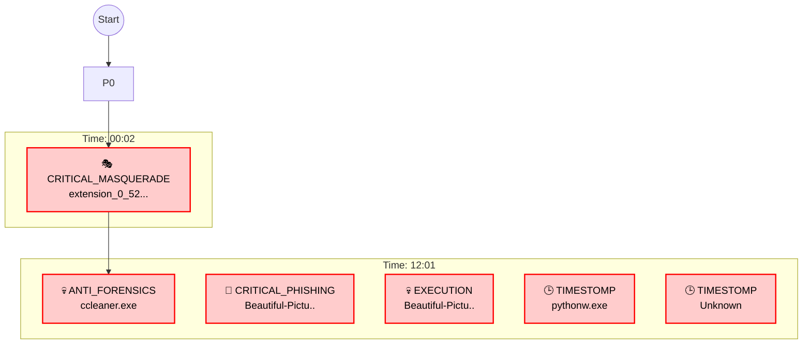

# インシデント調査報告書 - 4ORENSICS

### 🛡️ 証拠保全および案件情報 (Chain of Custody)
| Item | Details |
|---|---|
| **Target Host** | **4ORENSICS** |
| **OS Info** | Windows 8.1 Mock |
| **Primary User** | Hunter |
| **Incident Scope** | **2016-06-20 20:48 〜 15:01 (UTC)** |
| **Report Date** | 2026-01-07 |

---

## 📚 Table of Contents
- [1. エグゼクティブ・サマリー](#1-エグゼクティブ・サマリー)
- [2. 初期侵入経路分析 (Initial Access Vector)](#2-初期侵入経路分析-initial-access-vector)
- [3. 調査タイムライン (Critical Chain)](#3-調査タイムライン-critical-chain)
- [4. 技術的詳細 (High Confidence Findings)](#4-技術的詳細-high-confidence-findings)
- [5. 検知統計 (Detection Statistics)](#5-検知統計-detection-statistics)
- [7. 添付資料 (Critical IOCs Only)](#7-添付資料-critical-iocs-only)
- [Pivot Config (Deep Dive Targets)](#deep-dive-recommendation)

---

## 1. エグゼクティブ・サマリー
**結論:**
2016-06-20 20:48 〜 15:01 (UTC) の期間において、端末 4ORENSICS に対する **高度な隠蔽工作を伴う重大な侵害活動** を確認しました。
**主な攻撃手口:** フィッシング（LNK）による初期侵入, 偽装ファイル設置（Masquerading）, タイムスタンプ偽装（Timestomp）。

> **Deep Dive 推奨:** 詳細な調査を行う際は、添付の `Pivot_Config.json` に記載された **CRITICAL_PHISHING** ターゲット群から開始してください。

### 🏹 Attack Timeline Flow (Critical Chain)

### 💎 Key Indicators (Critical Only)
| Time | Type | Value (File/IP) | **Target / Action** | **Score** | Path |
|---|---|---|---|---|---| ignore
|  | **TIMESTOMP** | `pythonw.exe` | ⚠️ 実行痕跡なし (存在のみ) | 50 | `c:\python27\pythonw.exe` |
| 2016-06-21 00:02:50 | **CRITICAL_MASQUERADE** | `extension_0_52.crx` | 🎭 偽装ファイル設置 | 300 | `C:\Program Files (x86)\Adobe` |
| 2016-06-21 12:01:44 | **PERSISTENCE** | `ccleaner.exe` | Persistence | 80 | `C:\Program Files\CCleaner\ccle..` |
| 2016-06-21 12:01:46 | **CRITICAL_PHISHING** | `Beautiful-Pictures-Of-Cute-Animals-6.jpg.lnk` | Target Unknown | 250 | `C:\Users\Hunter\AppData\Roamin..` |
| 2016-06-21 12:01:46 | **EXECUTION** | `Beautiful-Pictures.lnk` | Target Unknown | 100 | `Process` |
| Rollback: -35997 se | **TIMESTOMP** | `Unknown` | ⚠️ 実行痕跡なし (存在のみ) | 300 | `` |

## 2. 初期侵入経路分析 (Initial Access Vector)
**不審なツール・ファイルの持ち込み（Dropped Artifacts）:**

| ファイル名 | 発見場所 | 流入元 (Origin Trace) |
|---|---|---|
| `extension_0_52.crx` | 2016-06-21 00:02:50 | ❓ No Trace Found (Low Confidence) |
| `Beautiful-Pictures-Of-Cute-Animals-6.jpg.lnk` | 2016-06-21 12:01:46 | ❓ No Trace Found (Low Confidence) |
| `Unknown` | Rollback: -35997 se | ❓ No Trace Found (Low Confidence) |
| `pythonw.exe` | `c:\python27\pythonw.` | ❓ No Trace Found (Low Confidence) |

## 3. 調査タイムライン (Critical Chain)
以下に、検知された脅威イベントを時系列で示します。（重要度スコア80以上のイベント、および要注意ツール利用履歴）

### 📅 Phase 1 (2016-06-20)
| Time (UTC) | Category | Event Summary (Command / File) | Source |
|---|---|---|---|
| 2016-06-20 23:48:22 | FILE | **Rollback: -35997** | USN |
## 4. 技術的詳細 (High Confidence Findings)
### 🚨 Anti-Forensics Activities (Evidence Destruction)

⚠️⚠️⚠️ **重大な証拠隠滅活動を検出** ⚠️⚠️⚠️

攻撃者は侵入後、以下のツールを使用して活動痕跡を意図的に抹消しています：

#### CCLEANER.EXE
- 📊 **Run Count**: **Unknown**
- 🕐 **Last Execution**: 2016-06-21 12:01:44 (UTC)
- ⚠️ **Severity**: CRITICAL
- 🔍 **Description**: システムクリーナー。ブラウザ履歴やMRUの削除に使用されます。

🕵️ **Analyst Note**:
攻撃活動終了後の痕跡削除（Cleanup）に使用されたと推定されます。

---

### 📉 Missing Evidence Impact Assessment

以下の証拠が、Anti-Forensicsツールによって失われたと判断されます：

| 証拠カテゴリ | 期待される情報 | 現状 | 推定原因 |
|---|---|---|---|
| LNK Target Paths | `cmd.exe ...` 等の引数 | ❌ 欠落 | BCWipe/SDeleteによる削除 |
| Prefetch (Tools) | 実行回数・タイムスタンプ | ❌ 欠落 | CCleaner/BCWipeによる削除 |
| 一時ファイル | ペイロード本体 | ❌ 欠落 | ワイピングによる物理削除 |

🕵️ **Analyst Note**:
これらの証拠欠落は「ツールの限界」ではなく、**「攻撃者による高度な隠蔽工作」**の結果です。
Ghost Detection (USNジャーナル) によりファイルの「存在していた事実」のみを確認できています。

本セクションでは、検出された脅威を分類して詳述します。

### 🎭 File Masquerading & Backdoors
- **2016-06-21 00:02:50** | Type: `CRITICAL_MASQUERADE` | Path: `C:\Program Files (x86)\Adobe`
  - 🕵️ **Analyst Note:** Adobe Readerのフォルダに、無関係なChrome拡張機能(.crx)が配置されています。これは典型的なPersistence（永続化）手法です。

### 🎣 Phishing & Initial Access (LNKs)
- **2016-06-21 12:01:46** | Type: `CRITICAL_PHISHING` | Path: `C:\Users\Hunter\AppData\Roaming\Microsoft\Windows\...`
  - 🕵️ **Analyst Note:** 不審なショートカットファイルが作成されました。フィッシング攻撃の可能性があります。

### 📦 Suspicious Files (Presence Only)
> **Note:** 以下のツールはディスク上に存在しますが、明確な実行痕跡（Prefetch/ProcessLog等）は確認されていません。

- **** | Type: `TIMESTOMP` | Path: `c:\python27\pythonw.exe`
  - 🕵️ **Analyst Note:** `pythonw.exe` のタイムスタンプに不整合（Timestomp）を確認。攻撃ツールを隠蔽しようとした痕跡です。

### ⚠️ Other High Confidence Threats
- **Rollback: -35997 se** | Type: `TIMESTOMP` | Path: ``
  - 🕵️ **Analyst Note:** `Unknown` のタイムスタンプに不整合（Timestomp）を確認。攻撃ツールを隠蔽しようとした痕跡です。

## 5. 検知統計 (Detection Statistics)
### 📊 Overall Analysis Summary
| Category | Count | Percentage |
|---|---|---|
| **Total Events Analyzed** | **3** | 100% |
| Critical Detections | 7 | 233.33% |
| Filtered Noise | 0 | 0.0% |

### 🎯 Critical Detection Breakdown
| Type | Count | Max Score | Impact |
|---|---|---|---|
| **TIMESTOMP** | **2** | 250 | Evasion |
| **MASQUERADE** | **1** | 300 | Evasion |
| **PHISHING / LNK** | **1** | 250 | Initial access |
| **PERSISTENCE** | **1** | 250 | Evasion |
| **EXECUTION** | **1** | 250 | Evasion |
| **ANTI_FORENSICS** | **1** | 300 | Evidence destruction |

### ⚠️ Medium Confidence Events
**Count:** 2 件 (Timeline CSV参照)
| Time | Summary |
|---|---|
| 2016-06-21 12:01:46 | Run Count: 5... |
| 2016-06-21 12:01:44 | ccleaner.exe executed... |

### 📉 Filtered Noise Statistics
| Filter Reason | Count |
|---|---|
| No noise filtered | 0 |

## 7. 添付資料 (Critical IOCs Only) (Full IOC List)
本調査で確認されたすべての侵害指標（IOC）の一覧です。

### 📂 File IOCs (Malicious/Suspicious Files)
| File Name | Path | Source | Note |
|---|---|---|---|
| `extension_0_52.crx` | `C:\Program Files (x86)\Adobe` | CRITICAL_MASQUERADE (Critical Score [DROP]) | 2016-06-21T00:02:50 |
| `Beautiful-Pictures-Of-Cute-Animals-6.jpg.lnk` | `C:\Users\Hunter\AppData\Roaming\Microsoft\Windows\Recent` | CRITICAL_PHISHING (Critical Score [DROP]) | 2016-06-21T12:01:46 |
| `Unknown` | `` | TIMESTOMP (High Score (Timestomp) [DROP]) | Rollback: -35997 sec |
| `pythonw.exe` | `c:\python27\pythonw.exe` | TIMESTOMP (Dual-Use Tool [DROP]) |  |
| `ccleaner.exe` | `C:\Program Files\CCleaner\ccleaner.exe` | PERSISTENCE (Persistence) | 2016-06-21T12:01:44 |
| `Beautiful-Pictures.lnk` | `Process` | EXECUTION (Execution) | 2016-06-21T12:01:46.054037 |
| `ccleaner.exe` | `Process` | ANTI_FORENSICS (Evidence Destruction) | 2016-06-21T12:01:44.005640 |

---
*Report woven by SkiaHelios (The Triad v4.50)* 🦁